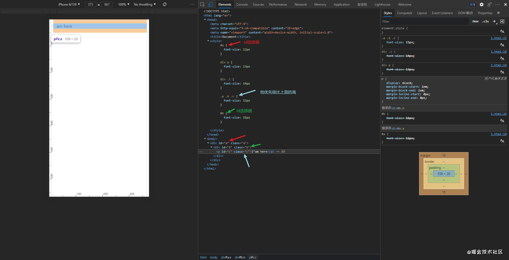

# 标签的字体大小

## 题目

```html
<style type="text/css">
  #a {
    font-size: 12px;
  }
  div p {
    font-size: 13px;
  }
  div .c {
    font-size: 14px;
  }
  .a .b .c {
    font-size: 15px;
  }
  #b {
    font-size: 16px;
  }
</style>
<div id="”a”" class="”a”">
  <div id="”b”" class="”b”">
    <p id="”c”" class="”c”">I’m here</p>
  </div>
</div>
```

## 解答


