# 浏览器渲染

## 前言

浏览器渲染这是一个广而深的题目，其中的每一个点如果深入，都可以讲一整天。本文主要从广度的层面，梳理了浏览器的整体渲染流程，有不对的地方，烦请指正！

ps：本文整体思路主要参考极客时间专栏-浏览器工作原理与实践[1]（推荐，讲的不错），文中部分图片画起来比较复杂，也直接采用了文中的图片，仅供学习。

## 整体流程

1. 解析 HTML，构建 DOM 树
2. 解析 CSS，生成 CSS 规则树
3. 合并 DOM 树和 CSS 规则，生成 Render 树（页面布局）
4. 绘制 Render 树（paint），绘制页面像素信息
5. 显示

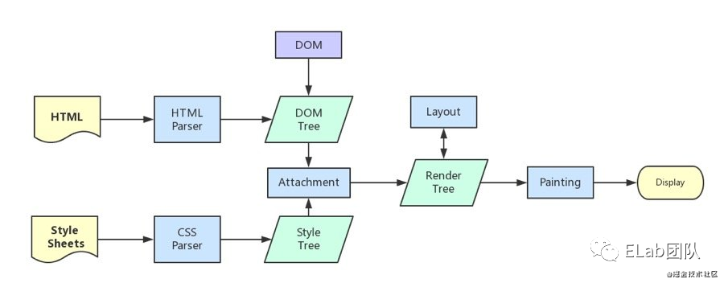

## 1、构建 DOM 树

因为浏览器无法直接理解和使用 html，所以需要将 html 转换为浏览器能够理解的结构——DOM 树。在渲染引擎内部，有一个叫 HTML 解析器（HTMLParser）的模块，它的职责就是负责将 HTML 字节流转换为 DOM 结构。

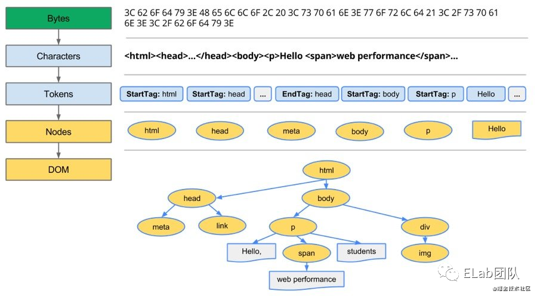

1. 解码：浏览器将接收的字节流（Bytes）基于编码方式解析为字符（characters）
2. 分词：通过分词器（也就是词法分析）将字符转换为 Token，分为 Tag Token 和文本 Token
3. tokens->nodes
4. nodes->DOM

第 3 步和第 4 步其实是同时进行的，需要将 Token 解析为 DOM 节点，并将 DOM 节点添加到 DOM 树中。此过程 HTML 解析器通过维护了一个 Token 栈结构来完成。

- 如果是 StartTag Token，就会创建一个 DOM 节点，并推入栈
- 如果是文本 Token，就会生成一个文本节点，然后将直接该节点加入到 DOM 树中
- 如果是 EndTag Token，会查看栈顶元素是否为对应的 StartTag Token，如果是则弹出，该节点解析完成。

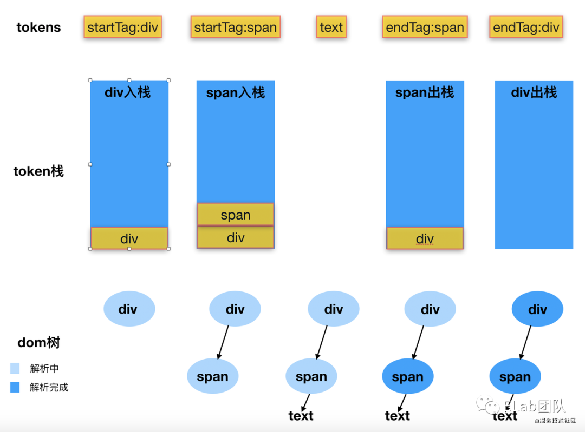

> 具体实现可以参考 Vue.js 的 HTMLParser 实现[2]

## 2、构建 CSS 规则树

与 HTML 文本一样，渲染引擎也没法直接理解 CSS 文本，因此渲染引擎会将其转换为其能理解的结构——styleSheets。在控制台执行 document.styleSheets 可以看到：

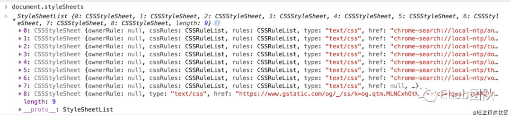

styleSheets 是对页面样式的一个总览，其内部层级如下图：

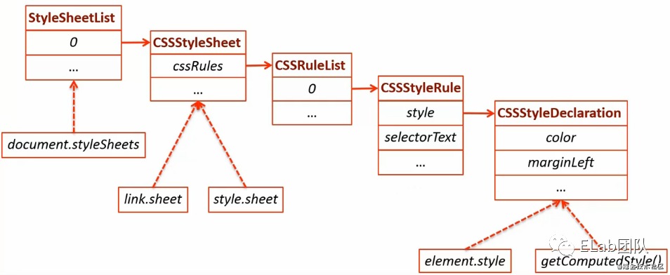

> 关于 stylesheets 的具体属性，可参考链接[3]

针对 styleSheets，结合 CSS 的继承、优先级层叠等规则，渲染引擎最终生成如下 CSS 规则树：

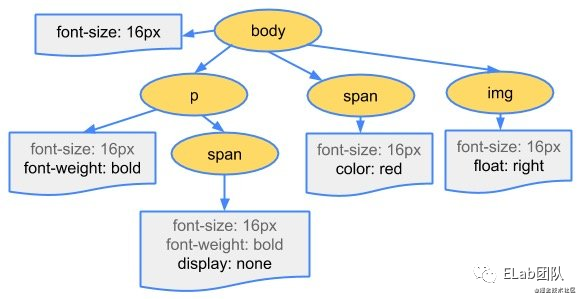

此时每个元素上的样式就是最终应用这个元素上的样式了，通过浏览器的 Element->Computed 可以查看。

## 3、布局 Layout

页面结构和页面样式都确定了，接下来就需要将两者结合起来，对页面进行整体布局。

### 3.1 构建 Render 树

DOM 树只是描述了源码中 HTML 的结构，但其中许多元素并不需要展示在画面中（比如 head、dispaly:none），也有一些不存在 DOM 树中但需要显示在页面上的元素（比如伪类），因此在显示之前需要遍历 DOM 树中的所有节点，**忽略掉不可见元素，添加不存在 DOM 树中但需要显示的的内容**，最终生成一棵只包含可见元素的 Render 树。

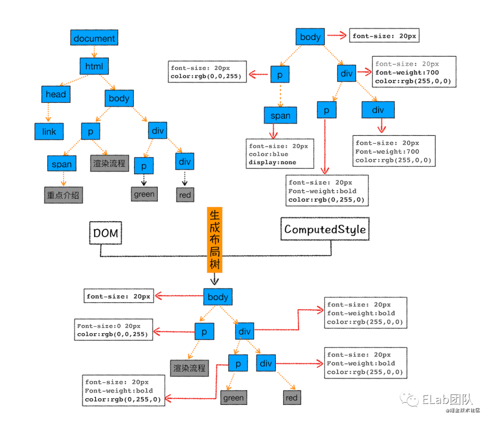

### 3.2 计算布局信息

以上得到了每个 DOM 元素的文档结构和样式，但是还不知道元素的**具体绝对几何位置**。

比如一个 div 元素的样式如下：

```css
div {
  position: absolute;
  width: 100px;
  height: 100px;
  top: 10px;
  left: 10px;
}
```

那么我们还需要知道它的具体绝对几何位置：

```css
div {
  x: ?;
  y: ?;
  width: 100px;
  height: 100px;
}
```

而计算元素的具体绝对几何位置是一项艰巨的任务，因为即使是最简单的页面布局（如从上到下的块流程）也必须考虑字体的大小以及在何处换行，因为这会影响段落的大小和形状，也会影响下一段的位置。

在 Chrome 中，有一整个工程师团队在为布局而工作， few talks from BlinkOn Conference[4] 有提到一些，大家感兴趣可以看看。

## 4、绘制 paint

以上得到了完整的 Render 树，也就是知道了**页面的样式和位置信息**，但还没到绘制的时候。类似于画一幅画，我们还需要知道页面各元素的绘制顺序，比如需要先画蓝天再画白云，否则白云会被蓝天覆盖住。

针对绘制顺序，因为页面中有很多复杂的效果，如一些复杂的 3D 变换、页面滚动，或者使用 z-index 做 z 轴排序等，为了更加方便地实现这些效果，渲染引擎采用了分层机制。

### 4.1 分层 layer

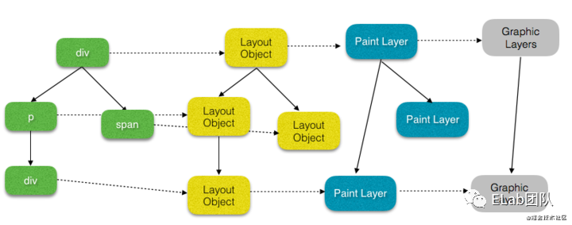

每个 DOM 元素会有自己的布局信息 Layout Object， 根据其布局信息的层级等关系，某些 Layout Object 会拥有共同的渲染层 Paint Layer，某些 Paint Layer 又会拥有共同的合成层 Composite Layer(Graphic Layers)。

#### 4.1.1 分层-渲染层（Paint Layer)

如上图，DOM 树中得每个 Node 节点都有一个对应的 LayoutObject；拥有相同的坐标空间的 LayoutObjects，属于同一个渲染层（PaintLayer）。渲染层产生的最普遍条件是“**层叠上下文**”。

层叠上下文示意图:

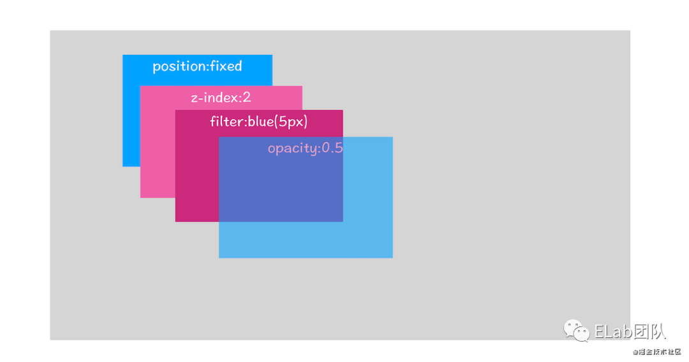

根据层叠上下文-MDN[5]，层叠上下文由满足以下任意一个条件的元素形成：

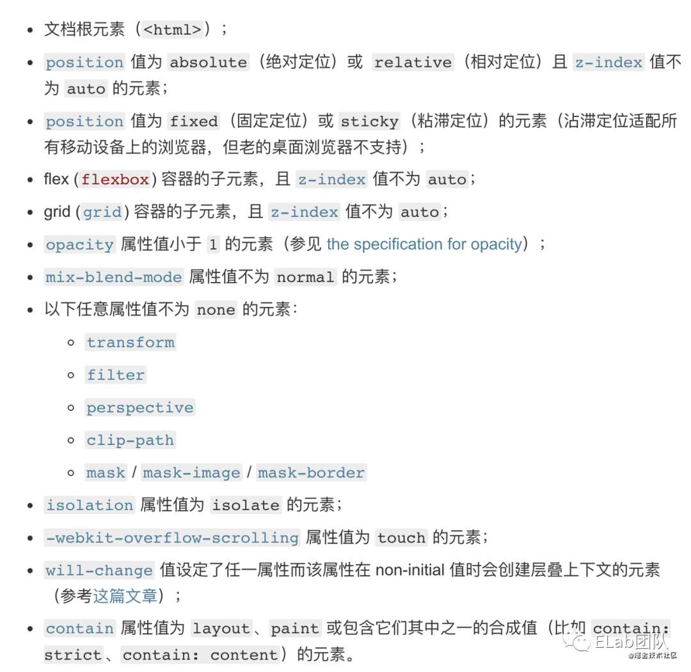

满足以上任一条件的元素，都会拥有自己的渲染层，其子元素若没有单独的渲染层，则随父级元素同一层。

> 其他产生渲染层的特殊场景（除“层叠上下文”），可参考链接[6]

#### 4.1.2 分层-合成层(Composite Layer)

某些特殊的渲染层会被认为是合成层（Composite Layer），合成层拥有单独的 GraphicsLayer。渲染层与合成层的区别，如图：

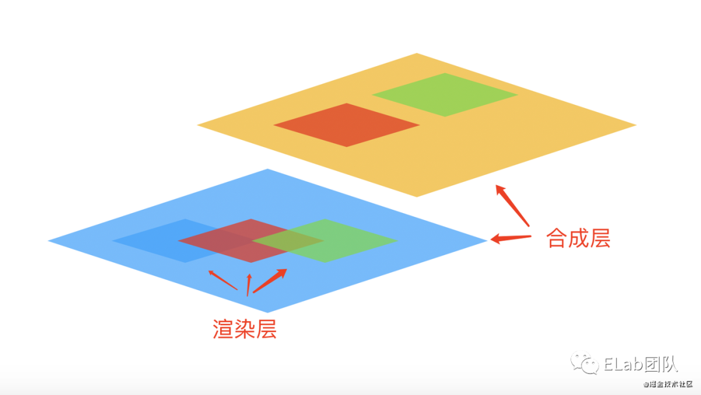

产生合成层的具体条件可参考文章，这里列出几个常见的场景：

- 有 3D transform
- 对 opacity、fliter、transform 应用了 animation 或者 transition（需要是 active 的 animation 或者 transition，当 animation 或者 transition 效果未开始或结束后，提升合成层也会失效）
- will-change 设置为 opacity、transform、top、left、bottom、right（其中 top、left 等需要设置明确的定位属性，如 relative 等

以上三种原因生成合成层 demo 代码如下

```html
<!DOCTYPE html>
<html lang="en">
  <head>
    <style type="text/css">
      * { margin: 0; padding: 0; }
      div { width: 200px; height: 100px; }
      .default { background: #ffb284; }
      .composite-translateZ { transform: translateZ(0); background: #f5cec7; }
      .composite-tansform-active { background: #e79796; transform: translate(0, 0); transition: 3s; }
      .composite-tansform-active:hover { transform: translate(100px, 100px); }
      .composite-will-change { background: #ffc988; will-change: transform; }
    </style>
  </head>
  <body>
    <div class="default">默认层</div>
    <div class="composite-translateZ">合成层-translateZ</div>
    <div class="composite-tansform-active">合成层——active transform（hover一下我）</div>
    <div class="composite-will-change">合成层——will-change</div>
  </body>
</html>
```

在控制台的 Layers 下，可以看到合成层。


overlap：元素覆盖在其他合成层元素上，则该元素被隐式提升为合成层，demo 代码如下

```html
<!DOCTYPE html>
<html lang="en">
  <head>
    <style type="text/css">
      * { margin: 0; padding: 0; }
      div { width: 200px; height: 200px; /*background: */ }
      .bottom { background: #f5cec7; 
        animation: anim-translate 3s ease-in-out alternate infinite both; }
      @keyframes anim-translate {
        from {
          transform: translateX(0);
        }
        to {
          transform: translateX(50px);
        }
      }
      .top { background: #e79796; transform: translateY(-50px); }
    </style>
  </head>
  <body>
    <div class="parents">
      <div class="bottom">下层-有动画</div>
      <div class="top">上层-隐式提升为合成层</div>
    </div>
  </body>
</html>
```

demo 中的上层 div，本不具备提升为合成层的因素，但由于其覆盖在了下层 div 上，如果上层 div 不隐式提升为合成层，它就会和和父元素共用一个合成层，此时渲染顺序就会出错。为了保证渲染顺序，因此上层被隐式提升为合成层。在控制台也可以看到原因：might overlap other composited content.

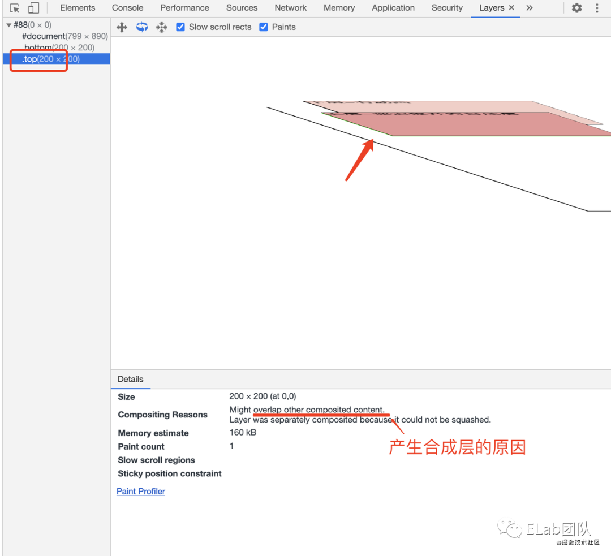

**渲染层是为保证页面元素以正确的顺序，合成层是为了减少渲染的开销。**

提升为合成层的好处：

- 合成层的位图，会采用硬件加速，也就是会交由 GPU 合成，比 CPU 处理要快
- 当需要 repaint 时，只需要 repaint 本身，不会影响到其他的层
- 对于已提升为合成层中的 transform 和 opacity 效果，都只是几何变换，透明度变换等，不会触发 layout 和 paint，直接由 GPU 完成即可

因此，在开发中，建议对于需要频繁移动的元素，建议将其提升为单独的合成层，可减少不必要的重绘，同时可以利用硬件加速，提高渲染效率。

### 4.2 层绘制 paint

分好层后，就需要对每个层进行绘制了。绘制并不是一蹴而就，而是像画画一样，是按顺序一笔一笔画出来的，渲染引擎也是类似。对于每一个合成层，渲染引擎的渲染过程：

- 先绘制下面的渲染层，再绘制上面的渲染层；
- 在绘制一个渲染层时，将一个渲染层的绘制拆分成很多小的绘制指令。

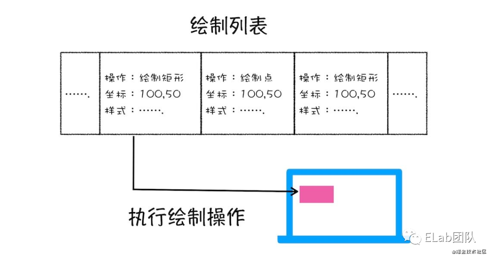

常见的指令如下：

- drawReact(rect, paint)：使用 paint 画一个矩形 rect
- drawTextBlob(x,y,paint)：使用 paint 以 x、y 为起始坐标绘制文字
- drawPaint(paint)：用 paint 填充画布
- color：采用 ARGB 的方式

> 各指令的含义可参考链接[7]

打开“开发者工具”的“Layers”标签，任意选择一层合成层，可查看该层 detail 下的详细渲染列表 paint profiler。绘制指令 demo 代码如下

```html
<!DOCTYPE html>
<html lang="en">
  <meta http-equiv="Content-Type" content="text/html; Charset=UTF-8" />
  <head>
    <style type="text/css">
      * { margin: 0; padding: 0; }
      div { width: 200px; height: 100px; text-align: center; line-height: 100px; }
      p { height: 40px; line-height: 40px; font-size: 20px; margin-bottom: 30px; }
      .level-default { position: absolute; background: #f5cec7; top: 60px; }
      .level1 { background: #ffb284; position: absolute; z-index: 2; top: 160px; }
      .level2 { background: #e79796; position: absolute; z-index: 1; top: 260px; }
      .composite-1,
      .composite-2 { position: relative; transform: translateZ(0); width: 300px; 
        height: 400px; background: #ddd; margin-bottom: 20px; }
    </style>
  </head>
  <body>
    <div class="composite-1">
      <p>合成层一</p>
      <div class="level-default">默认层</div>
      <div class="level1">渲染层1：z-index:2</div>
      <div class="level2">渲染层2：z-index:1</div>
    </div>
    <div class="composite-2">
      <p>合成层二</p>
      <div class="level-default">默认层</div>
      <div class="level1">渲染层1：z-index:2</div>
      <div class="level2">渲染层2：z-index:1</div>
    </div>
  </body>
</html>
```

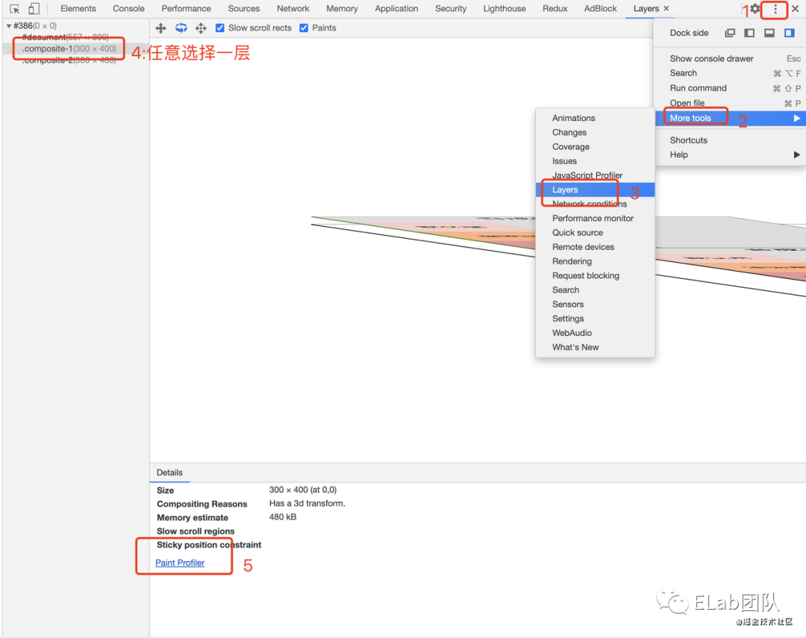

比如选择 composite-1 的合成层，绘制列表如下：

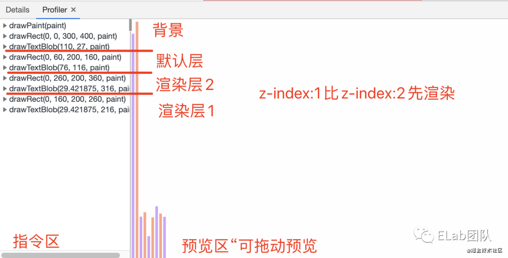

这里顺便也可以看到一点：渲染层 2 在渲染层 1 的后面，但由于其 z-index 较大（说明其渲染层层级较高），因此优先渲染层 2。

**需要说明一点，绘制列表只是用来记录绘制顺序和绘制指令的列表，并没有真正的绘制出页面。**

### 4.3 栅格化

生成了绘制指令，就到了真正绘制页面的时候了，真正的绘制过程不是在主线程完成的，而是在得到绘制指令后，主线程会将这些信息交给合成线程，由合成线程来完成绘制。

合成线程是如何工作的呢？

页面可能很大，但用户只能看到一部分，在这种情况下如果全部绘制，就会产生很大的性能开销，因此需要优先绘制视口（即用户看到的区域）区域内的元素。

基于此原因，绘制前，合成线程会对页面进行分块，然后将每个图块发送给栅格线程，栅格线程将图块转换为位图。合成器线程可以优先处理不同的栅格线程，这样就可以首先对视口（或附近）中的事物进行栅格化。

通常，栅格化过程都会使用 GPU 来加速生成，生成的位图被保存在 GPU 内存中。

栅格化的过程：

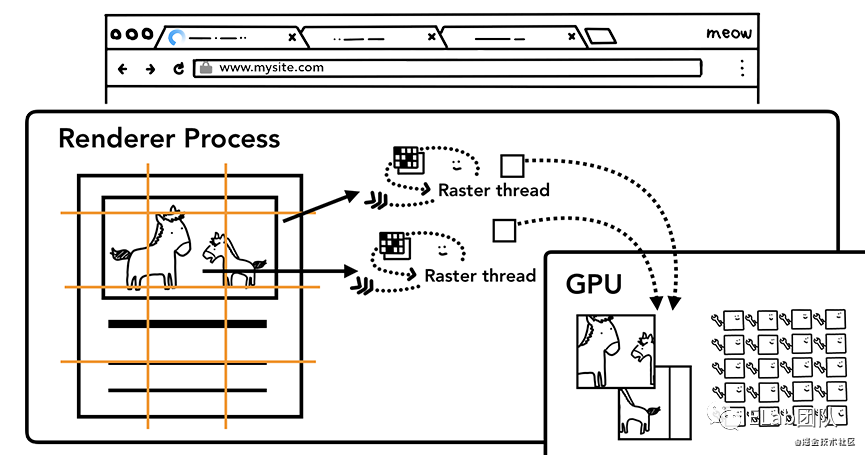

## 5、合成与显示

栅格化完成后，每一个图层都对应一张“图片”，合成线程会将这些图片合成为一张“图片”。此时，页面数据已经完成绘制，现在只需要显示给用户即可，此时就需要显卡和显示器就上场了。

显卡分为前缓冲区和后缓冲区，合成线程生成的“图片”会被发送至后缓冲区。显卡对图片进行处理完成后，系统就会让后缓冲区和前缓冲区互换，这样显示器就总能读到显卡最新产生的数据了。

通常显卡和显示器的刷新频率是一致的，都会 60 次/秒，但对于一些复杂的场景，显卡处理速度比较慢，显卡的刷新频率就会低于显示器，此时页面就会出现卡顿现象。

**因此在开发中，我们需要尽量保证一帧画面的处理总时长（以上的所有步骤）不超过 1/60s = 16.7ms，这样画面才不会出现卡顿现象。不过量化地衡量渲染时间比较困难，但基于以上分析的渲染过程，我们就可以从渲染的各个步骤着手优化渲染流程，提高渲染效率。**

## 6、相关拓展

### 6.1 CSS 如何影响 DOM 的构建

JavaScript 脚本由于可能会修改 DOM，因此会阻塞 DOM 的构建，这一点我们都知道；而 CSS 并不会操作或者改变 DOM，因此通常我们认为 CSS 不会影响 DOM 的构建，只会影响后续的布局、绘制等过程，即会影响 DOM 的渲染。但其实**CSS 可以通过 JavaScript 来阻塞 DOM 的构建。**

因为 JavaScript 是可以改变样式的，也就是具有修改 CSS 规则树的能力，而 JavaScript 脚本里是否有改变样式的操作，这一点在执行 JavaScript 之前是不可知的。因此，为保证 JavaScript 脚本的正确执行，在**执行 JavaScript 之前，CSS 规则树必须要先准备好**（不然万一有修改 CSS 的操作呢）。

也就是说，若在构建 DOM 的中途存在阻塞 DOM 构建的 JavaScript 脚本，而此页面中还包含了外部 CSS 文件的引用，那么此时就需要等目前的 CSS 规则树（基于目前生成完的部分 DOM 树）构建完毕后，再开始 JavaScript 脚本的执行，等一切结束了，再继续 DOM 的构建。

整个流程如图：（其中 CSSOM 表示 CSS 规则树）

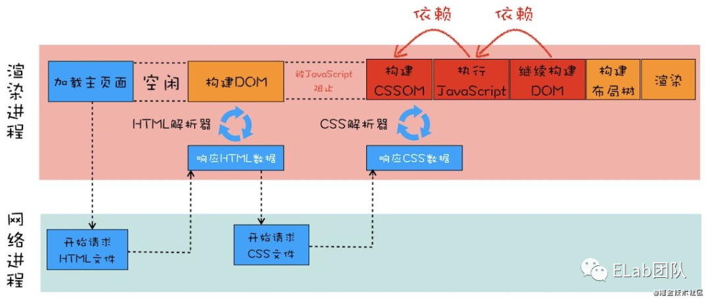

demo 代码如下：

```html
<!DOCTYPE html>
<html lang="en">
  <meta http-equiv="Content-Type" content="text/html; Charset=UTF-8" />
  <head>
    <style type="text/css">
      h4 { font-size: 18px; font-weight: none; }
    </style>
    <link rel="stylesheet" type="text/css"
      href="https://ss1.bdstatic.com/5eN1bjq8AAUYm2zgoY3K/r/www/cache/static/protocol/https/soutu/css/soutu_new2_ae491b7.css"
    />
  </head>
  <body>
    <button id="btn">清空dom</button>
    <div>我是div</div>
    <!-- !!!script阻塞div的构建 -->
    <script>console.log("遇到内联script啦");</script>
    <div>我是div</div>
    <div>我是div</div>
    <div>我是div</div>
    <div>我是div</div>
  </body>
  <script type="text/javascript">
    let btn = document.getElementById("btn");
    let body = document.body;
    btn.addEventListener(
      "click",
      function (e) {
        body.innerHTML = "";
      },
      true
    );
  </script>
</html>
```

将控制台 Network 中的网络调为 Slow 3G，点击按钮清空 dom 后，刷新页面观察 Element 中 DOM 元素出现的时机。

- 当不存在 script 时，所有 div 全部很快出现
- 存在 script 时，script 后的 div 元素要等一会（css 加载完成）才会出现

说明 **CSS 可以通过 JavaScript 来阻塞 DOM 的构建。**

### 6.2 重排、重绘、合成

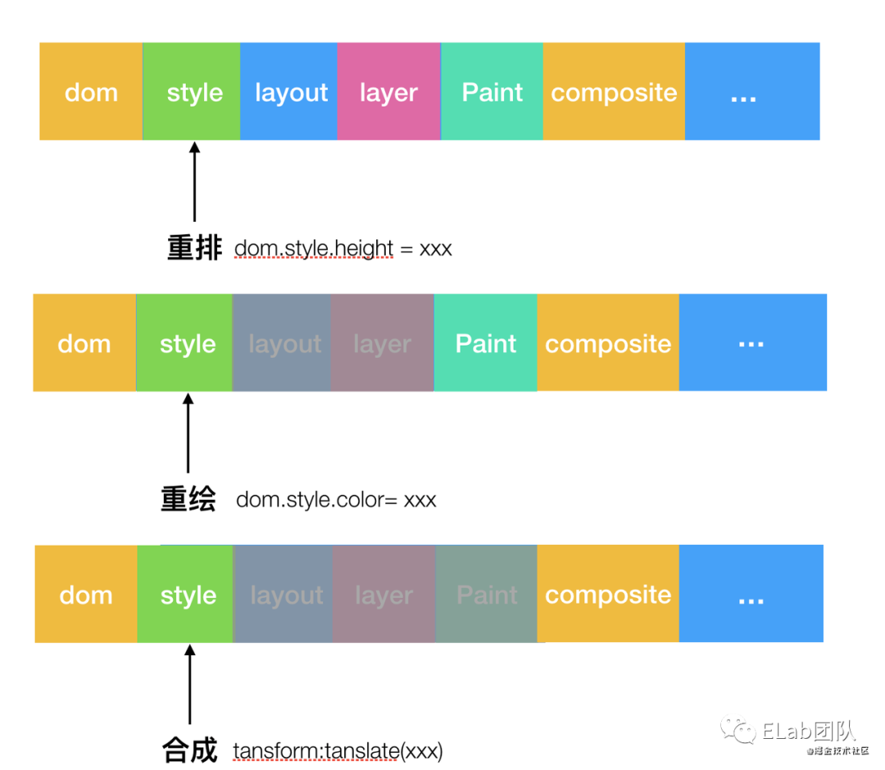

- 重排**会改变元素的几何位置**，需要更新完整的渲染流水线，所以开销也是最大的
- 重绘**只是修改元素的颜色等非位置属性**，所以省去了布局和分层阶段，开销比重排小
- 合成只会**由已提升会合成层的 transform 或 opacity 触发，只涉及几何变换或透明度变换**， 会跳过前面的流程，直接进入合成阶段，开销最小。**（transform 或 opacity 若未提升为合成层，则依然会触发 paint）**

另外在合成小节提到，生成绘制指令之后的分开、栅格化等工作是在合成线程中进行，这也就意味着在执行合成操作时，是不会影响到主线程执行的，这也是合成动画性能好的原因之一。也就揭示了为什么经常主线程卡住了，但是 CSS 动画依然能执行的原因。

### 6.3 层爆炸

前面提到 overlap 会导致生成隐式合成层，极端情况下就可能会产生大量的不在预期内的额外合成层，导致层爆炸。demo[8]

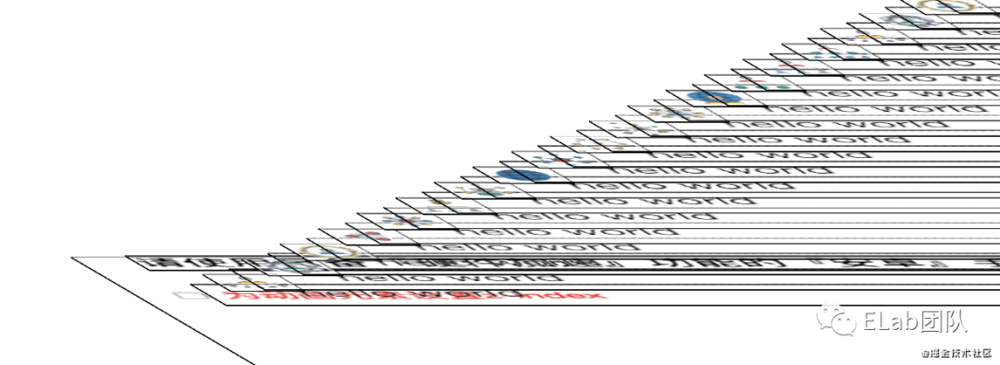

因此，在开发过程中，建议：

- 为防止层爆炸，在提升为合成层的元素上，建议加上 z-index，防止 overlap 引起的层提升。
- 不要创建太多层，因为每层都需要内存和管理开销；不要在不分析的情况下提升元素。

## 7、参考

- -浏览器工作原理与实践[9]
- 无线性能优化:composite[10]
- Inside look at modern web browser part 3[11]
- 详谈层合成[12]

参考资料

[1] [极客时间专栏-浏览器工作原理与实践](https://time.geekbang.org/column/intro/216)
[2] [Vue.js 的 HTMLParser 实现](https://github.com/vuejs/vue/blob/dev/src/compiler/parser/html-parser.js)
[3] [链接](https://www.cnblogs.com/xiaohuochai/p/5848335.html)
[4] [few talks from BlinkOn Conference](https://www.youtube.com/watch?v=Y5Xa4H2wtVA)
[5] [层叠上下文-MDN](https://developer.mozilla.org/zh-CN/docs/Web/CSS/CSS_Positioning/Understanding_z_index/The_stacking_context)
[6] [链接](https://fed.taobao.org/blog/taofed/do71ct/performance-composite/)
[7] [链接](https://api.flutter.dev/flutter/dart-ui/Canvas/restore.html)
[8] [demo](http://fouber.github.io/test/layer/?size=20)
[9] [极客时间专栏-浏览器工作原理与实践](https://time.geekbang.org/column/intro/216)
[10] [无线性能优化:composite](https://fed.taobao.org/blog/taofed/do71ct/performance-composite/)
[11] [Inside look at modern web browser (part 3)](https://developers.google.com/web/updates/2018/09/inside-browser-part3)
[12] [详谈层合成](http://jartto.wang/2017/09/29/expand-on-performance-composite)
