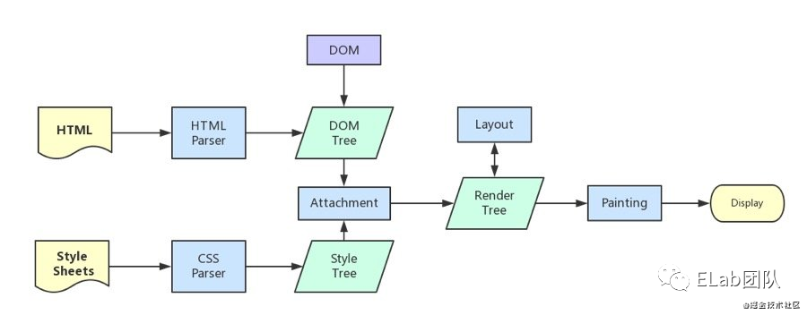
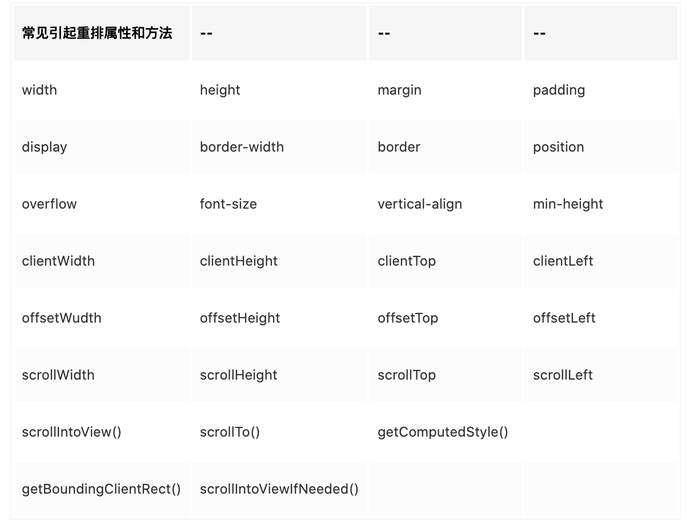
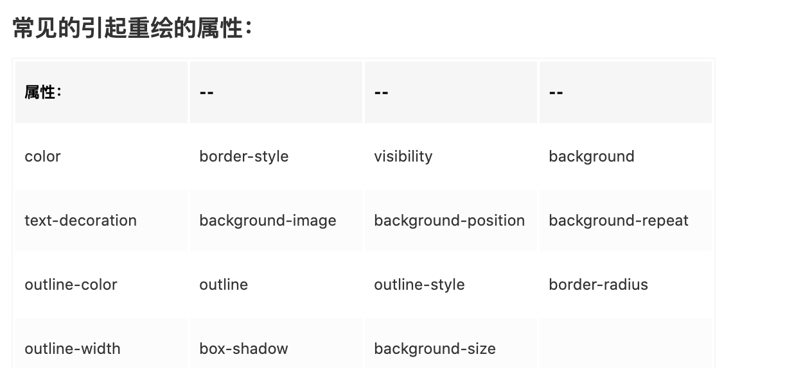

# 重排(reflow)和重绘(repaint)

## 页面生成的过程

1. HTML 被 HTML 解析器解析成 DOM 树；
2. CSS 被 CSS 解析器解析成 CSSOM 树；
3. 结合 DOM 树和 CSSOM 树，生成一棵渲染树(Render Tree)，这一过程称为 Attachment；
4. 生成布局(flow)，浏览器在屏幕上“画”出渲染树中的所有节点；
5. 将布局绘制(paint)在屏幕上，显示出整个页面。

第四步和第五步是最耗时的部分，这两步合起来，就是我们通常所说的渲染。



## 渲染

在页面的生命周期中，网页生成的时候，至少会渲染一次。在用户访问的过程中，还会不断触发重排(reflow)和重绘(repaint)，不管页面发生了重绘还是重排，都会影响性能，最可怕的是重排，会使我们付出高额的性能代价，所以我们应尽量避免。

## 重排比重绘大

大，在这个语境里的意思是：谁能影响谁？

- 重绘：某些元素的外观被改变，例如：元素的填充颜色
- 重排：重新生成布局，重新排列元素。

就如上面的概念一样，单单改变元素的外观，肯定不会引起网页重新生成布局，但当浏览器完成重排之后，将会重新绘制受到此次重排影响的部分。比如改变元素高度，这个元素乃至周边 dom 都需要重新绘制。
也就是说：重绘不一定导致重排，但重排一定会导致重绘。

## 重排(reflow)

### 概念

当 DOM 的变化影响了元素的几何信息(元素的的位置和尺寸大小)，浏览器需要重新计算元素的几何属性，将其安放在界面中的正确位置，这个过程叫做重排。

重排也叫回流，简单的说就是重新生成布局，重新排列元素。

下面情况会发生重排：

- 页面初始渲染，这是开销最大的一次重排
- 添加/删除可见的 DOM 元素
- 改变元素位置
- 改变元素尺寸，比如边距、填充、边框、宽度和高度等
- 改变元素内容，比如文字数量，图片大小等
- 改变元素字体大小
- 改变浏览器窗口尺寸，比如 resize 事件发生时
- 激活 CSS 伪类（例如：:hover）
- 设置 style 属性的值，因为通过设置 style 属性改变结点样式的话，每一次设置都会触发一次 reflow
- 查询某些属性或调用某些计算方法：offsetWidth、offsetHeight 等，除此之外，当我们调用 getComputedStyle 方法，或者 IE 里的 currentStyle 时，也会触发重排，原理是一样的，都为求一个“即时性”和“准确性”。



### 重排影响的范围

由于浏览器渲染界面是基于流式布局模型的，所以触发重排时会对周围 DOM 重新排列，影响的范围有两种：

- 全局范围：从根节点 html 开始对整个渲染树进行重新布局。
- 局部范围：对渲染树的某部分或某一个渲染对象进行重新布局

#### 全局范围重排

```html
<body>
  <div class="hello">
    <h4>hello</h4>
    <p><strong>Name:</strong>Ding</p>
    <h5>male</h5>
    <ol>
      <li>coding</li>
      <li>loving</li>
    </ol>
  </div>
</body>
```

当 p 节点上发生 reflow 时，hello 和 body 也会重新渲染，甚至 h5 和 ol 都会收到影响。

#### 局部范围重排

用局部布局来解释这种现象：把一个 dom 的宽高之类的几何信息定死，然后在 dom 内部触发重排，就只会重新渲染该 dom 内部的元素，而不会影响到外界。

## 重绘(Repaints)

### 概念

当一个元素的外观发生改变，但没有改变布局,重新把元素外观绘制出来的过程，叫做重绘。

### 常见的引起重绘的属性



## 重排优化建议

重排的代价是高昂的，会破坏用户体验，并且让 UI 展示非常迟缓。通过减少重排的负面影响来提高用户体验的最简单方式就是尽可能的减少重排次数，重排范围。下面是一些行之有效的建议，大家可以用来参考。

### 减少重排范围

我们应该尽量以局部布局的形式组织 html 结构，尽可能小的影响重排的范围。

- 尽可能在低层级的 DOM 节点上，而不是像上述全局范围的示例代码一样，如果你要改变 p 的样式，class 就不要加在 div 上，通过父元素去影响子元素不好。
- 不要使用 table 布局，可能很小的一个小改动会造成整个 table 的重新布局。那么在不得已使用 table 的场合，可以设置 table-layout:auto;或者是 table-layout:fixed 这样可以让 table 一行一行的渲染，这种做法也是为了限制 reflow 的影响范围。

### 减少重排次数

#### 1.样式集中改变

不要频繁的操作样式，对于一个静态页面来说，明智且可维护的做法是更改类名而不是修改样式，对于动态改变的样式来说，相较每次微小修改都直接触及元素，更好的办法是统一在 cssText 变量中编辑。虽然现在大部分现代浏览器都会有 Flush 队列进行渲染队列优化，但是有些老版本的浏览器比如 IE6 的效率依然低下。

```js
// bad
var left = 10;
var top = 10;
el.style.left = left + 'px';
el.style.top = top + 'px';

// 当top和left的值是动态计算而成时...
// better
el.style.cssText += '; left: ' + left + 'px; top: ' + top + 'px;';

// better
el.className += 'className';
```

#### 2.分离读写操作

DOM 的多个读操作（或多个写操作），应该放在一起。不要两个读操作之间，加入一个写操作。

```js
// bad 强制刷新 触发四次重排+重绘
div.style.left = div.offsetLeft + 1 + 'px';
div.style.top = div.offsetTop + 1 + 'px';
div.style.right = div.offsetRight + 1 + 'px';
div.style.bottom = div.offsetBottom + 1 + 'px';

// good 缓存布局信息 相当于读写分离 触发一次重排+重绘
var curLeft = div.offsetLeft;
var curTop = div.offsetTop;
var curRight = div.offsetRight;
var curBottom = div.offsetBottom;

div.style.left = curLeft + 1 + 'px';
div.style.top = curTop + 1 + 'px';
div.style.right = curRight + 1 + 'px';
div.style.bottom = curBottom + 1 + 'px';
```

原来的操作会导致四次重排，读写分离之后实际上只触发了一次重排，这都得益于浏览器的渲染队列机制：

> 当我们修改了元素的几何属性，导致浏览器触发重排或重绘时。它会把该操作放进渲染队列，等到队列中的操作到了一定的数量或者到了一定的时间间隔时，浏览器就会批量执行这些操作。

#### 3.将 DOM 离线

“离线”意味着不在当前的 DOM 树中做修改，我们可以这样做：

- 使用 display:none
  一旦我们给元素设置 display:none 时（只有一次重排重绘），元素便不会再存在在渲染树中，相当于将其从页面上“拿掉”，我们之后的操作将不会触发重排和重绘，添加足够多的变更后，通过 display 属性显示（另一次重排重绘）。通过这种方式即使大量变更也只触发两次重排。另外，visibility : hidden 的元素只对重绘有影响，不影响重排。

- 通过 documentFragment 创建一个 dom 碎片,在它上面批量操作 dom，操作完成之后，再添加到文档中，这样只会触发一次重排。

- 复制节点，在副本上工作，然后替换它！

#### 4.使用 absolute 或 fixed 脱离文档流

使用绝对定位会使的该元素单独成为渲染树中 body 的一个子元素，重排开销比较小，不会对其它节点造成太多影响。当你在这些节点上放置这个元素时，一些其它在这个区域内的节点可能需要重绘，但是不需要重排。

#### 5.优化动画

- 可以把动画效果应用到 position 属性为 absolute 或 fixed 的元素上，这样对其他元素影响较小
  动画效果还应牺牲一些平滑，来换取速度，这中间的度自己衡量：比如实现一个动画，以 1 个像素为单位移动这样最平滑，但是 Layout 就会过于频繁，大量消耗 CPU 资源，如果以 3 个像素为单位移动则会好很多
- 启用 GPU 加速
  GPU 硬件加速是指应用 GPU 的图形性能对浏览器中的一些图形操作交给 GPU 来完成，因为 GPU 是专门为处理图形而设计，所以它在速度和能耗上更有效率。

  GPU 加速通常包括以下几个部分：Canvas2D，布局合成, CSS3 转换（transitions），CSS3 3D 变换（transforms），WebGL 和视频(video)。

```css
/**
 * 根据上面的结论 
 * 将 2d transform 换成 3d 
 * 就可以强制开启 GPU 加速
 * 提高动画性能
 */
div {
  transform: translate3d(10px, 10px, 0);
}
```

## 如何在浏览器中查看页面渲染时间

1. 打开开发者工具：点击 Performance 左侧有个小圆点 点击刷新页面会录制整个页面加载出来时间的分配情况。

   - 蓝色: 网络通信和 HTML 解析
   - 黄色: JavaScript 执行
   - 紫色: 样式计算和布局，即重排
   - 绿色: 重绘

   哪种色块比较多，就说明性能耗费在那里。色块越长，问题越大。

2. 点击 Event Log：单独勾选 Loading 项会显示 html 和 css 加载时间。
3. 解析完 DOM + CSSOM 之后会生成一个渲染树 Render Tree，就是 DOM 和 CSSOM 的一一对应关系。
4. 通过渲染树中在屏幕上“画”出的所有节点，称为渲染。

## 小结

渲染的三个阶段 Layout，Paint，Composite Layers。

- Layout：重排，又叫回流。
- Paint:重绘，重排重绘这些步骤都是在 CPU 中发生的。
- Composite Layers：CPU 把生成的 BitMap（位图）传输到 GPU，渲染到屏幕。

CSS3 就是在 GPU 发生的：Transform Opacity。在 GPU 发生的属性比较高效。所以 CSS3 性能比较高。
