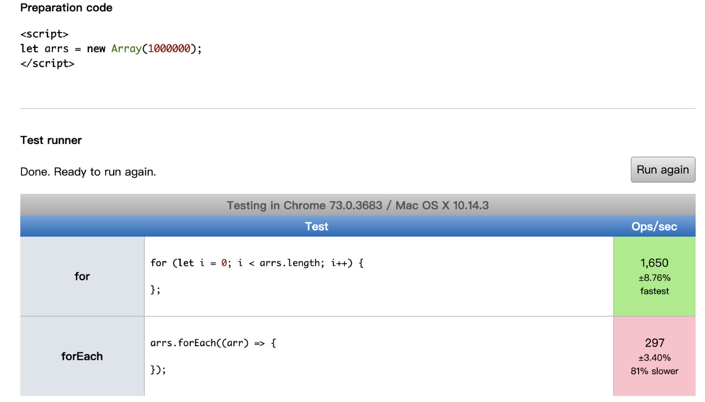

# 面试题

## 第 1 题：（滴滴、饿了么）写 React / Vue 项目时为什么要在列表组件中写 key，其作用是什么

key 的作用是为了在 diff 算法执行时更快的找到对应的节点，提高 diff 速度。

key 是给每一个 vnode 的唯一 id,可以依靠 key,更准确, 更快的拿到 oldVnode 中对应的 vnode 节点。

1. 更准确
   因为带 key 就不是就地复用了，在 sameNode 函数 a.key === b.key 对比中可以避免就地复用的情况。所以会更加准确。

2. 更快
   利用 key 的唯一性生成 map 对象来获取对应节点，比遍历方式更快。(这个观点，就是我最初的那个观点。从这个角度看，map 会比遍历更快。)

## 第 2 题：['1', '2', '3'].map(parseInt) what & why

首先让我们回顾一下，map 函数的第一个参数 callback：
var new_array = arr.map(function callback(currentValue[, index[, array]]) { // Return element for new_array }[, thisArg])
这个 callback 一共可以接收三个参数，其中第一个参数代表当前被处理的元素，而第二个参数代表该元素的索引。

而 parseInt 则是用来解析字符串的，使字符串成为指定基数的整数。
parseInt(string, radix)
接收两个参数，第一个表示被处理的值（字符串），第二个表示为解析时的基数。

在 radix 为 undefined，或者 radix 为 0 或者没有指定的情况下，JavaScript 作如下处理：

- 如果字符串 string 以"0x"或者"0X"开头, 则基数是 16 (16 进制).
- 如果字符串 string 以"0"开头, 基数是 8（八进制）或者 10（十进制），那么具体是哪个基数由实现环境决定。ECMAScript 5 规定使用 10，但是并不是所有的浏览器都遵循这个规定。因此，永远都要明确给出 radix 参数的值。
- 如果字符串 string 以其它任何值开头，则基数是 10 (十进制)。

了解这两个函数后，我们可以模拟一下运行情况

parseInt('1', 0) //radix 为 0 时，按照 10 为基数处理。这个时候返回 1
parseInt('2', 1) //基数为 1（1 进制）表示的数中，最大值小于 2，所以无法解析，返回 NaN
parseInt('3', 2) //基数为 2（2 进制）表示的数中，最大值小于 3，所以无法解析，返回 NaN
map 函数返回的是一个数组，所以最后结果为[1, NaN, NaN]

实际执行的代码为

```js
["1", "2", "3"].map((item, index) => {
  return parseInt(item, index);
});
```

## 第 3 题：（挖财）什么是防抖和节流？有什么区别？如何实现

1. 防抖

   触发高频事件后 n 秒内函数只会执行一次，如果 n 秒内高频事件再次被触发，则重新计算时间

   思路：每次触发事件时都取消之前的延时调用方法

   ```js
   function debounce(fn) {
     let timeout = null; // 创建一个标记用来存放定时器的返回值
     return function () {
       clearTimeout(timeout); // 每当用户输入的时候把前一个 setTimeout clear 掉
       timeout = setTimeout(() => {
         // 然后又创建一个新的 setTimeout, 这样就能保证输入字符后的 interval 间隔内如果还有字符输入的话，就不会执行 fn 函数
         fn.apply(this, arguments);
       }, 500);
     };
   }
   function sayHi() {
     console.log("防抖成功");
   }

   var inp = document.getElementById("inp");
   inp.addEventListener("input", debounce(sayHi)); // 防抖
   ```

2. 节流

   高频事件触发，但在 n 秒内只会执行一次，所以节流会稀释函数的执行频率

   思路：每次触发事件时都判断当前是否有等待执行的延时函数

   ```js
   function throttle(fn) {
     let canRun = true; // 通过闭包保存一个标记
     return function () {
       if (!canRun) return; // 在函数开头判断标记是否为true，不为true则return
       canRun = false; // 立即设置为false
       setTimeout(() => {
         // 将外部传入的函数的执行放在setTimeout中
         fn.apply(this, arguments);
         // 最后在setTimeout执行完毕后再把标记设置为true(关键)表示可以执行下一次循环了。当定时器没有执行的时候标记永远是false，在开头被return掉
         canRun = true;
       }, 500);
     };
   }
   function sayHi(e) {
     console.log(e.target.innerWidth, e.target.innerHeight);
   }
   window.addEventListener("resize", throttle(sayHi));
   ```

## 第 4 题：介绍下 Set、Map、WeakSet 和 WeakMap 的区别

- Set
  - 成员唯一、无序且不重复
  - [value, value]，键值与键名是一致的（或者说只有键值，没有键名）
  - 可以遍历，方法有：add、delete、has
- WeakSet
  - 成员都是对象
  - 成员都是弱引用，可以被垃圾回收机制回收，可以用来保存 DOM 节点，不容易造成内存泄漏
  - 不能遍历，方法有 add、delete、has
- Map
  - 本质上是键值对的集合，类似集合
  - 可以遍历，方法很多可以跟各种数据格式转换
- WeakMap
  - 只接受对象作为键名（null 除外），不接受其他类型的值作为键名
  - 键名是弱引用，键值可以是任意的，键名所指向的对象可以被垃圾回收，此时键名是无效的
  - 不能遍历，方法有 get、set、has、delete

## 第 5 题：介绍下深度优先遍历和广度优先遍历，如何实现


1. 深度优先遍历

   深度优先遍历 DFS 与树的先序遍历比较类似。
   假设初始状态是图中所有顶点均未被访问，则从某个顶点 v 出发，首先访问该顶点然后依次从它的各个未被访问的邻接点出发深度优先搜索遍历图，直至图中所有和 v 有路径相通的顶点都被访问到。若此时尚有其他顶点未被访问到，则另选一个未被访问的顶点作起始点，重复上述过程，直至图中所有顶点都被访问到为止。

   ```js
   /*深度优先遍历三种方式*/
   let deepTraversal1 = (node, nodeList = []) => {
     if (node !== null) {
       nodeList.push(node);
       let children = node.children;
       for (let i = 0; i < children.length; i++) {
         deepTraversal1(children[i], nodeList);
       }
     }
     return nodeList;
   };
   let deepTraversal2 = (node) => {
     let nodes = [];
     if (node !== null) {
       nodes.push(node);
       let children = node.children;
       for (let i = 0; i < children.length; i++) {
         nodes = nodes.concat(deepTraversal2(children[i]));
       }
     }
     return nodes;
   };
   // 非递归
   let deepTraversal3 = (node) => {
     let stack = [];
     let nodes = [];
     if (node) {
       // 推入当前处理的node
       stack.push(node);
       while (stack.length) {
         let item = stack.pop();
         let children = item.children;
         nodes.push(item);
         // node = [] stack = [parent]
         // node = [parent] stack = [child3,child2,child1]
         // node = [parent, child1] stack = [child3,child2,child1-2,child1-1]
         // node = [parent, child1-1] stack = [child3,child2,child1-2]
         for (let i = children.length - 1; i >= 0; i--) {
           stack.push(children[i]);
         }
       }
     }
     return nodes;
   };
   ```

2. 广度优先遍历

   广度优先遍历 BFS
   从图中某顶点 v 出发，在访问了 v 之后依次访问 v 的各个未曾访问过的邻接点，然后分别从这些邻接点出发依次访问它们的邻接点，并使得“先被访问的顶点的邻接点先于后被访问的顶点的邻接点被访问，直至图中所有已被访问的顶点的邻接点都被访问到。 如果此时图中尚有顶点未被访问，则需要另选一个未曾被访问过的顶点作为新的起始点，重复上述过程，直至图中所有顶点都被访问到为止。

   ```js
   let widthTraversal2 = (node) => {
     let nodes = [];
     let stack = [];
     if (node) {
       stack.push(node);
       while (stack.length) {
         let item = stack.shift();
         let children = item.children;
         nodes.push(item);
         // 队列，先进先出
         // nodes = [] stack = [parent]
         // nodes = [parent] stack = [child1,child2,child3]
         // nodes = [parent, child1] stack = [child2,child3,child1-1,child1-2]
         // nodes = [parent,child1,child2]
         for (let i = 0; i < children.length; i++) {
           stack.push(children[i]);
         }
       }
     }
     return nodes;
   };
   ```

## 第 6 题：请分别用深度优先思想和广度优先思想实现一个拷贝函数

```js
// 工具函数
let _toString = Object.prototype.toString;
let map = {
  array: "Array",
  object: "Object",
  function: "Function",
  string: "String",
  null: "Null",
  undefined: "Undefined",
  boolean: "Boolean",
  number: "Number",
};
let getType = (item) => {
  return _toString.call(item).slice(8, -1);
};
let isTypeOf = (item, type) => {
  return map[type] && map[type] === getType(item);
};
```

```js
let DFSdeepClone = (obj, visitedArr = []) => {
  let _obj = {};
  if (isTypeOf(obj, "array") || isTypeOf(obj, "object")) {
    let index = visitedArr.indexOf(obj);
    _obj = isTypeOf(obj, "array") ? [] : {};
    if (~index) {
      // 判断环状数据
      _obj = visitedArr[index];
    } else {
      visitedArr.push(obj);
      for (let item in obj) {
        _obj[item] = DFSdeepClone(obj[item], visitedArr);
      }
    }
  } else if (isTypeOf(obj, "function")) {
    _obj = eval("(" + obj.toString() + ")");
  } else {
    _obj = obj;
  }
  return _obj;
};
```

```js
let BFSdeepClone = (obj) => {
  let origin = [obj],
    copyObj = {},
    copy = [copyObj];
  // 去除环状数据
  let visitedQueue = [],
    visitedCopyQueue = [];
  while (origin.length > 0) {
    let items = origin.shift(),
      _obj = copy.shift();
    visitedQueue.push(items);
    if (isTypeOf(items, "object") || isTypeOf(items, "array")) {
      for (let item in items) {
        let val = items[item];
        if (isTypeOf(val, "object")) {
          let index = visitedQueue.indexOf(val);
          if (!~index) {
            _obj[item] = {};
            //下次while循环使用给空对象提供数据
            origin.push(val);
            // 推入引用对象
            copy.push(_obj[item]);
          } else {
            _obj[item] = visitedCopyQueue[index];
            visitedQueue.push(_obj);
          }
        } else if (isTypeOf(val, "array")) {
          // 数组类型在这里创建了一个空数组
          _obj[item] = [];
          origin.push(val);
          copy.push(_obj[item]);
        } else if (isTypeOf(val, "function")) {
          _obj[item] = eval("(" + val.toString() + ")");
        } else {
          _obj[item] = val;
        }
      }
      // 将已经处理过的对象数据推入数组 给环状数据使用
      visitedCopyQueue.push(_obj);
    } else if (isTypeOf(items, "function")) {
      copyObj = eval("(" + items.toString() + ")");
    } else {
      copyObj = obj;
    }
  }
  return copyObj;
};
```

## 第 7 题：ES5/ES6 的继承除了写法以外还有什么区别

1. class 声明会提升，但不会初始化赋值。Foo 进入暂时性死区，类似于 let、const 声明变量。

   ```js
   const bar = new Bar(); // it's ok
   function Bar() {
     this.bar = 42;
   }

   const foo = new Foo(); // ReferenceError: Foo is not defined
   class Foo {
     constructor() {
       this.foo = 42;
     }
   }
   ```

2. class 声明内部会启用严格模式。

   ```js
   // 引用一个未声明的变量
   function Bar() {
     baz = 42; // it's ok
   }
   const bar = new Bar();

   class Foo {
     constructor() {
       fol = 42; // ReferenceError: fol is not defined
     }
   }
   const foo = new Foo();
   ```

3. class 的所有方法（包括静态方法和实例方法）都是不可枚举的。

   ```js
   // 引用一个未声明的变量
   function Bar() {
     this.bar = 42;
   }
   Bar.answer = function () {
     return 42;
   };
   Bar.prototype.print = function () {
     console.log(this.bar);
   };
   const barKeys = Object.keys(Bar); // ['answer']
   const barProtoKeys = Object.keys(Bar.prototype); // ['print']

   class Foo {
     constructor() {
       this.foo = 42;
     }
     static answer() {
       return 42;
     }
     print() {
       console.log(this.foo);
     }
   }
   const fooKeys = Object.keys(Foo); // []
   const fooProtoKeys = Object.keys(Foo.prototype); // []
   ```

4. class 的所有方法（包括静态方法和实例方法）都没有原型对象 prototype，所以也没有[[construct]]，不能使用 new 来调用。

   ```js
   function Bar() {
     this.bar = 42;
   }
   Bar.prototype.print = function () {
     console.log(this.bar);
   };

   const bar = new Bar();
   const barPrint = new bar.print(); // it's ok

   class Foo {
     constructor() {
       this.foo = 42;
     }
     print() {
       console.log(this.foo);
     }
   }
   const foo = new Foo();
   const fooPrint = new foo.print(); // TypeError: foo.print is not a constructor
   ```

5. 必须使用 new 调用 class。

   ```js
   function Bar() {
     this.bar = 42;
   }
   const bar = Bar(); // it's ok

   class Foo {
     constructor() {
       this.foo = 42;
     }
   }
   const foo = Foo(); // TypeError: Class constructor Foo cannot be invoked without 'new'
   ```

6. class 内部无法重写类名。

   ```js
   function Bar() {
     Bar = "Baz"; // it's ok
     this.bar = 42;
   }
   const bar = new Bar();
   // Bar: 'Baz'
   // bar: Bar {bar: 42}

   class Foo {
     constructor() {
       this.foo = 42;
       Foo = "Fol"; // TypeError: Assignment to constant variable
     }
   }
   const foo = new Foo();
   Foo = "Fol"; // it's ok
   ```

## 第 8 题：setTimeout、Promise、Async/Await 的区别

settimeout 的回调函数放到宏任务队列里，等到执行栈清空以后执行；

Promise 新建后立即执行 then 方法指定的回调函数，将在当前脚本所有同步任务执行完才会执行,调用 resolve 或 reject 并不会终结 Promise 的参数函数的执行。 resolved,reject 的 Promise 是在本轮事件循环的末尾执行，总是晚于本轮循环的同步任务。

```js
console.log("script start");
let promise1 = new Promise(function (resolve) {
  console.log("promise1");
  resolve();
  console.log("promise1 end");
}).then(function () {
  console.log("promise2");
});
setTimeout(function () {
  console.log("settimeout");
});
console.log("script end");
// 输出顺序: script start->promise1->promise1 end->script end->promise2->settimeout
```

async 函数返回一个 Promise 对象，当函数执行的时候，一旦遇到 await 就会先返回，等到触发的异步操作完成，再执行函数体内后面的语句。可以理解为，是让出了线程，跳出了 async 函数体。

```js
async function async1() {
  console.log("async1 start");
  await async2();
  console.log("async1 end");
}
async function async2() {
  console.log("async2");
}
console.log("script start");
async1();
console.log("script end");
// 输出顺序：script start->async1 start->async2->script end->async1 end
```

## 第 9 题：（头条、微医）Async/Await 如何通过同步的方式实现异步

async/await 是 Generator 的语法糖，先来看一下二者的对比：

```js
// Generator
function run(gen) {
  const g = gen();
  function next(data) {
    const res = g.next(data);
    // 深度递归，只要 `Generator` 函数还没执行到最后一步，`next` 函数就调用自身
    if (res.done) return res.value;
    res.value.then(function(data) {
      next(data);
    });
  }
  next();
}
run(function*() {
  const res1 = yield readFile(path.resolve(__dirname, '../data/a.json'), { encoding: 'utf8' });
  console.log(res1);
  const res2 = yield readFile(path.resolve(__dirname, '../data/b.json'), { encoding: 'utf8' });
  console.log(res2);
});

// async/await
const readFile = async () => {
  const res1 = await readFile(path.resolve(__dirname, '../data/a.json'), { encoding: 'utf8' });
  console.log(res1);
  const res2 = await readFile(path.resolve(__dirname, '../data/b.json'), { encoding: 'utf8' });
  console.log(res2);
  return 'done'；
}
const res = readFile();
```

可以看到，async function 代替了 function\*，await 代替了 yield，同时也无需自己手写一个自动执行器 run 了

现在再来看看 async/await 的特点：

当 await 后面跟的是 Promise 对象时，才会异步执行，其它类型的数据会同步执行
执行 const res = readFile(); 返回的仍然是个 Promise 对象，上面代码中的 return 'done'; 会直接被下面 then 函数接收到

```js
res.then((data) => {
  console.log(data); // done
});
```

## 第 10 题：（头条）异步笔试题

请写出下面代码的运行结果

```js
async function async1() {
  console.log("async1 start");
  await async2();
  console.log("async1 end");
}
async function async2() {
  console.log("async2");
}
console.log("script start");
setTimeout(function () {
  console.log("setTimeout");
}, 0);
async1();
new Promise(function (resolve) {
  console.log("promise1");
  resolve();
}).then(function () {
  console.log("promise2");
});
console.log("script end");
// script start -> async1 start -> async2 -> promise1 -> script end -> async1 end -> promise2 -> settimeout
```

## 第 11 题：（携程）算法手写题

已知如下数组：

`var arr = [ [1, 2, 2], [3, 4, 5, 5], [6, 7, 8, 9, [11, 12, [12, 13, [14] ] ] ], 10];`

编写一个程序将数组扁平化去并除其中重复部分数据，最终得到一个升序且不重复的数组

```js
arr
  .toString()
  .split(",")
  .sort((a, b) => {
    return a - b;
  })
  .map(Number);
Array.from(new Set(arr.flat(Infinity))).sort((a, b) => {
  return a - b;
});
```

## 第 12 题：（滴滴、挖财、微医、海康）JS 异步解决方案的发展历程以及优缺点

1. 回调函数（callback）

   ```js
   setTimeout(() => {
     // callback 函数体
   }, 1000);
   ```

   缺点：回调地狱，不能用 try catch 捕获错误，不能 return

   回调地狱的根本问题在于：

   缺乏顺序性： 回调地狱导致的调试困难，和大脑的思维方式不符
   嵌套函数存在耦合性，一旦有所改动，就会牵一发而动全身，即（控制反转）
   嵌套函数过多的多话，很难处理错误

   ```js
   ajax("XXX1", () => {
     // callback 函数体
     ajax("XXX2", () => {
       // callback 函数体
       ajax("XXX3", () => {
         // callback 函数体
       });
     });
   });
   ```

   优点：解决了同步的问题（只要有一个任务耗时很长，后面的任务都必须排队等着，会拖延整个程序的执行。）

2. Promise

   Promise 就是为了解决 callback 的问题而产生的。

   Promise 实现了链式调用，也就是说每次 then 后返回的都是一个全新 Promise，如果我们在 then 中 return ，return 的结果会被 Promise.resolve() 包装

   优点：解决了回调地狱的问题

   ```js
   ajax("XXX1")
     .then((res) => {
       // 操作逻辑
       return ajax("XXX2");
     })
     .then((res) => {
       // 操作逻辑
       return ajax("XXX3");
     })
     .then((res) => {
       // 操作逻辑
     });
   ```

   缺点：无法取消 Promise ，错误需要通过回调函数来捕获

3. Generator

   特点：可以控制函数的执行，可以配合 co 函数库使用

   ```js
   function* fetch() {
     yield ajax("XXX1", () => {});
     yield ajax("XXX2", () => {});
     yield ajax("XXX3", () => {});
   }
   let it = fetch();
   let result1 = it.next();
   let result2 = it.next();
   let result3 = it.next();
   ```

4. Async/await

   async、await 是异步的终极解决方案

   优点是：代码清晰，不用像 Promise 写一大堆 then 链，处理了回调地狱的问题

   缺点：await 将异步代码改造成同步代码，如果多个异步操作没有依赖性而使用 await 会导致性能上的降低。

   ```js
   async function test() {
     // 以下代码没有依赖性的话，完全可以使用 Promise.all 的方式
     // 如果有依赖性的话，其实就是解决回调地狱的例子了
     await fetch("XXX1");
     await fetch("XXX2");
     await fetch("XXX3");
   }
   ```

   下面来看一个使用 await 的例子：

   ```js
   let a = 0;
   let b = async () => {
     a = a + (await 10);
     console.log("2", a); // -> '2' 10
   };
   b();
   a++;
   console.log("1", a); // -> '1' 1
   ```

   对于以上代码你可能会有疑惑，让我来解释下原因

   首先函数 b 先执行，在执行到 await 10 之前变量 a 还是 0，因为 await 内部实现了 generator ，generator 会保留堆栈中东西，所以这时候 a = 0 被保存了下来
   因为 await 是异步操作，后来的表达式不返回 Promise 的话，就会包装成 Promise.reslove(返回值)，然后会去执行函数外的同步代码
   同步代码执行完毕后开始执行异步代码，将保存下来的值拿出来使用，这时候 a = 0 + 10
   上述解释中提到了 await 内部实现了 generator，其实 await 就是 generator 加上 Promise 的语法糖，且内部实现了自动执行 generator。如果你熟悉 co 的话，其实自己就可以实现这样的语法糖。

## 第 13 题：（微医）Promise 构造函数是同步执行还是异步执行，那么 then 方法呢

Promise new 的时候会立即执行里面的代码 then 是微任务 会在本次任务执行完的时候执行

## 第 14 题：（兑吧）情人节福利题，如何实现一个 new

```js
// 首先创建一个空的对象，空对象的__proto__属性指向构造函数的原型对象
// 把上面创建的空对象赋值构造函数内部的this，用构造函数内部的方法修改空对象
// 如果构造函数返回一个非基本类型的值，则返回这个值，否则上面创建的对象
function _new(fn, ...arg) {
  let obj = Object.create(fn.prototype);
  let ret = fn.apply(obj, arg);
  return ret instanceof Object ? ret : obj;
}
```

## 第 15 题：（网易）简单讲解一下 http2 的多路复用

HTTP2 采用二进制格式传输，取代了 HTTP1.x 的文本格式，二进制格式解析更高效。
多路复用代替了 HTTP1.x 的序列和阻塞机制，所有的相同域名请求都通过同一个 TCP 连接并发完成。在 HTTP1.x 中，并发多个请求需要多个 TCP 连接，浏览器为了控制资源会有 6-8 个 TCP 连接都限制。

HTTP2 中

- 同域名下所有通信都在单个连接上完成，消除了因多个 TCP 连接而带来的延时和内存消耗。
- 单个连接上可以并行交错的请求和响应，之间互不干扰

在 HTTP/1 中，每次请求都会建立一次 HTTP 连接，也就是我们常说的 3 次握手 4 次挥手，这个过程在一次请求过程中占用了相当长的时间，即使开启了 Keep-Alive ，解决了多次连接的问题，但是依然有两个效率上的问题：

第一个：串行的文件传输。当请求 a 文件时，b 文件只能等待，等待 a 连接到服务器、服务器处理文件、服务器返回文件，这三个步骤。我们假设这三步用时都是 1 秒，那么 a 文件用时为 3 秒，b 文件传输完成用时为 6 秒，依此类推。（注：此项计算有一个前提条件，就是浏览器和服务器是单通道传输）
第二个：连接数过多。我们假设 Apache 设置了最大并发数为 300，因为浏览器限制，浏览器发起的最大请求数为 6，也就是服务器能承载的最高并发为 50，当第 51 个人访问时，就需要等待前面某个请求处理完成。
HTTP/2 的多路复用就是为了解决上述的两个性能问题。
在 HTTP/2 中，有两个非常重要的概念，分别是帧（frame）和流（stream）。
帧代表着最小的数据单位，每个帧会标识出该帧属于哪个流，流也就是多个帧组成的数据流。
多路复用，就是在一个 TCP 连接中可以存在多条流。换句话说，也就是可以发送多个请求，对端可以通过帧中的标识知道属于哪个请求。通过这个技术，可以避免 HTTP 旧版本中的队头阻塞问题，极大的提高传输性能。

**简单来说， 就是在同一个 TCP 连接，同一时刻可以传输多个 HTTP 请求。**

## 第 16 题：谈谈你对 TCP 三次握手和四次挥手的理解


MSL(Maximum Segment Lifetime)报文最长存活时间

## 第 17 题：A、B 机器正常连接后，B 机器突然重启，问 A 此时处于 TCP 什么状态

如果 A 与 B 建立了正常连接后，从未相互发过数据，这个时候 B 突然机器重启，问 A 此时处于 TCP 什么状态？如何消除服务器程序中的这个状态？（超纲题，了解即可）

服务器和客户建立连接后，若服务器主机崩溃，有两种可能：

- 服务器不重启，客户继续工作，就会发现对方没有回应(ETIMEOUT)，路由器聪明的话，则是目的地不可达(EHOSTUNREACH)。
- 服务器重启后，客户继续工作，然而服务器已丢失客户信息，收到客户数据后响应 RST。

## 第 18 题：（微医）React 中 setState 什么时候是同步的，什么时候是异步的

在 React 中，**如果是由 React 引发的事件处理（比如通过 onClick 引发的事件处理），调用 setState 不会同步更新 this.state，除此之外的 setState 调用会同步执行 this.state。**所谓“除此之外”，指的是绕过 React 通过 addEventListener 直接添加的事件处理函数，还有通过 setTimeout/setInterval 产生的异步调用。

原因：在 React 的 setState 函数实现中，会根据一个变量 isBatchingUpdates 判断是直接更新 this.state 还是放到队列中回头再说，而 isBatchingUpdates 默认是 false，也就表示 setState 会同步更新 this.state，但是，**有一个函数 batchedUpdates，这个函数会把 isBatchingUpdates 修改为 true，而当 React 在调用事件处理函数之前就会调用这个 batchedUpdates，造成的后果，就是由 React 控制的事件处理过程 setState 不会同步更新 this.state。**

## 第 19 题：React setState 笔试题，下面的代码输出什么

```js
class Example extends React.Component {
  constructor() {
    super();
    this.state = {
      val: 0,
    };
  }
  componentDidMount() {
    this.setState({ val: this.state.val + 1 });
    console.log(this.state.val); // 第 1 次 log
    this.setState({ val: this.state.val + 1 });
    console.log(this.state.val); // 第 2 次 log
    setTimeout(() => {
      this.setState({ val: this.state.val + 1 });
      console.log(this.state.val); // 第 3 次 log
      this.setState({ val: this.state.val + 1 });
      console.log(this.state.val); // 第 4 次 log
    }, 0);
  }
  render() {
    return null;
  }
}
```

1、第一次和第二次都是在 react 自身生命周期内，触发时 isBatchingUpdates 为 true，所以并不会直接执行更新 state，而是加入了 dirtyComponents，所以打印时获取的都是更新前的状态 0。

2、两次 setState 时，获取到 this.state.val 都是 0，所以执行时都是将 0 设置成 1，在 react 内部会被合并掉，只执行一次。设置完成后 state.val 值为 1。

3、setTimeout 中的代码，触发时 isBatchingUpdates 为 false，所以能够直接进行更新，所以连着输出 2，3。

输出： 0 0 2 3

## 第 20 题：介绍下 npm 模块安装机制，为什么输入 npm install 就可以自动安装对应的模块

1. 发出 npm install 命令；

2. npm 向 registry 查询模块压缩包的网址；

3. 下载压缩包，存放在~/.npm 目录；

4. 解压压缩包到当前项目的 node_modules 目录；

## 第 21 题：有以下 3 个判断数组的方法，请分别介绍它们之间的区别和优劣

`Object.prototype.toString.call()` 、 `instanceof` 以及 `Array.isArray()`

1. Object.prototype.toString.call()

   每一个继承 Object 的对象都有 toString 方法，如果 toString 方法没有重写的话，会返回 [Object type]，其中 type 为对象的类型。但当除了 Object 类型的对象外，其他类型直接使用 toString 方法时，会直接返回都是内容的字符串，所以我们需要使用 call 或者 apply 方法来改变 toString 方法的执行上下文。

   这种方法对于所有基本的数据类型都能进行判断，即使是 null 和 undefined 。

   ```js
   Object.prototype.toString.call("An"); // "[object String]"
   Object.prototype.toString.call(1); // "[object Number]"
   Object.prototype.toString.call(Symbol(1)); // "[object Symbol]"
   Object.prototype.toString.call(null); // "[object Null]"
   Object.prototype.toString.call(undefined); // "[object Undefined]"
   Object.prototype.toString.call(function () {}); // "[object Function]"
   Object.prototype.toString.call({ name: "An" }); // "[object Object]"
   ```

2. instanceof

   instanceof 的内部机制是通过判断对象的原型链中是不是能找到类型的 prototype。

   使用 instanceof 判断一个对象是否为数组，instanceof 会判断这个对象的原型链上是否会找到对应的 Array 的原型，找到返回 true，否则返回 false。

   [] instanceof Array; // true
   但 instanceof 只能用来判断对象类型，原始类型不可以。并且所有对象类型 instanceof Object 都是 true。

   [] instanceof Object; // true

3. Array.isArray()

   功能：用来判断对象是否为数组

   instanceof 与 isArray

   当检测 Array 实例时，Array.isArray 优于 instanceof ，因为 Array.isArray 可以检测出 iframes

## 第 22 题：介绍下重绘和回流（Repaint & Reflow），以及如何进行优化

1. 重绘

   由于节点的几何属性发生改变或者由于样式发生改变而不会影响布局的，称为重绘，例如 outline, visibility, color、background-color 等，重绘的代价是高昂的，因为浏览器必须验证 DOM 树上其他节点元素的可见性。

2. 回流

   回流是布局或者几何属性需要改变就称为回流。回流是影响浏览器性能的关键因素，因为其变化涉及到部分页面（或是整个页面）的布局更新。一个元素的回流可能会导致了其所有子元素以及 DOM 中紧随其后的节点、祖先节点元素的随后的回流。

回流必定会发生重绘，重绘不一定会引发回流。

减少重绘与回流

- CSS

  - 使用 transform 替代 top
  - 使用 visibility 替换 display: none ，因为前者只会引起重绘，后者会引发回流（改变了布局
  - 避免使用 table 布局，可能很小的一个小改动会造成整个 table 的重新布局。
  - 尽可能在 DOM 树的最末端改变 class，回流是不可避免的，但可以减少其影响。尽可能在 DOM 树的最末端改变 class，可以限制了回流的范围，使其影响尽可能少的节点。
  - 避免设置多层内联样式，CSS 选择符从右往左匹配查找，避免节点层级过多。

    ```html
    <div>
      <a> <span></span> </a>
    </div>
    <style>
      span {
        color: red;
      }
      div > a > span {
        color: red;
      }
    </style>
    ```

    对于第一种设置样式的方式来说，浏览器只需要找到页面中所有的 span 标签然后设置颜色，但是对于第二种设置样式的方式来说，浏览器首先需要找到所有的 span 标签，然后找到 span 标签上的 a 标签，最后再去找到 div 标签，然后给符合这种条件的 span 标签设置颜色，这样的递归过程就很复杂。所以我们应该尽可能的避免写过于具体的 CSS 选择器，然后对于 HTML 来说也尽量少的添加无意义标签，保证层级扁平。

  - 将动画效果应用到 position 属性为 absolute 或 fixed 的元素上，避免影响其他元素的布局，这样只是一个重绘，而不是回流，同时，控制动画速度可以选择 requestAnimationFrame，详见探讨 requestAnimationFrame。
  - 避免使用 CSS 表达式，可能会引发回流。
  - 将频繁重绘或者回流的节点设置为图层，图层能够阻止该节点的渲染行为影响别的节点，例如 will-change、video、iframe 等标签，浏览器会自动将该节点变为图层。
  - CSS3 硬件加速（GPU 加速），使用 css3 硬件加速，可以让 transform、opacity、filters 这些动画不会引起回流重绘 。但是对于动画的其它属性，比如 background-color 这些，还是会引起回流重绘的，不过它还是可以提升这些动画的性能。

- JavaScript

  - 避免频繁操作样式，最好一次性重写 style 属性，或者将样式列表定义为 class 并一次性更改 class 属性。
  - 避免频繁操作 DOM，创建一个 documentFragment，在它上面应用所有 DOM 操作，最后再把它添加到文档中。
  - 避免频繁读取会引发回流/重绘的属性，如果确实需要多次使用，就用一个变量缓存起来。
  - 对具有复杂动画的元素使用绝对定位，使它脱离文档流，否则会引起父元素及后续元素频繁回流。

## 第 23 题：介绍下观察者模式和订阅-发布模式的区别，各自适用于什么场景

观察者模式中主体和观察者是互相感知的，发布-订阅模式是借助第三方来实现调度的，发布者和订阅者之间互不感知

总的来说，发布-订阅模式适合更复杂的场景。在「一对多」的场景下，发布者的某次更新只想通知它的部分订阅者？在「多对一」或者「多对多」场景下。一个订阅者依赖于多个发布者，某个发布者更新后是否需要通知订阅者？还是等所有发布者都更新完毕再通知订阅者？

## 第 24 题：聊聊 Redux 和 Vuex 的设计思想

- 共同点
  首先两者都是处理全局状态的工具库，大致实现思想都是：全局 state 保存状态---->dispatch(action)
  ------>reducer(vuex 里的 mutation)----> 生成 newState; 整个状态为同步操作；
- 区别
  最大的区别在于处理异步的不同，vuex 里面多了一步 commit 操作，在 action 之后 commit(mutation)之前处理异步，而 redux 里面则是通过中间件处理

## 第 25 题：说说浏览器和 Node 事件循环的区别

- 浏览器
  关于微任务和宏任务在浏览器的执行顺序是这样的：
  - 执行一只 task（宏任务）
  - 执行完 micro-task 队列 （微任务）
- Node
  Node 的事件循环是 libuv 实现的

  大体的 task（宏任务）执行顺序是这样的：

  - timers 定时器：本阶段执行已经安排的 setTimeout() 和 setInterval() 的回调函数。
  - pending callbacks 待定回调：执行延迟到下一个循环迭代的 I/O 回调。
  - idle, prepare：仅系统内部使用。
  - poll 轮询：检索新的 I/O 事件;执行与 I/O 相关的回调（几乎所有情况下，除了关闭的回调函数，它们由计时器和 setImmediate() 排定的之外），其余情况 node 将在此处阻塞。
  - check 检测：setImmediate() 回调函数在这里执行。
  - close callbacks 关闭的回调函数：一些准备关闭的回调函数，如：socket.on('close', ...)。

  微任务和宏任务在 Node 的执行顺序

  - Node 10 以前：
    - 执行完一个阶段的所有任务
    - 执行完 nextTick 队列里面的内容
    - 然后执行完微任务队列的内容
  - Node 11 以后：
    和浏览器的行为统一了，都是每执行一个宏任务就执行完微任务队列。

## 第 26 题：介绍模块化发展历程

可从 IIFE、AMD、CMD、CommonJS、UMD、webpack(require.ensure)、`ES Module`、`<script type="module">` 这几个角度考虑。

模块化主要是用来抽离公共代码，隔离作用域，避免变量冲突等。

- IIFE： 使用自执行函数来编写模块化，特点：在一个单独的函数作用域中执行代码，避免变量冲突。

  ```js
  (function () {
    return {
      data: [],
    };
  })();
  ```

- AMD： 使用 requireJS 来编写模块化，特点：依赖必须提前声明好。

  AMD 机制是浏览器编程范式，它是在客户端使用的，由于资源都是在服务器上，所以它是异步加载。同时，它最大的特点是强调依赖前置。

  ```js
  define("./index.js", function (code) {
    // code 就是index.js 返回的内容
  });
  ```

- CMD： 使用 seaJS 来编写模块化，特点：支持动态引入依赖文件。

  机制和 AMD 类似，最大的区别就是 CMD 强调延迟加载，对应的依赖等到回调函数里执行具体依赖语句，才会去加载，但是 AMD 在后续版本里也支持了延迟加载的写法

  ```js
  define(function (require, exports, module) {
    var indexCode = require("./index.js");
  });
  ```

- CommonJS： nodejs 中自带的模块化。

  commonJS 是服务器编程范式，因为服务器上所有文件都在硬盘里，通过同步加载的方式即可，所以该规范是同步加载规范。同时它是在运行时加载，也就是你可以在 require 里拼接变量，在加载时会自动识别出最终的实际路径

  ```js
  var fs = require("fs");
  ```

- UMD：兼容 AMD，CommonJS 模块化语法。

  CommonJS、AMD、CMD 并行的状态下，就需要一种方案能够兼容他们，这样我们在开发时，就不需要再去考虑依赖模块所遵循的规范了，而 UMD 的出现就是为了解决这个问题。

- webpack(require.ensure)：webpack 2.x 版本中的代码分割。

- ES Modules： ES6 引入的模块化，支持 import 来引入另一个 js 。

  编译时加载，不允许在里边引用变量，必须为真实的文件路径。可以通过调用 import()语句，会生成一个 promise 去加载对应的文件，这样子就是运行时加载，可以在路径里边编写变量

## 第 27 题：全局作用域中，用 const 和 let 声明的变量不在 window 上，那到底在哪里？如何去获取

在 ES5 中，顶层对象的属性和全局变量是等价的，var 命令和 function 命令声明的全局变量，自然也是顶层对象。

```js
var a = 12;
function f() {}

console.log(window.a); // 12
console.log(window.f); // f(){}
```

但 ES6 规定，var 命令和 function 命令声明的全局变量，依旧是顶层对象的属性，但 let 命令、const 命令、class 命令声明的全局变量，不属于顶层对象的属性。

```js
let aa = 1;
const bb = 2;

console.log(window.aa); // undefined
console.log(window.bb); // undefined
```

在全局作用域中，用 let 和 const 声明的全局变量并没有在全局对象中，只是一个块级作用域（Script）中

怎么获取？在定义变量的块级作用域中就能获取啊，既然不属于顶层对象，那就不加 window（global）呗。

var let const 三种，前者因为 var 的变量会提升到 window，但是 let 和 const 不会，let ，const 会生成块作用域，同一作用域下 let 和 const 不能声明同名变量，而 var 可以，ES5 没有块级作用域的概念，只有函数作用域。在 ES5 中，全局变量直接挂载到全局对象的属性上，所以能在 window 上看到 var 声明的变量，在 ES6 中，全局对象的属性和全局变量脱钩，但是为了保持兼容性，旧的不变，所以 var、function 声明的全局变量依然可以在 window 对象上看到，而 let、const 声明的全局变量在 window 对象上看不到

## 第 28 题：cookie 和 token 都存放在 header 中，为什么不会劫持 token

在劫持面前，不管 cookie 还有 token，都能劫持。只是说： cookie 会自动携带上，而 token 需要设置 header 才可。

具体说一下 xss 层面的劫持和 csxf 层面的劫持：

- xss: 劫持 cookie 或者 localStorage，从而伪造用户身份相关信息。前端层面 token 会存在哪儿？不外乎 cookie localStorage sessionStorage,这些东西都是通过 js 代码获取到的。解决方案：过滤标签<>,不信任用户输入， 对用户身份等 cookie 层面的信息进行 http-only 处理。

- csrf：是后端过于乐观的将 header 区的 cookie 取到（所以这才是主要原因，不是因为会自动携带 cookie 所以不安全，是后端代码不安全而已），并当作用户信息进行相关操作。解决方案也很简单，对于 cookie 不信任，对每次请求都进行身份验证，比如 token 的处理。

所以说，不管 cookie token 都能劫持，对开发者而言，做好这两种攻击即可。

## 第 29 题：聊聊 Vue 的双向数据绑定，Model 如何改变 View，View 又是如何改变 Model 的

- 从 M 到 V 的映射（Data Binding），这样可以大量节省你人肉来 update View 的代码
- 从 V 到 M 的事件监听（DOM Listeners），这样你的 Model 会随着 View 触发事件而改变

底层就是 defineProperty get 是读取之前的旧数据，set 中如果发现数据没改 直接 return 原始值 ，如果改了就直接修改为 NewValue

1. M 到 V 实现

   做到这件事的第一步是形成类似于：

   ```js
   // template
   var tpl = "<p>{{ text }}</p>";
   // data
   var data = {
     text: "This is some text",
   };
   // magic process
   template(tpl, data); // '<p>This is some text</p>'
   ```

   中间的 magic process 是模板引擎所做的事情

   但是仅仅是这样并不够，我们需要知道什么时候来更新 view（ 即 render ），一般来说主要的 VM 做了以下几种选择：

   - VM 实例初始化时
   - model 动态修改时

   其中初始化拿到 model 对象然后 render ；model 被修改的时候如何监听属性的改变是一个问题，目前有以下几种思路：

   - 借助于 Object 的 observe 方法
   - 自己在 set，以及数组的常用操作里触发 change 事件
   - 手动 setState()，然后在里面触发 change 事件

   知道了触发 render 的时机以及如何 render，一个简单的 M 到 V 映射就实现了。

2. V 到 M 实现

   从 V 到 M 主要由两类（ 虽然本质上都是监听 DOM ）构成，一类是用户自定义的 listener， 一类是 VM 自动处理的含有 value 属性元素的 listener

   第一类类似于你在 Vue 里用 v-on 时绑定的那样，VM 在实例化得时候可以将所有用户自定义的 listener 一次性代理到根元素上，这些 listener 可以访问到你的 model 对象，这样你就可以在 listener 中改变 model

   第二类类似于对含有 v-model 与 value 元素的自动处理，我们期望的是例如在一个输入框内

   `<input type="text" v-model="message" />`
   输入值，那么我与之对应的 model 属性 message 也会随之改变，相当于 VM 做了一个默认的 listener，它会监听这些元素的改变然后自动改变 model

## 第 30 题：两个数组合并成一个数组

请把两个数组 `['A1', 'A2', 'B1', 'B2', 'C1', 'C2', 'D1', 'D2']` 和 `['A', 'B', 'C', 'D']`，合并为 `['A1', 'A2', 'A', 'B1', 'B2', 'B', 'C1', 'C2', 'C', 'D1', 'D2', 'D']`。

```js
const arr1 = ["A1", "A2", "B1", "B2", "C1", "C2", "D1", "D2"];
const arr2 = ["A", "B", "C", "D"];
const ret = [];
let tmp = arr2[0];
let j = 0;
for (let i = 0; i < arr1.length; i++) {
  if (tmp === arr1[i].charAt(0)) {
    ret.push(arr1[i]);
  } else {
    ret.push(tmp);
    ret.push(arr1[i]);
    tmp = arr2[++j];
  }
  if (i === arr1.length - 1) {
    ret.push(tmp);
  }
}
console.log(ret);
```

## 第 31 题：改造下面的代码，使之输出 0 - 9，写出你能想到的所有解法

```js
for (var i = 0; i < 10; i++) {
  setTimeout(() => {
    console.log(i);
  }, 1000);
}
```

```js
for (var i = 0; i < 10; i++) {
  setTimeout(
    (i) => {
      console.log(i);
    },
    1000,
    i
  );
}

for (let i = 0; i < 10; i++) {
  setTimeout(() => {
    console.log(i);
  }, 1000);
}

for (var i = 0; i < 10; i++) {
  ((i) => {
    setTimeout(() => {
      console.log(i);
    }, 1000);
  })(i);
}
```

## 第 32 题：Virtual DOM 真的比操作原生 DOM 快吗？谈谈你的想法

这是一个性能 vs. 可维护性的取舍。框架的意义在于为你掩盖底层的 DOM 操作，让你用更声明式的方式来描述你的目的，从而让你的代码更容易维护。没有任何框架可以比纯手动的优化 DOM 操作更快，因为框架的 DOM 操作层需要应对任何上层 API 可能产生的操作，它的实现必须是普适的。针对任何一个 benchmark，我都可以写出比任何框架更快的手动优化，但是那有什么意义呢？在构建一个实际应用的时候，你难道为每一个地方都去做手动优化吗？出于可维护性的考虑，这显然不可能。框架给你的保证是，你在不需要手动优化的情况下，我依然可以给你提供过得去的性能

## 第 33 题：下面的代码打印什么内容，为什么

```js
var b = 10;
(function b() {
  b = 20;
  console.log(b);
})();
```

打印 `[Function: b]`

特性：声明提前：一个声明在函数体内都是可见的，函数声明优先于变量声明；

在非匿名自执行函数中，函数变量为只读状态无法修改；

- 函数表达式与函数声明不同，函数名只在该函数内部有效，并且此绑定是常量绑定。
- 对于一个常量进行赋值，在 strict 模式下会报错，非 strict 模式下静默失败。
- IIFE 中的函数是函数表达式，而不是函数声明。
- b 函数是一个相当于用`const`定义的常量，内部无法进行重新赋值，如果在严格模式下，会报错`"Uncaught TypeError: Assignment to constant variable."`

## 第 34 题：简单改造下面的代码，使之分别打印 10 和 20

```js
var b = 10;
(function b() {
  b = 20;
  console.log(b);
})();
```

```js
var b = 10;
(function b() {
  let b = 20;
  console.log(b);
})(); // 20

var b = 10;
(function b(b) {
  console.log(b);
  b = 20;
})(b); // 10
```

## 第 35 题：浏览器缓存读取规则

可以分成 Service Worker、Memory Cache、Disk Cache 和 Push Cache，那请求的时候 from memory cache 和 from disk cache 的依据是什么，哪些数据什么时候存放在 Memory Cache 和 Disk Cache 中？

- Service Worker pwa 的基础 但是 ios 支持很差
- form memory cache 不请求网络资源，资源在内存当中，一般脚本、字体、图片会存在内存当中
- form disk ceche 不请求网络资源，在磁盘当中，一般非脚本会存在内存当中，如 css 等
- Push Cache（推送缓存）是 HTTP/2 中的内容，当以上三种缓存都没有命中时，它才会被使用。它只在会话（Session）中存在，一旦会话结束就被释放，并且缓存时间也很短暂

**缓存机制：**强制缓存优先于协商缓存进行，若强制缓存(Expires 和 Cache-Control)生效则直接使用缓存，若不生效则进行协商缓存(Last-Modified / If-Modified-Since 和 Etag / If-None-Match)，协商缓存由服务器决定是否使用缓存，若协商缓存失效，那么代表该请求的缓存失效，返回 200，重新返回资源和缓存标识，再存入浏览器缓存中；生效则返回 304，继续使用缓存。

## 第 36 题：使用迭代的方式实现 flatten 函数

```js
// 迭代
const flatten = function (arr) {
  while (arr.some((item) => Array.isArray(item))) {
    arr = [].concat(...arr);
  }
  return arr;
};
// 递归
function flatten(arr) {
  let arrs = [];
  arr.map((item) => {
    if (Array.isArray(item)) {
      arrs.push(...flatten(item));
    } else {
      arrs.push(item);
    }
  });
  return arrs;
}
// 字符串
arr.join(",").split(",").map(Number);
```

## 第 37 题：为什么 Vuex 的 mutation 和 Redux 的 reducer 中不能做异步操作

每一条 mutation 被记录，devtools 都需要捕捉到前一状态和后一状态的快照。然而，mutation 中的异步函数中的回调让这不可能完成：因为当 mutation 触发的时候，回调函数还没有被调用，devtools 不知道什么时候回调函数实际上被调用——实质上任何在回调函数中进行的状态的改变都是不可追踪的。

因为需要 Redux 实现时间旅行，保存应用的历史状态，实现应用状态的可预测。所以整个 Redux 都是函数式编程的范式，要求 reducer 是纯函数也是自然而然的事情，使用纯函数才能保证相同的输入得到相同的输入，保证状态的可预测。

## 第 38 题：（京东）下面代码中 a 在什么情况下会打印 1

```js
var a = ?;
if(a == 1 && a == 2 && a == 3){
  console.log(1);
}
```

```js
// 因为==会进行隐式类型转换 所以我们重写toString方法就可以了
var a = {
  i: 1,
  toString() {
    // valueOf也行
    return a.i++;
  },
};
if (a == 1 && a == 2 && a == 3) {
  console.log(1);
}
// 数组 toString 会调用本身的 join 方法
var a = [1, 2, 3];
a.join = a.shift;
```

## 第 39 题：介绍下 BFC 及其应用

BFC 就是块级格式上下文，是页面盒模型布局中的一种 CSS 渲染模式，相当于一个独立的容器，里面的元素和外部的元素相互不影响。创建 BFC 的方式有：

- body 根元素
- 浮动元素：float 除 none 以外的值
- 绝对定位元素：position (absolute、fixed)
- display 为 inline-block、table-cells、flex
- overflow 除了 visible 以外的值 (hidden、auto、scroll)

BFC 特性：

- 内部 box 会在垂直方向，一个接一个地放置。
- Box 垂直方向的距离由 margin 决定，在一个 BFC 中，两个相邻的块级盒子的垂直外边距会产生折叠。
- 在 BFC 中，每一个盒子的左外边缘（margin-left）会触碰到容器的左边缘(border-left)（对于从右到左的格式来说，则触碰到右边缘）
- 形成了 BFC 的区域不会与 float box 重叠
- 计算 BFC 高度时，浮动元素也参与计算

BFC 主要的作用是：

- 清除浮动
- 防止同一 BFC 容器中的相邻元素间的外边距重叠问题
- 利用特性 4 可实现左图右文之类的效果

  ```html
  <style>
    img {
      float: left;
    }
    p {
      overflow: hidden;
    }
  </style>
  
  <p>我是超长的文字</p>
  <p></p>
  ```

- 利用特性 5 可以解决浮动元素造成的父元素高度塌陷问题

  ```html
  <style>
    .parent {
      overflow: hidden;
    }
    .float {
      float: left;
    }
  </style>
  <div class="parent">
    <div class="float">浮动元素</div>
  </div>
  ```

## 第 40 题：在 Vue 中，子组件为何不可以修改父组件传递的 Prop,如果修改了，Vue 是如何监控到属性的修改并给出警告的

如果传入的 props 是基本数据类型，子组件修改父组件传的 props 会警告，并且修改不成功，如果传入的是引用数据类型，那么修改改引用数据类型的某个属性值时，对应的 props 也会修改，并且 vue 不会警告。

所有的 prop 都使得其父子 prop 之间形成了一个单向下行绑定：父级 prop 的更新会向下流动到子组件中，但是反过来则不行。这样会防止从子组件意外改变父级组件的状态，从而导致你的应用的数据流向难以理解。

// src/core/instance/state.js 源码路径
在 initProps 的时候，在 defineReactive 时通过判断是否在开发环境，如果是开发环境，会在触发 set 的时候判断是否此 key 是否处于 updatingChildren 中被修改，如果不是，说明此修改来自子组件，触发 warning 提示

## 第 41 题：下面代码输出什么

```js
var a = 10;
(function () {
  console.log(a);
  a = 5;
  console.log(window.a);
  var a = 20;
  console.log(a);
})();
```

分别为`undefined 10 20`，原因是作用域问题，在内部声明`var a = 20;`相当于先声明`var a;`然后再执行赋值操作，这是在 IIFE 内形成的独立作用域，如果把`var a=20`注释掉，那么 a 只有在外部有声明，显示的就是外部的Ａ变量的值了。结果Ａ会是`10 5 5`

## 第 42 题：实现一个 sleep 函数

比如 sleep(1000) 意味着等待 1000 毫秒，可从 Promise、Generator、Async/Await 等角度实现

```js
//Promise
const sleep = (time) => {
  return new Promise((resolve) => setTimeout(resolve, time));
};
sleep(1000).then(() => {
  console.log(1);
});

//Generator
function* sleepGenerator(time) {
  yield new Promise(function (resolve, reject) {
    setTimeout(resolve, time);
  });
}
sleepGenerator(1000)
  .next()
  .value.then(() => {
    console.log(1);
  });

//async
function sleep(time) {
  return new Promise((resolve) => setTimeout(resolve, time));
}
async function output() {
  let out = await sleep(1000);
  console.log(1);
  return out;
}
output();

//ES5
function sleep(callback, time) {
  if (typeof callback === "function") setTimeout(callback, time);
}
function output() {
  console.log(1);
}
sleep(output, 1000);
```

## 第 43 题：使用 sort() 对数组 [3, 15, 8, 29, 102, 22] 进行排序，输出结果

[102, 15, 22, 29, 3, 8]

## 第 44 题：介绍 HTTPS 握手过程

1. 客户端使用 https 的 url 访问 web 服务器,要求与服务器建立 ssl 连接
2. web 服务器收到客户端请求后, 会将网站的证书(包含公钥)传送一份给客户端
3. 客户端收到网站证书后会检查证书的颁发机构以及过期时间, 如果没有问题就随机产生一个秘钥
4. 客户端利用公钥将会话秘钥加密, 并传送给服务端, 服务端利用自己的私钥解密出会话秘钥
5. 之后服务器与客户端使用秘钥加密传输

## 第 45 题：HTTPS 握手过程中，客户端如何验证证书的合法性

1. 校验证书的颁发机构是否受客户端信任。
2. 通过 CRL 或 OCSP 的方式校验证书是否被吊销。
3. 对比系统时间，校验证书是否在有效期内。
4. 通过校验对方是否存在证书的私钥，判断证书的网站域名是否与证书颁发的域名一致。

## 第 46 题：输出以下代码执行的结果并解释为什么

```js
var obj = {
  "2": 3,
  "3": 4,
  length: 2,
  splice: Array.prototype.splice,
  push: Array.prototype.push,
};
obj.push(1);
obj.push(2);
console.log(obj);
```

```js
Object(4) [empty × 2, 1, 2, splice: ƒ, push: ƒ]
2: 1
3: 2
length: 4
push: ƒ push()
splice: ƒ splice()
```

> 在对象中加入 splice 属性方法，和 length 属性后。这个对象变成一个类数组。
> push() 方法将一个或多个元素添加到数组的末尾，并返回该数组的新长度。

1. 使用第一次 push，obj 对象的 push 方法设置 obj[2]=1;obj.length+=1
2. 使用第二次 push，obj 对象的 push 方法设置 obj[3]=2;obj.length+=1
3. 使用 console.log 输出的时候，因为 obj 具有 length 属性和 splice 方法，故将其作为数组进行打印
4. 打印时因为数组未设置下标为 0 1 处的值，故打印为 empty，主动 obj[0] 获取为 undefined

## 第 47 题：双向绑定和 vuex 是否冲突

在严格模式中使用 Vuex，当用户输入时，v-model 会试图直接修改属性值，但这个修改不是在 mutation 中修改的，所以会抛出一个错误。当需要在组件中使用 vuex 中的 state 时，有 2 种解决方案：

1. 在 input 中绑定 value(vuex 中的 state)，然后监听 input 的 change 或者 input 事件，在事件回调中调用 mutation 修改 state 的值
2. 使用带有 setter 的双向绑定计算属性。见以下例子

```html
<input v-model="message" />
```

```js
computed: {
  message: {
    set (value) {
      this.$store.dispatch('updateMessage', value);
    },
    get () {
      return this.$store.state.obj.message
    }
  }
}
mutations: {
  UPDATE_MESSAGE (state, v) {
    state.obj.message = v;
  }
}
actions: {
  update_message ({ commit }, v) {
    commit('UPDATE_MESSAGE', v);
  }
}
```

## 第 48 题：call 和 apply 的区别是什么，哪个性能更好一些

Function.prototype.apply 和 Function.prototype.call 的作用是一样的，区别在于传入参数的不同；

1. 第一个参数都是，指定函数体内 this 的指向；
2. 第二个参数开始不同，apply 是传入带下标的集合，数组或者类数组，apply 把它传给函数作为参数，call 从第二个开始传入的参数是不固定的，都会传给函数作为参数。

call 比 apply 的性能要好，平常可以多用 call, call 传入参数的格式正是内部所需要的格式，尤其是 es6 引入了 Spread operator (延展操作符) 后，即使参数是数组，可以使用 call

## 第 49 题：为什么通常在发送数据埋点请求的时候使用的是 1x1 像素的透明 gif 图片

1. 没有跨域问题，一般这种上报数据，代码要写通用的；（排除 ajax）
2. 不会阻塞页面加载，影响用户的体验，只要 new Image 对象就好了；（排除 JS/CSS 文件资源方式上报）
3. GIF 的最低合法体积最小（最小的 BMP 文件需要 74 个字节，PNG 需要 67 个字节，而合法的 GIF，只需要 43 个字节）
4. 能够完成整个 HTTP 请求+响应（尽管不需要响应内容）
5. 触发 GET 请求之后不需要获取和处理数据、服务器也不需要发送数据

## 第 50 题：（百度）实现 (5).add(3).minus(2) 功能

例： 5 + 3 - 2，结果为 6

```js
Number.prototype.add = function (n) {
  return this.valueOf() + n;
};
Number.prototype.minus = function (n) {
  return this.valueOf() - n;
};
```

## 第 51 题：Vue 的响应式原理中 Object.defineProperty 有什么缺陷

为什么在 Vue3.0 采用了 Proxy，抛弃了 Object.defineProperty？

由于性能问题， Vue 不能检测以下变动的数组：

- 当你利用索引直接设置一个项时，例如： `vm.items[indexOfItem] = newValue`

- 当你修改数组的长度时，例如： `vm.items.length = newLength`

为了解决这个问题，经过 vue 内部处理后可以使用以下几种方法来监听数组

```js
push();
pop();
shift();
unshift();
splice();
sort();
reverse();
```

由于只针对了以上八种方法进行了 hack 处理,所以其他数组的属性也是检测不到的，还是具有一定的局限性。

> Object.defineProperty 只能劫持对象的属性,因此我们需要对每个对象的每个属性进行遍历。Vue 2.x 里，是通过 递归 + 遍历 data 对象来实现对数据的监控的，如果属性值也是对象那么需要深度遍历,显然如果能劫持一个完整的对象是才是更好的选择。

而要取代它的 Proxy 有以下两个优点;

> 可以劫持整个对象，并返回一个新对象
> 有 13 种劫持操作

## 第 52 题：怎么让一个 div 水平垂直居中

```html
<div class="parent">
  <div class="child"></div>
</div>
```

```scss
/* 1 */
div.parent {
  display: flex;
  justify-content: center;
  align-items: center;
}
/* 2 */
div.parent {
  position: relative;
}
div.child {
  position: absolute;
  top: 50%;
  left: 50%;
  transform: translate(-50%, -50%);
}
/* 或者 */
div.child {
  width: 50px;
  height: 10px;
  position: absolute;
  top: 50%;
  left: 50%;
  margin-left: -25px;
  margin-top: -5px;
}
/* 或 */
div.child {
  width: 50px;
  height: 10px;
  position: absolute;
  left: 0;
  top: 0;
  right: 0;
  bottom: 0;
  margin: auto;
}
/* 3 */
div.parent {
  display: grid;
}
div.child {
  justify-self: center;
  align-self: center;
}
/* 4 */
div.parent {
  font-size: 0;
  text-align: center;
  &::before {
    content: "";
    display: inline-block;
    width: 0;
    height: 100%;
    vertical-align: middle;
  }
}
div.child{
  display: inline-block;
  vertical-align: middle;
}
// 5
div.parent{
  display: flex; // grid也行
}
div.child{
  margin: auto;
}
// 6
div.parent {
  display: table;
}
div.child {
  display: table-cell
  vertical-align: middle;
  text-align: center;
}
```

## 第 53 题：输出以下代码的执行结果并解释为什么

```js
var a = { n: 1 };
var b = a;
a.x = a = { n: 2 };
console.log(a.x); // undefined
console.log(b.x); // {n: 2}
```

1. 优先级。`.`的优先级高于=，所以先执行 a.x，堆内存中的{n: 1}就会变成{n: 1, x: undefined}，改变之后相应的 b.x 也变化了，因为指向的是同一个对象。
2. 赋值操作是从右到左，所以先执行 a = {n: 2}，a 的引用就被改变了，然后这个返回值又赋值给了 a.x，需要注意的是这时候 a.x 是第一步中的{n: 1, x: undefined}那个对象，其实就是 b.x，相当于 b.x = {n: 2}

## 第 54 题：冒泡排序如何实现，时间复杂度是多少， 还可以如何改进


```js
function bubbleSort(arr) {
  for (let i = 0; i < arr.length; i++) {
    for (let j = 0; j < arr.length - i - 1; j++) {
      if (arr[j] > arr[j + 1]) {
        const temp = arr[j];
        arr[j] = arr[j + 1];
        arr[j + 1] = temp;
      }
    }
  }
  console.log(arr);
}

// 改进冒泡排序
function bubbleSort1(arr) {
  let i = arr.length - 1;
  while (i > 0) {
    let pos = 0;
    for (let j = 0; j < i; j++) {
      if (arr[j] > arr[j + 1]) {
        pos = j;
        const temp = arr[j];
        arr[j] = arr[j + 1];
        arr[j + 1] = temp;
      }
    }
    i = pos;
  }
  console.log(arr);
}
```

## 第 55 题：某公司 1 到 12 月份的销售额存在一个对象里面

如下：`{1:222, 2:123, 5:888}`，请把数据处理为如下结构：`[222, 123, null, null, 888, null, null, null, null, null, null, null]`。

```js
let obj = { 1: 222, 2: 123, 5: 888 };
const result = Array.from({ length: 12 }).map(
  (_, index) => obj[index + 1] || null
);
console.log(result);
```

## 第 56 题：要求设计 LazyMan 类，实现以下功能

```js
LazyMan("Tony"); // Hi I am Tony
LazyMan("Tony").sleep(10).eat("lunch");
// Hi I am Tony
// 等待了10秒...
// I am eating lunch
LazyMan("Tony").eat("lunch").sleep(10).eat("dinner");
// Hi I am Tony
// I am eating lunch
// 等待了10秒...
// I am eating diner
LazyMan("Tony")
  .eat("lunch")
  .eat("dinner")
  .sleepFirst(5)
  .sleep(10)
  .eat("junk food");
// Hi I am Tony
// 等待了5秒...
// I am eating lunch
// I am eating dinner
// 等待了10秒...
// I am eating junk food
```

```js
class LazyManClass {
  constructor(name) {
    this.taskList = [];
    console.log(`Hi I am ${name}`);
    setTimeout(() => {
      this.next();
    }, 0);
  }
  next() {
    let fn = this.taskList.shift();
    fn && fn();
  }
  eat(food) {
    let fn = () => {
      console.log(`I am eating ${food}`);
      this.next();
    };
    this.taskList.push(fn);
    return this;
  }
  sleep(time) {
    let fn = () => {
      setTimeout(() => {
        console.log(`等待了${time}秒...`);
        this.next();
      }, time * 1000);
    };
    this.taskList.push(fn);
    return this;
  }
  sleepFirst(time) {
    let fn = () => {
      setTimeout(() => {
        console.log(`等待了${time}秒...`);
        this.next();
      }, time * 1000);
    };
    this.taskList.push(fn);
    return this;
  }
}
function LazyMan(name) {
  return new LazyManClass(name);
}
LazyMan("Tony")
  .eat("lunch")
  .eat("dinner")
  .sleepFirst(5)
  .sleep(10)
  .eat("junk food");
```

## 第 57 题：分析比较 opacity: 0、visibility: hidden、display: none 优劣和适用场景

1. display: none (不占空间，不能点击)（场景，显示出原来这里不存在的结构）
2. visibility: hidden（占据空间，不能点击）（场景：显示不会导致页面结构发生变动，不会撑开）
3. opacity: 0（占据空间，可以点击）（场景：可以跟 transition 搭配）

## 第 58 题：箭头函数与普通函数（function）的区别是什么？构造函数（function）可以使用 new 生成实例，那么箭头函数可以吗？为什么

箭头函数是普通函数的简写，可以更优雅的定义一个函数，和普通函数相比，有以下几点差异：

1. 函数体内的 this 对象，就是定义时所在的对象，而不是使用时所在的对象。

2. 不可以使用 arguments 对象，该对象在函数体内不存在。如果要用，可以用 rest 参数代替。

3. 不可以使用 yield 命令，因此箭头函数不能用作 Generator 函数。

4. 不可以使用 new 命令，因为：

   - 没有自己的 this，无法调用 call，apply。
   - 没有 prototype 属性 ，而 new 命令在执行时需要将构造函数的 `prototype` 赋值给新的对象的 `__proto__`

## 第 59 题：给定两个数组，写一个方法来计算它们的交集

例如：给定 `nums1 = [1, 2, 2, 1]，nums2 = [2, 2]`，返回 `[2, 2]`。

```js
const intersect = (nums1, nums2) => {
  const map = {};
  const res = [];
  for (let n of nums1) {
    if (map[n]) {
      map[n]++;
    } else {
      map[n] = 1;
    }
  }
  for (let n of nums2) {
    if (map[n] > 0) {
      res.push(n);
      map[n]--;
    }
  }
  return res;
};
```

## 第 60 题：已知如下代码，如何修改才能让图片宽度为 300px ？注意下面代码不可修改

``

```css
.img {
  /* 1 */
  max-width: 300px;
  /* 2 */
  transform: scale(0.625, 0.625);
  /* 3 */
  box-sizing: border-box;
  padding: 0 90px;
}
```

## 第 61 题：介绍下如何实现 token 加密

jwt 举例

1. 需要一个 secret（随机数）
2. 后端利用 secret 和加密算法(如：HMAC-SHA256)对 payload(如账号密码)生成一个字符串(token)，返回前端
3. 前端每次 request 在 header 中带上 token
4. 后端用同样的算法解密

## 第 62 题：redux 为什么要把 reducer 设计成纯函数

store 里的 state 是一个引用类型，多个组件都可能共享这个 state，如果允许直接在组件中修改这个 state，由于组件间千丝万缕的关系，复杂度会变得很高，定位问题会变得异常困难，因为很难搞清楚到底是哪个组件“搞坏”了数据，而采用纯函数就没有这样的副作用。

## 第 63 题：如何设计实现无缝轮播

两种实现思想：

1. 每次轮播元素动画执行到末尾的时候迅速让其位置恢复原位，造成视觉上的无缝轮播
2. 将轮播元素复制一份，第一个 item 元素轮播执行完后将其删除后添加在整个轮播列表的最后，造成循环轮播

## 第 64 题：模拟实现一个 Promise.finally

```js
Promise.prototype.finally = function (callback) {
  let P = this.constructor;
  return this.then(
    (value) => P.resolve(callback()).then(() => value),
    (reason) =>
      P.resolve(callback()).then(() => {
        throw reason;
      })
  );
};
```

## 第 65 题： a.b.c.d 和 a['b']['c']['d']，哪个性能更高

`a.b.c.d` 比 `a['b']['c']['d']` 性能高点，后者还要考虑 [ ] 中是变量的情况，再者，从两种形式的结构来看，显然编译器解析前者要比后者容易些，自然也就快一点。

## 第 66 题：ES6 代码转成 ES5 代码的实现思路是什么

ES6 转 ES5 目前行业标配是用 Babel，转换的大致流程如下：

- 解析：解析代码字符串，生成 AST；
- 转换：按一定的规则转换、修改 AST；
- 生成：将修改后的 AST 转换成普通代码。

如果不用工具，纯人工的话，就是使用或自己写各种 polyfill 了。

## 第 67 题：数组编程题

随机生成一个长度为 10 的整数类型的数组，例如 `[2, 10, 3, 4, 5, 11, 10, 11, 20]`，将其排列成一个新数组，要求新数组形式如下，例如 `[[2, 3, 4, 5], [10, 11], [20]]`。

```js
// 按区间
function formArray(arr) {
  let sortedArr = Array.from(new Set(arr)).sort((a, b) => a - b);
  let map = new Map();
  sortedArr.forEach((v) => {
    let key = Math.floor(v / 10);
    let group = map.get(key) || [];
    group.push(v);
    map.set(key, group);
  });
  return [...map.values()];
}

// 求连续的版本
function formArray1(arr) {
  let sortedArr = Array.from(new Set(arr)).sort((a, b) => a - b);
  return sortedArr.reduce((acc, cur) => {
    let lastArr = acc.slice().pop() || [];
    let lastVal = lastArr.slice().pop();
    if (lastVal !== null && cur - lastVal === 1) {
      lastArr.push(cur);
    } else {
      acc.push([cur]);
    }
    return acc;
  }, []);
}
function genNumArray(num, base = 100) {
  return Array.from({ length: num }, () => Math.floor(Math.random() * base));
}
const arr = genNumArray(10, 20); //[2, 10, 3, 4, 5, 11, 10, 11, 20];
const res = formArray(arr);
console.log(`res ${JSON.stringify(res)}`);
```

## 第 68 题： 如何解决移动端 Retina 屏 1px 像素问题

```scss
@mixin border_1px($color) {
  position: relative;

  @media (-webkit-min-device-pixel-ratio: 1.5), (min-device-pixel-ratio: 1.5) {
    &::after {
      position: absolute;
      content: " ";
      height: 1px;
      transform: scaleY(0.7);
      background: $color;
      bottom: 0px;
      left: 0px;
      right: 0px;
    }
  }

  @media (-webkit-min-device-pixel-ratio: 2), (min-device-pixel-ratio: 2) {
    &::after {
      position: absolute;
      content: " ";
      height: 1px;
      transform: scaleY(0.5);
      background: $color;
      bottom: 0px;
      left: 0px;
      right: 0px;
    }
  }

  @media (-webkit-min-device-pixel-ratio: 3), (min-device-pixel-ratio: 3) {
    &::after {
      position: absolute;
      content: " ";
      height: 1px;
      transform: scaleY(0.333);
      background: $color;
      bottom: 0px;
      left: 0px;
      right: 0px;
    }
  }
}
```

```css
.border_1px {
  box-shadow: inset 0px -1px 1px -1px #333;
}
```

## 第 69 题： 如何把一个字符串的大小写取反（大写变小写小写变大写），例如 ’AbC' 变成 'aBc'

```js
let str = "AbC";
let arr = str
  .split("")
  .map((value) => {
    return value === value.toUpperCase()
      ? value.toLowerCase()
      : value.toUpperCase();
  })
  .join("");
console.log(arr);
```

## 第 70 题： 介绍下 webpack 热更新原理，是如何做到在不刷新浏览器的前提下更新页面的

首先，介绍 webpack-dev-server:

webpack-dev-server 主要包含了三个部分：

1. webpack: 负责编译代码
2. webpack-dev-middleware: 主要负责构建内存文件系统，把 webpack 的 OutputFileSystem 替换成 InMemoryFileSystem。同时作为 Express 的中间件拦截请求，从内存文件系统中把结果拿出来。
3. express：负责搭建请求路由服务。

其次，介绍工作流程:

1. 启动 dev-server，webpack 开始构建，在编译期间会向 entry 文件注入热更新代码；
2. Client 首次打开后，Server 和 Client 基于 Socket 建立通讯渠道；
3. 修改文件，Server 端监听文件发送变动，webpack 开始编译，直到编译完成会触发"Done"事件；
4. Server 通过 socket 发送消息告知 Client；
5. Client 根据 Server 的消息（hash 值和 state 状态），通过 ajax 请求获取 Server 的 manifest 描述文件；
6. Client 对比当前 modules tree ，再次发请求到 Server 端获取新的 JS 模块；
7. Client 获取到新的 JS 模块后，会更新 modules tree 并替换掉现有的模块；
8. 最后调用 module.hot.accept() 完成热更新

## 第 71 题： 实现一个字符串匹配算法，从长度为 n 的字符串 S 中，查找是否存在字符串 T，T 的长度是 m，若存在返回所在位置

```js
// 因为 T 的 length 是一定的，所以在循环S的的时候 ，循环当前项 i 后面至少还有 T.length 个元素
const find = (S, T) => {
  if (S.length < T.length) return -1;
  for (let i = 0; i < S.length - T.length; i++) {
    if (S.substr(i, T.length) === T) return i;
  }
  return -1;
};
```

## 第 72 题： 为什么普通 for 循环的性能远远高于 forEach 的性能，请解释其中的原因



for 循环没有任何额外的函数调用栈和上下文；

forEach 函数签名实际上是 array.forEach(function(currentValue, index, arr), thisValue)

它不是普通的 for 循环的语法糖，还有诸多参数和上下文需要在执行的时候考虑进来，这里可能拖慢性能；

## 第 73 题： 介绍下 BFC、IFC、GFC 和 FFC

**BFC（Block formatting contexts）：块级格式上下文**
页面上的一个隔离的渲染区域，那么他是如何产生的呢？可以触发 BFC 的元素有 float、position、overflow、display：table-cell/ inline-block/table-caption ；BFC 有什么作用呢？比如说实现多栏布局’

**IFC（Inline formatting contexts）：内联格式上下文**
IFC 的 line box（线框）高度由其包含行内元素中最高的实际高度计算而来（不受到竖直方向的 padding/margin 影响)IFC 中的 line box 一般左右都贴紧整个 IFC，但是会因为 float 元素而扰乱。float 元素会位于 IFC 与与 line box 之间，使得 line box 宽度缩短。 同个 ifc 下的多个 line box 高度会不同
IFC 中时不可能有块级元素的，当插入块级元素时（如 p 中插入 div）会产生两个匿名块与 div 分隔开，即产生两个 IFC，每个 IFC 对外表现为块级元素，与 div 垂直排列。
那么 IFC 一般有什么用呢？
水平居中：当一个块要在环境中水平居中时，设置其为 inline-block 则会在外层产生 IFC，通过 text-align 则可以使其水平居中。
垂直居中：创建一个 IFC，用其中一个元素撑开父元素的高度，然后设置其 vertical-align:middle，其他行内元素则可以在此父元素下垂直居中。

**GFC（GrideLayout formatting contexts）：网格布局格式化上下文**
当为一个元素设置 display 值为 grid 的时候，此元素将会获得一个独立的渲染区域，我们可以通过在网格容器（grid container）上定义网格定义行（grid definition rows）和网格定义列（grid definition columns）属性各在网格项目（grid item）上定义网格行（grid row）和网格列（grid columns）为每一个网格项目（grid item）定义位置和空间。那么 GFC 有什么用呢，和 table 又有什么区别呢？首先同样是一个二维的表格，但 GridLayout 会有更加丰富的属性来控制行列，控制对齐以及更为精细的渲染语义和控制。

**FFC（Flex formatting contexts）:自适应格式上下文**
display 值为 flex 或者 inline-flex 的元素将会生成自适应容器（flex container），可惜这个牛逼的属性只有谷歌和火狐支持，不过在移动端也足够了，至少 safari 和 chrome 还是 OK 的，毕竟这俩在移动端才是王道。Flex Box 由伸缩容器和伸缩项目组成。通过设置元素的 display 属性为 flex 或 inline-flex 可以得到一个伸缩容器。设置为 flex 的容器被渲染为一个块级元素，而设置为 inline-flex 的容器则渲染为一个行内元素。伸缩容器中的每一个子元素都是一个伸缩项目。伸缩项目可以是任意数量的。伸缩容器外和伸缩项目内的一切元素都不受影响。简单地说，Flexbox 定义了伸缩容器内伸缩项目该如何布局。

## 第 74 题： 使用 JavaScript Proxy 实现简单的数据绑定

```html
<body>
  hello,world
  <input type="text" id="model" />
  <p id="word"></p>
</body>
<script>
  const model = document.getElementById("model");
  const word = document.getElementById("word");
  var obj = {};
  const newObj = new Proxy(obj, {
    get: function (target, key, receiver) {
      console.log(`getting ${key}!`);
      return Reflect.get(target, key, receiver);
    },
    set: function (target, key, value, receiver) {
      console.log("setting", target, key, value, receiver);
      if (key === "text") {
        model.value = value;
        word.innerHTML = value;
      }
      return Reflect.set(target, key, value, receiver);
    },
  });

  model.addEventListener("keyup", function (e) {
    newObj.text = e.target.value;
  });
</script>
```

## 第 75 题：数组里面有 10 万个数据，取第一个元素和第 10 万个元素的时间相差多少

JavaScript 没有真正意义上的数组，所有的数组其实是对象，其“索引”看起来是数字，其实会被转换成字符串，作为属性名（对象的 key）来使用。所以无论是取第 1 个还是取第 10 万个元素，都是用 key 精确查找哈希表的过程，其消耗时间大致相同

## 第 76 题：输出以下代码运行结果

```js
// example 1
var a = {},
  b = "123",
  c = 123;
a[b] = "b";
a[c] = "c";
console.log(a[b]);
// example 2
var a = {},
  b = Symbol("123"),
  c = Symbol("123");
a[b] = "b";
a[c] = "c";
console.log(a[b]);
// example 3
var a = {},
  b = { key: "123" },
  c = { key: "456" };
a[b] = "b";
a[c] = "c";
console.log(a[b]);
```

1. 对象的键名只能是字符串和 Symbol 类型。
2. 其他类型的键名会被转换成字符串类型。
3. 对象转字符串默认会调用 toString 方法。

```js
// example 1
var a = {},
  b = "123",
  c = 123;
a[b] = "b";
// c 的键名会被转换成字符串'123'，这里会把 b 覆盖掉。
a[c] = "c";
// 输出 c
console.log(a[b]);
// example 2
var a = {},
  b = Symbol("123"),
  c = Symbol("123");
// b 是 Symbol 类型，不需要转换。
a[b] = "b";
// c 是 Symbol 类型，不需要转换。任何一个 Symbol 类型的值都是不相等的，所以不会覆盖掉 b。
a[c] = "c";
// 输出 b
console.log(a[b]);
// example 3
var a = {},
  b = { key: "123" },
  c = { key: "456" };
// b 不是字符串也不是 Symbol 类型，需要转换成字符串。
// 对象类型会调用 toString 方法转换成字符串 [object Object]。
a[b] = "b";
// c 不是字符串也不是 Symbol 类型，需要转换成字符串。
// 对象类型会调用 toString 方法转换成字符串 [object Object]。这里会把 b 覆盖掉。
a[c] = "c";
// 输出 c
console.log(a[b]);
```

## 第 77 题：算法题「旋转数组」

给定一个数组，将数组中的元素向右移动 k 个位置，其中 k 是非负数。

示例 1：

输入: [1, 2, 3, 4, 5, 6, 7] 和 k = 3
输出: [5, 6, 7, 1, 2, 3, 4]
解释:
向右旋转 1 步: [7, 1, 2, 3, 4, 5, 6]
向右旋转 2 步: [6, 7, 1, 2, 3, 4, 5]
向右旋转 3 步: [5, 6, 7, 1, 2, 3, 4]
示例 2：

输入: [-1, -100, 3, 99] 和 k = 2
输出: [3, 99, -1, -100]
解释:
向右旋转 1 步: [99, -1, -100, 3]
向右旋转 2 步: [3, 99, -1, -100]

```js
function rotate(arr, k) {
  let len = arr.length;
  let step = k % len;
  return arr.slice(-step).concat(arr.slice(0, len - step));
}
```

## 第 78 题：Vue 的父组件和子组件生命周期钩子执行顺序是什么

- 加载渲染过程
  父 beforeCreate->父 created->父 beforeMount->子 beforeCreate->子 created->子 beforeMount->子 mounted->父 mounted
- 子组件更新过程
  父 beforeUpdate->子 beforeUpdate->子 updated->父 updated
- 父组件更新过程
  父 beforeUpdate->父 updated
- 销毁过程
  父 beforeDestroy->子 beforeDestroy->子 destroyed->父 destroyed

## 第 79 题：input 搜索如何防抖，如何处理中文输入

```html
<input
  ref="input"
  @compositionstart="handleComposition"
  @compositionupdate="handleComposition"
  @compositionend="handleComposition"
/>
```

切换中文输入法时在打拼音时(此时 input 内还没有填入真正的内容)，会首先触发 compositionstart，然后每打一个拼音字母，触发 compositionupdate，最后将输入好的中文填入 input 中时触发 compositionend。

## 第 80 题：介绍下 Promise.all 使用、原理实现及错误处理

Promise.all()接受一个由 promise 任务组成的数组，可以同时处理多个 promise 任务，当所有的任务都执行完成时，Promise.all()返回 resolve，但当有一个失败(reject)，则返回失败的信息，即使其他 promise 执行成功，也会返回失败。和后台的事务类似。和 rxjs 中的 forkJoin 方法类似，合并多个 Observable 对象 ，等到所有的 Observable 都完成后，才一次性返回值。

```js
// 以下 demo，请求两个 url，当两个异步请求返还结果后，再请求第三个 url
const p1 = request(`http://some.url.1`);
const p2 = request(`http://some.url.2`);
Promise.all([p1, p2])
  .then((datas) => {
    // 此处 datas 为调用 p1, p2 后的结果的数组
    return request(`http://some.url.3?a=${datas[0]}&b=${datas[1]}`);
  })
  .then((data) => {
    console.log(msg);
  });
```

```js
function promiseAll(promises) {
  return new Promise(function (resolve, reject) {
    if (!Array.isArray(promises)) {
      return reject(new TypeError("argument must be an array"))
    }
    var countNum = 0;
    var promiseNum = promises.length;
    var resolvedvalue = new Array(promiseNum);
    for (var i = 0; i < promiseNum; i++) {
      (function (i) {
        Promise.resolve(promises[i]).then(function (value) {
          countNum++;
          resolvedvalue[i] = value;
          if (countNum === promiseNum) {
            return resolve(resolvedvalue)
          }
        },
        function (reason) {
          return reject(reason)
        )
      })(i)
    }
  })
}
```

## 第 81 题：打印出 1 - 10000 之间的所有对称数

例如：121、1331 等

```js
let arr = [...Array(10000).keys()].filter((x) => {
  x = x.toString();
  return x.length > 1 && x === x.split("").reverse().join("");
});
console.log(arr);
```

## 第 82 题：周一算法题之「移动零」

给定一个数组 nums，编写一个函数将所有 0 移动到数组的末尾，同时保持非零元素的相对顺序。

示例:

输入: [0,1,0,3,12]
输出: [1,3,12,0,0]

说明:

必须在原数组上操作，不能拷贝额外的数组。
尽量减少操作次数。

```js
function zeroMove(array) {
  let len = array.length;
  let j = 0;
  for (let i = 0; i < len - j; i++) {
    if (array[i] === 0) {
      array.push(0);
      array.splice(i, 1);
      i--;
      j++;
    }
  }
  return array;
}
```

## 第 83 题：var、let 和 const 区别的实现原理是什么

1.let

- let 声明的变量不存在预解析
- let 声明的变量不允许重复（在同一个作用域内）
- 不存在变量提升
- 块内部定义的变量，在外部是不可以访问的
- 在块级作用域内部，变量只能先声明再使用

  2.const

- const 用来声明常量
- const 声明的常量不允许重新赋值
- const 声明的常量必须初始化
- 注意声明对象时，只能保证对象指针地址不变，对象自身的改变不会因此影响

  3.var

- var 命令会发生“变量提升”现象，即变量可以在声明之前使用，值为 undefined 。
- 内层变量可能覆盖外层变量
- 用来计数的循环变量泄露为全局变量

## 第 84 题：请实现一个 add 函数，满足以下功能

```js
add(1);       // 1
add(1)(2);    // 3
add(1)(2)(3)；// 6
add(1)(2, 3); // 6
add(1, 2)(3); // 6
add(1, 2, 3); // 6
```

```js
function curry(fn, args) {
  var length = fn.length;
  var args = args || [];
  return function () {
    var newArgs = args.concat(Array.prototype.slice.call(arguments));
    if (newArgs.length < length) {
      return curry.call(this, fn, newArgs);
    } else {
      return fn.apply(this, newArgs);
    }
  };
}
function addFn(a, b, c) {
  return a * b * c;
}
var add = curry(addFn);
add(2)(3)(4);
add(2, 3, 4);
add(2)(3, 4);
add(2, 3)(4);
```

## 第 85 题：react-router 里的 `<Link>` 标签和 `<a>` 标签有什么区别

如何禁掉 `<a>` 标签默认事件，禁掉之后如何实现跳转。

从最终渲染的 DOM 来看，这两者都是链接，都是 `<a>` 标签，区别是：

- `<Link>` 是 react-router 里实现路由跳转的链接，一般配合 `<Route>` 使用，react-router 接管了其默认的链接跳转行为，区别于传统的页面跳转，`<Link>` 的“跳转”行为只会触发相匹配的 `<Route>` 对应的页面内容更新，而不会刷新整个页面。

- 而 `<a>` 标签就是普通的超链接了，用于从当前页面跳转到 href 指向的另一个页面（非锚点情况）。

## 第 86 题：（京东、快手）周一算法题之「两数之和」

给定一个整数数组和一个目标值，找出数组中和为目标值的两个数。

你可以假设每个输入只对应一种答案，且同样的元素不能被重复利用。

示例：给定 nums = [2, 7, 11, 15], target = 9

因为 nums[0] + nums[1] = 2 + 7 = 9 所以返回 [0, 1]

```js
var twoSum = function (nums, target) {
  const res = [];
  loop: for (let i = 0; i < nums.length - 1; i++) {
    for (let j = i + 1; j < nums.length; j++) {
      if (nums[i] + nums[j] === target) {
        res.push(i, j);
        break loop;
      }
    }
  }
  return res;
};
```

## 第 87 题：在输入框中如何判断输入的是一个正确的网址

```js
function isUrl(url) {
  let a = document.createElement("a");
  a.href = url;
  return (
    [
      /^(http|https):$/.test(a.protocol),
      a.host,
      a.pathname !== url,
      a.pathname !== `/${url}`,
    ].find((x) => !x) === undefined
  );
}
```

## 第 88 题：实现 convert 方法，把原始 list 转换成树形结构，要求尽可能降低时间复杂度

以下数据结构中，id 代表部门编号，name 是部门名称，parentId 是父部门编号，为 0 代表一级部门，现在要求实现一个 convert 方法，把原始 list 转换成树形结构，parentId 为多少就挂载在该 id 的属性 children 数组下，结构如下：

```js
// 原始 list 如下
let list =[
    {id:1,name:'部门A',parentId:0},
    {id:2,name:'部门B',parentId:0},
    {id:3,name:'部门C',parentId:1},
    {id:4,name:'部门D',parentId:1},
    {id:5,name:'部门E',parentId:2},
    {id:6,name:'部门F',parentId:3},
    {id:7,name:'部门G',parentId:2},
    {id:8,name:'部门H',parentId:4}
];
const result = convert(list, ...);

// 转换后的结果如下
let result = [
    {
      id: 1,
      name: '部门A',
      parentId: 0,
      children: [
        {
          id: 3,
          name: '部门C',
          parentId: 1,
          children: [
            {
              id: 6,
              name: '部门F',
              parentId: 3
            }, {
              id: 16,
              name: '部门L',
              parentId: 3
            }
          ]
        },
        {
          id: 4,
          name: '部门D',
          parentId: 1,
          children: [
            {
              id: 8,
              name: '部门H',
              parentId: 4
            }
          ]
        }
      ]
    },
  ···
];
```

```js
function convert(list) {
  const res = [];
  const map = {};
  list.forEach((item) => {
    map[item.id] = item;
  });
  for (const item of list) {
    if (item.parentId === 0) {
      res.push(item);
      continue;
    }
    if (item.parentId in map) {
      const parent = map[item.parentId];
      parent.children = parent.children || [];
      parent.children.push(item);
    }
  }
  return res;
}
```

## 第 89 题：设计并实现 Promise.race()

```js
Promise._race = (promises) =>
  new Promise((resolve, reject) => {
    promises.forEach((promise) => {
      promise.then(resolve, reject);
    });
  });
```

## 第 90 题：实现模糊搜索结果的关键词高亮显示


```html
<!DOCTYPE html>
<html lang="en">
  <head>
    <meta charset="UTF-8" />
    <meta name="viewport" content="width=device-width, initial-scale=1.0" />
    <meta http-equiv="X-UA-Compatible" content="ie=edge" />
    <title>auto complete</title>
    <style>
      bdi {
        color: rgb(0, 136, 255);
      }

      li {
        list-style: none;
      }
    </style>
  </head>
  <body>
    <input class="inp" type="text" />
    <section>
      <ul class="container"></ul>
    </section>
  </body>
  <script>
    function debounce(fn, timeout = 300) {
      let t;
      return (...args) => {
        if (t) {
          clearTimeout(t);
        }
        t = setTimeout(() => {
          fn.apply(fn, args);
        }, timeout);
      };
    }
    function memorize(fn) {
      const cache = new Map();
      return (name) => {
        if (!name) {
          container.innerHTML = "";
          return;
        }
        if (cache.get(name)) {
          container.innerHTML = cache.get(name);
          return;
        }
        const res = fn.call(fn, name).join("");
        cache.set(name, res);
        container.innerHTML = res;
      };
    }
    function handleInput(value) {
      const reg = new RegExp(`\(${value}\)`);
      const search = data.reduce((res, cur) => {
        if (reg.test(cur)) {
          const match = RegExp.$1;
          res.push(`<li>${cur.replace(match, "<bdi>$&</bdi>")}</li>`);
        }
        return res;
      }, []);
      return search;
    }
    const data = [
      "上海野生动物园",
      "上饶野生动物园",
      "北京巷子",
      "上海中心",
      "上海黄埔江",
      "迪士尼上海",
      "陆家嘴上海中心",
    ];
    const container = document.querySelector(".container");
    const memorizeInput = memorize(handleInput);
    document.querySelector(".inp").addEventListener(
      "input",
      debounce((e) => {
        memorizeInput(e.target.value);
      })
    );
  </script>
</html>
```

## 第 91 题：介绍下 HTTPS 中间人攻击

中间人攻击过程如下：

1. 服务器向客户端发送公钥。
2. 攻击者截获公钥，保留在自己手上。
3. 然后攻击者自己生成一个【伪造的】公钥，发给客户端。
4. 客户端收到伪造的公钥后，生成加密 hash 值发给服务器。
5. 攻击者获得加密 hash 值，用自己的私钥解密获得真秘钥。
6. 同时生成假的加密 hash 值，发给服务器。
7. 服务器用私钥解密获得假秘钥。
8. 服务器用加秘钥加密传输信息

防范方法：

- 服务端在发送浏览器的公钥中加入 CA 证书，浏览器可以验证 CA 证书的有效性

## 第 92 题：已知数据格式，实现一个函数 fn 找出链条中所有的父级 id

```js
const value = '112'
const fn = (value) => {
...
}
fn(value) // 输出 [1， 11， 112]
```

```js
const data = [
  {
    id: "1",
    name: "test1",
    children: [
      {
        id: "11",
        name: "test11",
        children: [
          { id: "111", name: "test111" },
          { id: "112", name: "test112" },
        ],
      },
      {
        id: "12",
        name: "test12",
        children: [
          { id: "121", name: "test121" },
          { id: "122", name: "test122" },
        ],
      },
    ],
  },
];
```

```js
// 思路为88题逆操作
const fn = (data, value) => {
  let graph = [];
  const mapData = new Map();
  function ParentMap(data, parentId) {
    parentId = parentId || 0;
    data.forEach((item) => {
      mapData[item.id] = { ...item, parentId };
      if (item.children) {
        ParentMap(item.children, item.id);
      }
    });
  }
  ParentMap(data);
  function getId(data, value) {
    graph.unshift(data[value].id);
    if (data[value].parentId !== 0) {
      getId(data, data[value].parentId);
    }
  }
  getId(mapData, value);
  return graph;
};
```

## 第 93 题：给定两个大小为 m 和 n 的有序数组 nums1 和 nums2。请找出这两个有序数组的中位数。要求算法的时间复杂度为 O(log(m+n))

示例 1：

nums1 = [1, 3]
nums2 = [2]
中位数是 2.0

示例 2：

nums1 = [1, 2]
nums2 = [3, 4]
中位数是(2 + 3) / 2 = 2.5

```js
// 不考虑时间复杂度
var findMedianSortedArrays = function (nums1, nums2) {
  let num = nums1.concat(nums2);
  num = num.sort((a, b) => a - b);
  let mid = Math.floor(num.length / 2);
  if (num.length % 2 === 0) {
    return (num[mid - 1] + num[mid]) / 2;
  } else {
    return num[mid];
  }
};
```

```js
var findMedianSortedArrays = function (nums1, nums2) {
  var nums = [];
  while (nums1.length && nums2.length) {
    if (nums1[0] < nums2[0]) {
      nums.push(nums1.shift());
    } else {
      nums.push(nums2.shift());
    }
  }
  nums = nums.concat(nums1, nums2);
  if (nums.length % 2 === 0) {
    return (nums[mid - 1] + nums[mid]) / 2;
  } else {
    return nums[mid];
  }
};
```

## 第 94 题：vue 在 v-for 时给每项元素绑定事件需要用事件代理吗？为什么

vue 本身不做事件代理

1. 普通 html 元素和在组件上挂了.native 修饰符的事件。最终 EventTarget.addEventListener()挂载事件
2. 组件上的，vue 组件实例上的自定义事件（不包括.native）会调用原型上的$on,$emit（包括一些其他 api $off,$once 等等）

react 是委托到 document 上, 然后自己生成了合成事件, 冒泡到 document 的时候进入合成事件, 然后他通过 getParent() 获取该事件源的所有合成事件, 触发完毕之后继续冒泡

## 第 95 题：模拟实现一个深拷贝，并考虑对象相互引用以及 Symbol 拷贝的情况

```js
const clone = (source, target = {}) => {
  let names = Object.getOwnPropertyNames(source);
  for (let i = 0; i < names.length; i++) {
    let desc = Object.getOwnPropertyDescriptor(source, names[i]);
    if (typeof desc.value === "Object" && desc.value !== null) {
      let objs;
      if (desc.value.constructor === Date) {
        objs = new desc.value.constructor(desc.value);
      } else if (desc.value.constructor === RegExp) {
        objs = new desc.value.constructor(desc.value.source, desc.value.flags);
      } else {
        objs = new desc.value.constructor();
      }
      Object.defineProperty(target, names[i], {
        configurable: desc.confugurable,
        enumerable: desc.enumerable,
        writable: desc.writable,
        value: objs,
      });
      clone(desc.value, objs);
    } else {
      Object.defineProperty(target, names[i], desc);
    }
  }
  return target;
};
```

## 第 96 题：介绍下前端加密的常见场景和方法

**场景-密码传输**
前端密码传输过程中如果不加密，在日志中就可以拿到用户的明文密码，对用户安全不太负责。
这种加密其实相对比较简单，可以使用 PlanA-前端加密、后端解密后计算密码字符串的 MD5/MD6 存入数据库；也可以 PlanB-直接前端使用一种稳定算法加密成唯一值、后端直接将加密结果进行 MD5/MD6，全程密码明文不出现在程序中。

- PlanA 使用 Base64 / Unicode+1 等方式加密成非明文，后端解开之后再存它的 MD5/MD6 。
- PlanB 直接使用 MD5/MD6 之类的方式取 Hash ，让后端存 Hash 的 Hash 。

**场景-数据包加密**
应该大家有遇到过：打开一个正经网站，网站底下蹦出个不正经广告——比如 X 通的流量浮层，X 信的插入式广告……（我没有针对谁）
但是这几年，我们会发现这种广告逐渐变少了，其原因就是大家都开始采用 HTTPS 了。
被人插入这种广告的方法其实很好理解：你的网页数据包被抓取->在数据包到达你手机之前被篡改->你得到了带网页广告的数据包->渲染到你手机屏幕。
而 HTTPS 进行了包加密，就解决了这个问题。严格来说我认为从手段上来看，它不算是一种前端加密场景；但是从解决问题的角度来看，这确实是前端需要知道的事情。

- Plan 全面采用 HTTPS

**场景-展示成果加密**
经常有人开发网页爬虫爬取大家辛辛苦苦一点一点发布的数据成果，有些会影响你的竞争力，有些会降低你的知名度，甚至有些出于恶意爬取你的公开数据后进行全量公开……比如有些食谱网站被爬掉所有食谱，站点被克隆；有些求职网站被爬掉所有职位，被拿去卖信息；甚至有些小说漫画网站赖以生存的内容也很容易被爬取。

## 第 97 题：React 和 Vue 的 diff 时间复杂度从 O(n^3) 优化到 O(n) ，那么 O(n^3) 和 O(n) 是如何计算出来的

我认为 react 做了三种优化来降低复杂度：

1. 如果父节点不同，放弃对子节点的比较，直接删除旧节点然后添加新的节点重新渲染；
2. 如果子节点有变化，Virtual DOM 不会计算变化的是什么，而是重新渲染，
3. 通过唯一的 key 策略

## 第 98 题：（京东）写出如下代码的打印结果

```js
function changeObjProperty(o) {
  o.siteUrl = "http://www.baidu.com";
  o = new Object();
  o.siteUrl = "http://www.google.com";
}
let webSite = new Object();
changeObjProperty(webSite);
console.log(webSite.siteUrl);
```

`http://www.baidu.com`
函数的形参是值传递的

## 第 99 题：（bilibili）编程算法题

用 JavaScript 写一个函数，输入 int 型，返回整数逆序后的字符串。如：输入整型 1234，返回字符串“4321”。要求必须使用递归函数调用，不能用全局变量，输入函数必须只有一个参数传入，必须返回字符串。

```js
function fun(num) {
  let num1 = num / 10;
  let num2 = num % 10;
  if (num1 < 1) {
    return num;
  } else {
    num1 = Math.floor(num1);
    return `${num2}${fun(num1)}`;
  }
}
```

## 第 100 题：（京东）请写出如下代码的打印结果

```js
function Foo() {
  Foo.a = function () {
    console.log(1);
  };
  this.a = function () {
    console.log(2);
  };
}
Foo.prototype.a = function () {
  console.log(3);
};
Foo.a = function () {
  console.log(4);
};
Foo.a(); // 4
let obj = new Foo();
obj.a(); // 2
Foo.a(); // 1
```

## 第 101 题：修改以下 print 函数，使之输出 0 到 99，或者 99 到 0

要求：

1. 只能修改 setTimeout 到 Math.floor(Math.random() \* 1000 的代码
2. 不能修改 Math.floor(Math.random() \* 1000
3. 不能使用全局变量

```js
function print(n) {
  setTimeout(() => {
    console.log(n);
  }, Math.floor(Math.random() * 1000));
}
for (var i = 0; i < 100; i++) {
  print(i);
}
```

```js
function print(n) {
  setTimeout(
    () => {
      console.log(n);
    },
    1,
    Math.floor(Math.random() * 1000)
  );
}
for (var i = 0; i < 100; i++) {
  print(i);
}
```

## 第 102 题：不用加减乘除运算符，求整数的 7 倍

```js
function(x) {
  let arr = Array(x)
  let resultArr = [...arr, ...arr, ...arr, ...arr, ...arr, ...arr, ...arr]
  return resultArr.length
}
```

```js
// 转换进制
let multiply7_base7 = (num) => parseInt([num.toString(7), "0"].join(""), 7);
```

## 第 103 题：模拟实现一个 localStorage

```js
!window.localStorage &&
  !(function (win) {
    var thousandYears = 1e3 * 365 * 24 * 36e5;
    function getCookies() {
      return document.cookie.match(/([^;=]+)=([^;]+)/g) || [];
    }
    function getExpires(flag) {
      flag = flag || 1;
      return (
        "expires=" + new Date(+new Date() + thousandYears * flag).toUTCString()
      );
    }
    function get(key) {
      var cookies = getCookies();
      for (var i = 0; i < cookies.length; i++) {
        var param = cookies[i].match(/^\s*([^=]+)=(.+)/);
        if (param[1] === String(key)) {
          return decodeURIComponent(param[2]);
        }
      }
      return null;
    }
    function set(key, value, isExpired) {
      document.cookie = [
        key + "=" + encodeURIComponent(value),
        getExpires(isExpired ? -1 : 1),
        "path=/",
      ].join("; ");
    }
    function remove(key) {
      set(key, "", true);
    }
    function clear() {
      var cookies = getCookies();
      for (var i = 0; i < cookies.length; i++) {
        var key = cookies[i].match(/^\s*([^=]+)/)[1];
        remove(key);
      }
    }
    // 注册到 window 对象上
    win.localStorage = {
      getItem: get,
      setItem: set,
      removeItem: remove,
      clear: clear,
    };
  })(window);
```

## 第 104 题：模拟 localStorage 时如何实现过期时间功能

```js
(function () {
  var getItem = localStorage.getItem.bind(localStorage);
  var setItem = localStorage.setItem.bind(localStorage);
  var removeItem = localStorage.removeItem.bind(localStorage);
  localStorage.getItem = function (keyName) {
    var expires = getItem(keyName + "_expires");
    if (expires && new Date() > new Date(Number(expires))) {
      removeItem(keyName);
      removeItem(keyName + "_expires");
    }
    return getItem(keyName);
  };
  localStorage.setItem = function (keyName, keyValue, expires) {
    if (typeof expires !== "undefined") {
      var expiresDate = new Date(expires).valueOf();
      setItem(keyName + "_expires", expiresDate);
    }
    return setItem(keyName, keyValue);
  };
})();
```

## 第 105 题：编程题解析 url

url 有三种情况

`https://www.xx.cn/api?keyword=&level1=&local_batch_id=&elective=&local_province_id=33`

`https://www.xx.cn/api?keyword=&level1=&local_batch_id=&elective=800&local_province_id=33`

`https://www.xx.cn/api?keyword=&level1=&local_batch_id=&elective=800,700&local_province_id=33`

匹配 elective 后的数字输出（写出你认为的最优解法）:

`[] || ['800'] || ['800','700']`

```js
function getUrlValue(url) {
  if (!url) return;
  let res = url.match(/(?<=elective=)(\d+(,\d+)*)/);
  return res ? res[0].split(",") : [];
}
```

## 第 106 题：分别写出如下代码的返回值

```js
String("11") == new String("11");
String("11") === new String("11");
```

true； false

## 第 107 题：考虑到性能问题，如何快速从一个巨大的数组中随机获取部分元素

比如有个数组有 100K 个元素，从中不重复随机选取 10K 个元素。

```js
const MAXIMUM = 10000;
const UID_COUNT = 100000;
function random_with_set() {
  let set = new Set();
  while (true) {
    if (set.size >= MAXIMUM) break;
    let tmp = parseInt(Math.random() * UID_COUNT, 10);
    if (set.has(tmp)) continue;
    set.add(tmp);
  }
  return Array.from(set);
}
```

## 第 108 题：请写出如下代码的打印结果

```js
var name = "Tom";
(function () {
  if (typeof name == "undefined") {
    var name = "Jack";
    console.log("Goodbye " + name);
  } else {
    console.log("Hello " + name);
  }
})();
```

Goodbye Jack；
IIFE 内的 var 穿透了块作用域，name 被提升至 if()之前，且此时 name 为 undefined。

## 第 109 题：扩展题，请写出如下代码的打印结果

```js
var name = "Tom";
(function () {
  if (typeof name == "undefined") {
    name = "Jack";
    console.log("Goodbye " + name);
  } else {
    console.log("Hello " + name);
  }
})();
```

Hello Tom

## 第 110 题：编程题，请写一个函数，完成以下功能

输入 '1, 2, 3, 5, 7, 8, 10' 输出 '1~3, 5, 7~8, 10'

```js
const nums1 = [1, 2, 3, 5, 7, 8, 10];
function simplifyStr(num) {
  var result = [];
  var temp = num[0];
  num.forEach((value, index) => {
    if (value + 1 !== num[index + 1]) {
      if (temp !== value) {
        result.push(`${temp}~${value}`);
      } else {
        result.push(`${value}`);
      }
      temp = num[index + 1];
    }
  });
  return result;
}
console.log(simplifyStr(nums1).join(","));
```

## 第 111 题：编程题，写个程序把 entry 转换成如下对象

```js
var entry = {
  a: {
    b: {
      c: { dd: "abcdd" },
    },
    d: { xx: "adxx" },
    e: "ae",
  },
};

// 要求转换成如下对象
var output = {
  "a.b.c.dd": "abcdd",
  "a.d.xx": "adxx",
  "a.e": "ae",
};
```

```js
const trans = (entry, obj = {}, key) => {
  Object.keys(entry).forEach((item) => {
    let k1 = item;
    if (key !== undefined) {
      delete obj[key];
      k1 = `${key}.${item}`;
    }
    obj[k1] = entry[item];
    if (typeof entry[item] === "object") {
      trans(entry[item], obj, k1);
    }
  });
  return obj;
};
```

## 第 112 题：编程题，写个程序把 entry 转换成如下对象（跟昨日题目相反）

```js
var entry = {
  "a.b.c.dd": "abcdd",
  "a.d.xx": "adxx",
  "a.e": "ae",
};

// 要求转换成如下对象
var output = {
  a: {
    b: {
      c: {
        dd: "abcdd",
      },
    },
    d: {
      xx: "adxx",
    },
    e: "ae",
  },
};
```

```js
const trans = (entry) => {
  const obj = {};
  Object.keys(entry).forEach((item) => {
    const keys = item.split(".");
    const { length } = keys;
    const key = keys[0];
    if (1 === length) {
      obj[key] = entry[item];
    } else {
      obj[key] = {
        ...obj[key],
        ...trans({
          [keys.slice(0 + 1).join(".")]: entry[item],
        }),
      };
    }
  });
  return obj;
};
```

## 第 113 题：编程题，根据以下要求，写一个数组去重函数（蘑菇街）

- 如传入的数组元素为[123, "meili", "123", "mogu", 123]，则输出：[123, "meili", "123", "mogu"]

- 如传入的数组元素为[123, [1, 2, 3], [1, "2", 3], [1, 2, 3], "meili"]，则输出：[123, [1, 2, 3], [1, "2", 3], "meili"]

- 如传入的数组元素为[123, {a: 1}, {a: {b: 1}}, {a: "1"}, {a: {b: 1}}, "meili"]，则输出：[123, {a: 1}, {a: {b: 1}}, {a: "1"}, "meili"]

## 第 114 题：编程题，找出字符串中连续出现最多的字符和个数（蘑菇街）

```js
'abcaakjbb' => {'a':2,'b':2}
'abbkejsbcccwqaa' => {'c':3}
```

## 第 115 题：写一个单向链数据结构的 js 实现并标注复杂度（水滴筹）

## 第 116 题：输出以下代码运行结果

```js
1 + "1";

2 * "2"[(1, 2)] + [2, 1];

"a" + +"b";
```

## 第 117 题：介绍下 http1.0、1.1、2.0 协议的区别

## 第 118 题：vue 渲染大量数据时应该怎么优化

## 第 119 题：vue 如何优化首页的加载速度？vue 首页白屏是什么问题引起的？如何解决呢

## 第 120 题：为什么 for 循环嵌套顺序会影响性能

```js
var t1 = new Date().getTime();
for (let i = 0; i < 100; i++) {
  for (let j = 0; j < 1000; j++) {
    for (let k = 0; k < 10000; k++) {}
  }
}
var t2 = new Date().getTime();
console.log("first time", t2 - t1);

for (let i = 0; i < 10000; i++) {
  for (let j = 0; j < 1000; j++) {
    for (let k = 0; k < 100; k++) {}
  }
}
var t3 = new Date().getTime();
console.log("two time", t3 - t2);
```

for循环中使用let，js引擎会为每一次循环初始化一个独立作用域和变量。

所以，第一种情况：i 初始化次数：100，j 初始化次数：`100 * 1000`，k 初始化次数：`100 * 1000 * 10000`

第二种情况：i 初始化次数：10000，j 初始化次数：`10000 * 1000`，k 初始化次数：`10000 * 1000 * 100`

通过比较可得:第二种情况，需要初始化的次数较多，所以耗时较长。

结论：把循环次数大的放在内层，执行时间会比较短。

## 第 121 题：统计 1 ~ n 整数中出现 1 的次数

## 第 122 题：webpack 打包 vue 速度太慢怎么办

## 第 123 题：vue 是如何对数组方法进行变异的？例如 push、pop、splice 等方法

## 第 124 题：永久性重定向（301）和临时性重定向（302）对 SEO 有什么影响

## 第 125 题：算法题

如何将[{id: 1}, {id: 2, pId: 1}, ...] 的重复数组（有重复数据）转成树形结构的数组 [{id: 1, child: [{id: 2, pId: 1}]}, ...] （需要去重）

## 第 126 题：扑克牌问题

有一堆扑克牌，将牌堆第一张放到桌子上，再将接下来的牌堆的第一张放到牌底，如此往复；

最后桌子上的牌顺序为： (牌底) 1,2,3,4,5,6,7,8,9,10,11,12,13 (牌顶)；

问：原来那堆牌的顺序，用函数实现。

## 第 127 题：如何用 css 或 js 实现多行文本溢出省略效果，考虑兼容性

## 第 128 题：Http 状态码 301 和 302 的应用场景分别是什么

## 第 129 题：输出以下代码执行结果

```js
function wait() {
  return new Promise((resolve) => setTimeout(resolve, 10 * 1000));
}

async function main() {
  console.time();
  const x = wait();
  const y = wait();
  const z = wait();
  await x;
  await y;
  await z;
  console.timeEnd();
}
main();
```

## 第 130 题：输出以下代码执行结果，大致时间就好（不同于上题）

```js
function wait() {
  return new Promise((resolve) => setTimeout(resolve, 10 * 1000));
}

async function main() {
  console.time();
  await wait();
  await wait();
  await wait();
  console.timeEnd();
}
main();
```

## 第 131 题：接口如何防刷

## 第 132 题：实现一个 Dialog 类，Dialog 可以创建 dialog 对话框，对话框支持可拖拽（腾讯）

## 第 133 题：用 setTimeout 实现 setInterval，阐述实现的效果与 setInterval 的差异

## 第 134 题：求两个日期中间的有效日期

如 2015-2-8 到 2015-3-3，返回【2015-2-8 2015-2-9...】

## 第 135 题：算法题（盛大）

在一个字符串数组中有红、黄、蓝三种颜色的球，且个数不相等、顺序不一致，请为该数组排序。使得排序后数组中球的顺序为:黄、红、蓝。

例如：红蓝蓝黄红黄蓝红红黄红，排序后为：黄黄黄红红红红红蓝蓝蓝。

## 第 136 题：如何实现骨架屏，说说你的思路

## 第 137 题：如何在 H5 和小程序项目中计算白屏时间和首屏时间，说说你的思路

## 第 138 题：反转链表，每 k 个节点反转一次，不足 k 就保持原有顺序（哔哩哔哩）

## 第 139 题：谈一谈 nextTick 的原理

## 第 140 题：为什么 HTTP1.1 不能实现多路复用（腾讯）

## 第 141 题：Vue 中的 computed 是如何实现的（腾讯、平安）

## 第 142 题：（算法题）求多个数组之间的交集（阿里）

## 第 143 题：将 '10000000000' 形式的字符串，以每 3 位进行分隔展示 '10.000.000.000'

## 第 144 题：手写二进制转 Base64（阿里）

## 第 145 题：前端项目如何找出性能瓶颈（阿里）

## 第 146 题：Vue 中的 computed 和 watch 的区别在哪里（虾皮）

## 第 147 题：v-if、v-show、v-html 的原理是什么，它是如何封装的

## 第 148 题： webpack 中 loader 和 plugin 的区别是什么（平安）

## 第 149 题：babel 怎么把字符串解析成 AST，是怎么进行词法/语法分析的

## 第 150 题：二分查找如何定位左边界和右边界

不使用 JS 数组 API，查找有序数列最先出现的位置和最后出现的位置
