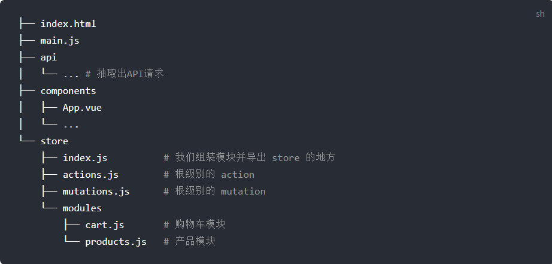

# 状态管理 vuex

## 开始

每一个 Vuex 应用的核心就是 store（仓库）。“store”基本上就是一个容器，它包含着你的应用中大部分的状态 (state)。Vuex 和单纯的全局对象有以下两点不同：

1.Vuex 的状态存储是响应式的。当 Vue 组件从 store 中读取状态的时候，若 store 中的状态发生变化，那么相应的组件也会相应地得到高效更新。

2.你不能直接改变 store 中的状态。改变 store 中的状态的唯一途径就是显式地提交 (commit) mutation。这样使得我们可以方便地跟踪每一个状态的变化，从而让我们能够实现一些工具帮助我们更好地了解我们的应用。

```js
// 如果在模块化构建系统中，请确保在开头调用了 Vue.use(Vuex)
const store = new Vuex.Store({
  state: {
    count: 0,
  },
  mutations: {
    increment(state) {
      state.count++;
    },
  },
});
// 现在，你可以通过 store.state 来获取状态对象，以及通过 store.commit 方法触发状态变更：
store.commit("increment");
console.log(store.state.count); // -> 1
```

## 核心概念

### State

Vuex 使用单一状态树——是的，用一个对象就包含了全部的应用层级状态。至此它便作为一个“唯一数据源 (SSOT)”而存在。这也意味着，每个应用将仅仅包含一个 store 实例。单一状态树让我们能够直接地定位任一特定的状态片段，在调试的过程中也能轻易地取得整个当前应用状态的快照。

那么我们如何在 Vue 组件中展示状态呢？由于 Vuex 的状态存储是响应式的，从 store 实例中读取状态最简单的方法就是在计算属性中返回某个状态：

```js
// 创建一个 Counter 组件
const Counter = {
  template: `<div>{{ count }}</div>`,
  computed: {
    count() {
      return store.state.count;
    },
  },
};
```

每当 `store.state.count` 变化的时候, 都会重新求取计算属性，并且触发更新相关联的 DOM。然而，这种模式导致组件依赖全局状态单例。在模块化的构建系统中，在每个需要使用 state 的组件中需要频繁地导入，并且在测试组件时需要模拟状态。

Vuex 通过 store 选项，提供了一种机制将状态从根组件“注入”到每一个子组件中（需调用 Vue.use(Vuex)）：

```js
const app = new Vue({
  el: "#app",
  // 把 store 对象提供给 “store” 选项，这可以把 store 的实例注入所有的子组件
  store,
  components: { Counter },
  template: `
    <div class="app">
      <counter></counter>
    </div>
  `,
});
```

通过在根实例中注册 store 选项，该 store 实例会注入到根组件下的所有子组件中，且子组件能通过 `this.$store` 访问到。让我们更新下 Counter 的实现：

```js
const Counter = {
  template: `<div>{{ count }}</div>`,
  computed: {
    count() {
      return this.$store.state.count;
    },
  },
};
```

当一个组件需要获取多个状态时候，将这些状态都声明为计算属性会有些重复和冗余。为了解决这个问题，我们可以使用 `mapState` 辅助函数帮助我们生成计算属性，让你少按几次键：

```js
// 在单独构建的版本中辅助函数为 Vuex.mapState
import { mapState } from "vuex";
export default {
  // ...
  computed: mapState({
    count: (state) => state.count, // 箭头函数可使代码更简练
    countAlias: "count", // 传字符串参数 'count' 等同于 `state => state.count`
    countPlusLocalState(state) {
      // 为了能够使用 `this` 获取局部状态，必须使用常规函数
      return state.count + this.localCount;
    },
  }),
};
```

当映射的计算属性的名称与 state 的子节点名称相同时，我们也可以给 `mapState` 传一个字符串数组。

```js
computed: mapState([
  // 映射 this.count 为 store.state.count
  "count",
]);
```

组件仍然保有局部状态:使用 Vuex 并不意味着你需要将所有的状态放入 Vuex。虽然将所有的状态放到 Vuex 会使状态变化更显式和易调试，但也会使代码变得冗长和不直观。如果有些状态严格属于单个组件，最好还是作为组件的局部状态。你应该根据你的应用开发需要进行权衡和确定

### Getter

有时候我们需要从 store 中的 state 中派生出一些状态，例如对列表进行过滤并计数：

```js
computed: {
  doneTodosCount () {
    return this.$store.state.todos.filter(todo => todo.done).length
  }
}
```

如果有多个组件需要用到此属性，我们要么复制这个函数，或者抽取到一个共享函数然后在多处导入它——无论哪种方式都不是很理想。`Vuex` 允许我们在 `store` 中定义`getter`（可以认为是 `store` 的计算属性）。就像计算属性一样，`getter` 的返回值会根据它的依赖被缓存起来，且只有当它的依赖值发生了改变才会被重新计算。

Getter 接受 state 作为其第一个参数:

```js
const store = new Vuex.Store({
  state: {
    todos: [
      { id: 1, text: "...", done: true },
      { id: 2, text: "...", done: false },
    ],
  },
  getters: {
    doneTodos: (state) => {
      return state.todos.filter((todo) => todo.done);
    },
  },
});
```

1. 通过属性访问

   Getter 会暴露为 store.getters 对象，你可以以属性的形式访问这些值：

   `store.getters.doneTodos // -> [{ id: 1, text: '...', done: true }]`

   Getter 也可以接受其他 getter 作为第二个参数：

   ```js
   getters: {
     // ...
     doneTodosCount: (state, getters) => {
       return getters.doneTodos.length;
     };
   }
   ```

   ```js
   store.getters.doneTodosCount; // -> 1
   ```

   我们可以很容易地在任何组件中使用它：

   ```js
   computed: {
     doneTodosCount () {
       return this.$store.getters.doneTodosCount
     }
   }
   ```

   注意，getter 在通过属性访问时是作为 Vue 的响应式系统的一部分缓存其中的。

2. 通过方法访问

   你也可以通过让 getter 返回一个函数，来实现给 getter 传参。在你对 store 里的数组进行查询时非常有用。

   ```js
   getters: {
     // ...
     getTodoById: (state) => (id) => {
       return state.todos.find((todo) => todo.id === id);
     };
   }
   ```

   ```js
   store.getters.getTodoById(2); // -> { id: 2, text: '...', done: false }
   ```

   注意，getter 在通过方法访问时，每次都会去进行调用，而不会缓存结果。

mapGetters 辅助函数仅仅是将 store 中的 getter 映射到局部计算属性：

```js
import { mapGetters } from "vuex";
export default {
  // ...
  computed: {
    // 使用对象展开运算符将 getter 混入 computed 对象中
    ...mapGetters([
      "doneTodosCount",
      "anotherGetter",
      // ...
    ]),
  },
};
```

如果你想将一个 getter 属性另取一个名字，使用对象形式：

```js
mapGetters({
  // 把 `this.doneCount` 映射为 `this.$store.getters.doneTodosCount`
  doneCount: "doneTodosCount",
});
```

### Mutation

更改 Vuex 的 store 中的状态的唯一方法是提交 mutation。Vuex 中的 mutation 非常类似于事件：每个 mutation 都有一个字符串的 事件类型 (type) 和 一个 回调函数 (handler)。这个回调函数就是我们实际进行状态更改的地方，并且它会接受 state 作为第一个参数：

```js
const store = new Vuex.Store({
  state: {
    count: 1,
  },
  mutations: {
    increment(state) {
      // 变更状态
      state.count++;
    },
  },
});
```

你不能直接调用一个 mutation handler。这个选项更像是事件注册：“当触发一个类型为 increment 的 mutation 时，调用此函数。”要唤醒一个 mutation handler，你需要以相应的 type 调用 store.commit 方法：

```js
store.commit("increment");
```

你可以向 store.commit 传入额外的参数，即 mutation 的 载荷（payload）：

```js
// ...
mutations: {
  increment (state, n) {
    state.count += n
  }
}
```

```js
store.commit("increment", 10);
```

在大多数情况下，载荷应该是一个对象，这样可以包含多个字段并且记录的 mutation 会更易读：

```js
// ...
mutations: {
  increment (state, payload) {
    state.count += payload.amount
  }
}
```

```js
store.commit("increment", {
  amount: 10,
});
```

提交 mutation 的另一种方式是直接使用包含 type 属性的对象：

```js
store.commit({
  type: "increment",
  amount: 10,
});
```

当使用对象风格的提交方式，整个对象都作为载荷传给 mutation 函数，因此 handler 保持不变：

```js
mutations: {
  increment (state, payload) {
    state.count += payload.amount
  }
}
```

使用常量替代 Mutation 事件类型:

使用常量替代 mutation 事件类型在各种 Flux 实现中是很常见的模式。这样可以使 linter 之类的工具发挥作用，同时把这些常量放在单独的文件中可以让你的代码合作者对整个 app 包含的 mutation 一目了然：

```js
// mutation-types.js
export const SOME_MUTATION = "SOME_MUTATION";
```

```js
// store.js
import Vuex from 'vuex'
import { SOME_MUTATION } from './mutation-types'
const store = new Vuex.Store({
  state: { ... },
  mutations: {
    // 我们可以使用 ES2015 风格的计算属性命名功能来使用一个常量作为函数名
    [SOME_MUTATION] (state) {
      // mutate state
    }
  }
})
```

用不用常量取决于你——在需要多人协作的大型项目中，这会很有帮助。但如果你不喜欢，你完全可以不这样做。

Mutation 必须是同步函数

你可以在组件中使用 this.\$store.commit('xxx') 提交 mutation，或者使用 mapMutations 辅助函数将组件中的 methods 映射为 store.commit 调用（需要在根节点注入 store）。

```js
import { mapMutations } from "vuex";
export default {
  // ...
  methods: {
    ...mapMutations([
      "increment", // 将 `this.increment()` 映射为 `this.$store.commit('increment')`

      // `mapMutations` 也支持载荷：
      "incrementBy", // 将 `this.incrementBy(amount)` 映射为 `this.$store.commit('incrementBy', amount)`
    ]),
    ...mapMutations({
      add: "increment", // 将 `this.add()` 映射为 `this.$store.commit('increment')`
    }),
  },
};
```

### Action

Action 类似于 mutation，不同在于：

- Action 提交的是 mutation，而不是直接变更状态。

- Action 可以包含任意异步操作。

让我们来注册一个简单的 action：

```js
const store = new Vuex.Store({
  state: {
    count: 0,
  },
  mutations: {
    increment(state) {
      state.count++;
    },
  },
  actions: {
    increment(context) {
      context.commit("increment");
    },
  },
});
```

Action 函数接受一个与 store 实例具有相同方法和属性的 context 对象，因此你可以调用 `context.commit` 提交一个 mutation，或者通过 `context.state` 和 `context.getters` 来获取 state 和 getters。当我们在之后介绍到 Modules 时，你就知道 context 对象为什么不是 store 实例本身了。

实践中，我们会经常用到 ES2015 的 参数解构 来简化代码（特别是我们需要调用 commit 很多次的时候）：

```js
actions: {
  increment ({ commit }) {
    commit('increment')
  }
}
```

Action 通过 store.dispatch 方法触发：

```js
store.dispatch("increment");
```

乍一眼看上去感觉多此一举，我们直接分发 mutation 岂不更方便？实际上并非如此，还记得 mutation 必须同步执行这个限制么？Action 就不受约束！我们可以在 action 内部执行异步操作：

```js
actions: {
  incrementAsync ({ commit }) {
    setTimeout(() => {
      commit('increment')
    }, 1000)
  }
}
```

Actions 支持同样的载荷方式和对象方式进行分发：

```js
// 以载荷形式分发
store.dispatch("incrementAsync", {
  amount: 10,
});
// 以对象形式分发
store.dispatch({
  type: "incrementAsync",
  amount: 10,
});
```

来看一个更加实际的购物车示例，涉及到调用异步 API 和分发多重 mutation：

```js
actions: {
  checkout ({ commit, state }, products) {
    // 把当前购物车的物品备份起来
    const savedCartItems = [...state.cart.added]
    // 发出结账请求，然后乐观地清空购物车
    commit(types.CHECKOUT_REQUEST)
    // 购物 API 接受一个成功回调和一个失败回调
    shop.buyProducts(
      products,
      // 成功操作
      () => commit(types.CHECKOUT_SUCCESS),
      // 失败操作
      () => commit(types.CHECKOUT_FAILURE, savedCartItems)
    )
  }
}
```

注意我们正在进行一系列的异步操作，并且通过提交 mutation 来记录 action 产生的副作用（即状态变更）。

在组件中分发 Action

你在组件中使用 `this.$store.dispatch('xxx')` 分发 action，或者使用 mapActions 辅助函数将组件的 methods 映射为 `store.dispatch` 调用（需要先在根节点注入 store）：

```js
import { mapActions } from "vuex";
export default {
  // ...
  methods: {
    ...mapActions([
      "increment", // 将 `this.increment()` 映射为 `this.$store.dispatch('increment')`
      // `mapActions` 也支持载荷：
      "incrementBy", // 将 `this.incrementBy(amount)` 映射为 `this.$store.dispatch('incrementBy', amount)`
    ]),
    ...mapActions({
      add: "increment", // 将 `this.add()` 映射为 `this.$store.dispatch('increment')`
    }),
  },
};
```

Action 通常是异步的，那么如何知道 action 什么时候结束呢？更重要的是，我们如何才能组合多个 action，以处理更加复杂的异步流程？

首先，你需要明白 store.dispatch 可以处理被触发的 action 的处理函数返回的 Promise，并且 store.dispatch 仍旧返回 Promise：

```js
actions: {
  actionA ({ commit }) {
    return new Promise((resolve, reject) => {
      setTimeout(() => {
        commit('someMutation')
        resolve()
      }, 1000)
    })
  }
}
```

现在你可以：

```js
store.dispatch("actionA").then(() => {
  // ...
});
```

在另外一个 action 中也可以：

```js
actions: {
  // ...
  actionB ({ dispatch, commit }) {
    return dispatch('actionA').then(() => {
      commit('someOtherMutation')
    })
  }
}
```

最后，如果我们利用 `async / await`，我们可以如下组合 action：

```js
// 假设 getData() 和 getOtherData() 返回的是 Promise

actions: {
  async actionA ({ commit }) {
    commit('gotData', await getData())
  },
  async actionB ({ dispatch, commit }) {
    await dispatch('actionA') // 等待 actionA 完成
    commit('gotOtherData', await getOtherData())
  }
}
```

> 一个 store.dispatch 在不同模块中可以触发多个 action 函数。在这种情况下，只有当所有触发函数完成后，返回的 Promise 才会执行。

### Module

由于使用单一状态树，应用的所有状态会集中到一个比较大的对象。当应用变得非常复杂时，store 对象就有可能变得相当臃肿。为了解决以上问题，Vuex 允许我们将 store 分割成模块（module）。每个模块拥有自己的 state、mutation、action、getter、甚至是嵌套子模块——从上至下进行同样方式的分割：

```js
const moduleA = {
  state: { ... },
  mutations: { ... },
  actions: { ... },
  getters: { ... }
}
const moduleB = {
  state: { ... },
  mutations: { ... },
  actions: { ... }
}
const store = new Vuex.Store({
  modules: {
    a: moduleA,
    b: moduleB
  }
})
store.state.a // -> moduleA 的状态
store.state.b // -> moduleB 的状态
```

对于模块内部的 mutation 和 getter，接收的第一个参数是模块的局部状态对象。

```js
const moduleA = {
  state: { count: 0 },
  mutations: {
    increment(state) {
      // 这里的 `state` 对象是模块的局部状态
      state.count++;
    },
  },
  getters: {
    doubleCount(state) {
      return state.count * 2;
    },
  },
};
```

同样，对于模块内部的 action，局部状态通过 context.state 暴露出来，根节点状态则为 context.rootState：

```js
const moduleA = {
  // ...
  actions: {
    incrementIfOddOnRootSum({ state, commit, rootState }) {
      if ((state.count + rootState.count) % 2 === 1) {
        commit("increment");
      }
    },
  },
};
```

对于模块内部的 getter，根节点状态会作为第三个参数暴露出来：

```js
const moduleA = {
  // ...
  getters: {
    sumWithRootCount(state, getters, rootState) {
      return state.count + rootState.count;
    },
  },
};
```

## 项目结构

Vuex 并不限制你的代码结构。但是，它规定了一些需要遵守的规则：

1. 应用层级的状态应该集中到单个 store 对象中。

2. 提交 mutation 是更改状态的唯一方法，并且这个过程是同步的。

3. 异步逻辑都应该封装到 action 里面。

只要你遵守以上规则，如何组织代码随你便。如果你的 store 文件太大，只需将 action、mutation 和 getter 分割到单独的文件。

对于大型应用，我们会希望把 Vuex 相关代码分割到模块中。下面是项目结构示例：



[购物车示例](https://github.com/vuejs/vuex/tree/dev/examples/shopping-cart)
