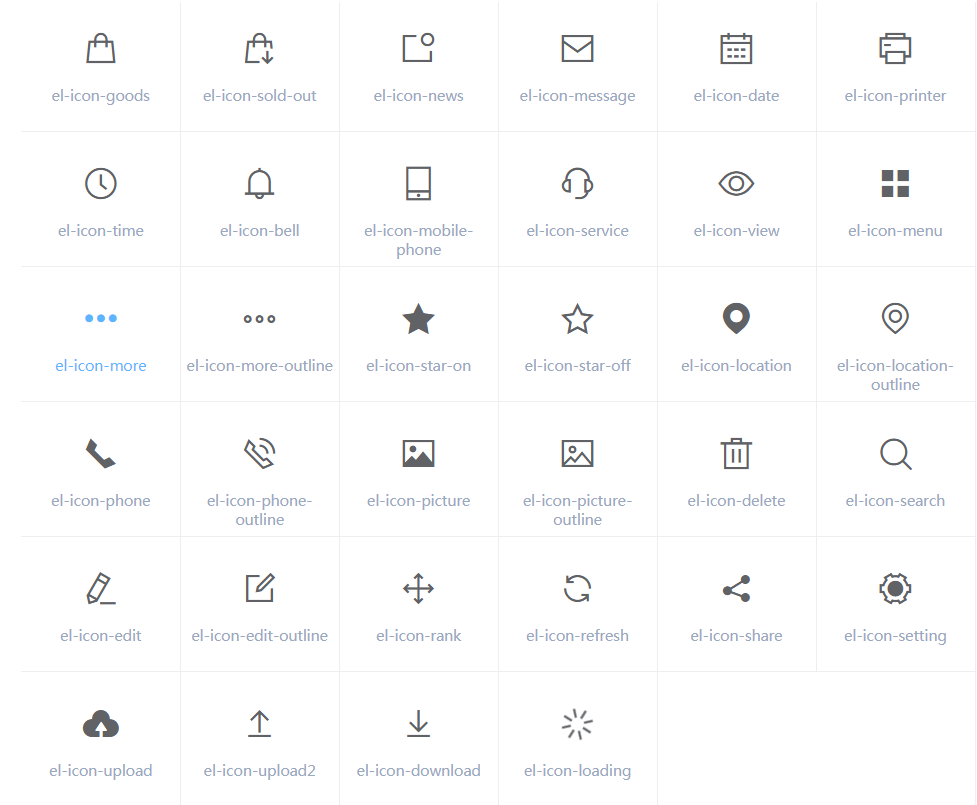
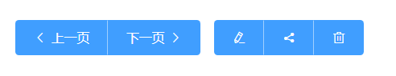
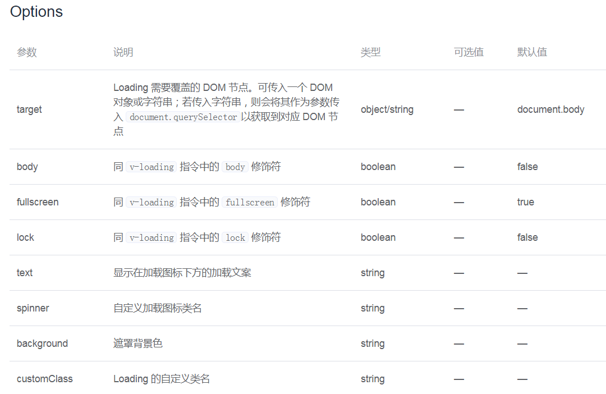
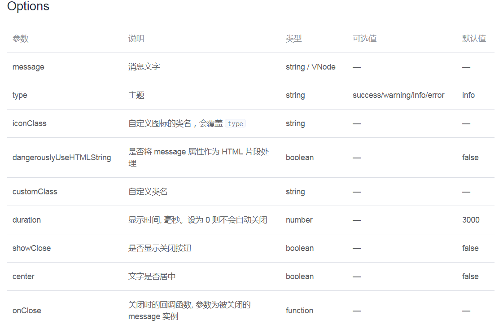

# element-ui

## 快速开始

npm i element-ui -S

```js
// main.js
import Vue from "vue";
import ElementUI from "element-ui";
import "element-ui/lib/theme-chalk/index.css";
import App from "./App.vue";
Vue.use(ElementUI);
new Vue({
  el: "#app",
  render: (h) => h(App),
});
```

## el 组件

### 内置动画

```html
<transition name="el-fade-in-linear">
  <div v-show="show" class="transition-box">.el-fade-in-linear</div>
</transition>
```

1. 淡入淡出

   el-fade-in-linear/el-fade-in

2. zoom 缩放

   el-zoom-in-center/el-zoom-in-top/el-zoom-in-bottom

3. collapse 展开折叠

   el-collapse-transition 组件

   ```html
   <el-collapse-transition>
     <div v-show="show3">
       <div class="transition-box">el-collapse-transition</div>
       <div class="transition-box">el-collapse-transition</div>
     </div>
   </el-collapse-transition>
   ```

### Layout 布局

> 通过基础的 24 分栏，迅速简便地创建布局

1. 基础布局

   通过 row 和 col 组件，并通过 col 组件的 span 属性我们就可以自由地组合布局。

   ```html
   <el-row>
     <el-col :span="12"><div class="grid-content bg-purple"></div></el-col>
     <el-col :span="12"
       ><div class="grid-content bg-purple-light"></div
     ></el-col>
   </el-row>
   ```

2. 分栏间隔

   Row 组件 提供 gutter 属性来指定每一栏之间的间隔，默认间隔为 0。

   ```html
   <el-row :gutter="20">
     <el-col :span="12"><div class="grid-content bg-purple"></div></el-col>
     <el-col :span="12"
       ><div class="grid-content bg-purple-light"></div
     ></el-col>
   </el-row>
   ```

3. 混合布局

   通过基础的 1/24 分栏任意扩展组合形成较为复杂的混合布局。

   ```html
   <el-row :gutter="20">
     <el-col :span="16"><div class="grid-content bg-purple"></div></el-col>
     <el-col :span="8"><div class="grid-content bg-purple"></div></el-col>
   </el-row>
   ```

4. 分栏偏移

   通过制定 col 组件的 offset 属性可以指定分栏偏移的栏数。

   ```html
   <el-row :gutter="20">
     <el-col :span="6"><div class="grid-content bg-purple"></div></el-col>
     <el-col :span="6" :offset="6"
       ><div class="grid-content bg-purple"></div
     ></el-col>
   </el-row>
   ```

5. 对齐方式

   将 type 属性赋值为 'flex'，可以启用 flex 布局，并可通过 justify 属性来指定 start, center, end, space-between, space-around 其中的值来定义子元素的排版方式。

   ```html
   <el-row type="flex" class="row-bg" justify="center">
     <el-col :span="6"><div class="grid-content bg-purple"></div></el-col>
     <el-col :span="6"><div class="grid-content bg-purple-light"></div></el-col>
     <el-col :span="6"><div class="grid-content bg-purple"></div></el-col>
   </el-row>
   ```

6. 响应式布局

   参照了 Bootstrap 的 响应式设计，预设了五个响应尺寸：xs、sm、md、lg 和 xl

   ```html
   <el-row :gutter="10">
     <el-col :xs="8" :sm="6" :md="4" :lg="3" :xl="1"
       ><div class="grid-content bg-purple"></div
     ></el-col>
     <el-col :xs="4" :sm="6" :md="8" :lg="9" :xl="11"
       ><div class="grid-content bg-purple-light"></div
     ></el-col>
     <el-col :xs="4" :sm="6" :md="8" :lg="9" :xl="11"
       ><div class="grid-content bg-purple"></div
     ></el-col>
     <el-col :xs="8" :sm="6" :md="4" :lg="3" :xl="1"
       ><div class="grid-content bg-purple-light"></div
     ></el-col>
   </el-row>
   ```

7. 基于断点的隐藏类

   Element 额外提供了一系列类名，用于在某些条件下隐藏元素。这些类名可以添加在任何 DOM 元素或自定义组件上。如果需要，请自行引入以下文件：`import 'element-ui/lib/theme-chalk/display.css';`

   - hidden-xs-only - 当视口在 xs 尺寸时隐藏
   - hidden-sm-only - 当视口在 sm 尺寸时隐藏
   - hidden-sm-and-down - 当视口在 sm 及以下尺寸时隐藏
   - hidden-sm-and-up - 当视口在 sm 及以上尺寸时隐藏
   - hidden-md-only - 当视口在 md 尺寸时隐藏
   - hidden-md-and-down - 当视口在 md 及以下尺寸时隐藏
   - hidden-md-and-up - 当视口在 md 及以上尺寸时隐藏
   - hidden-lg-only - 当视口在 lg 尺寸时隐藏
   - hidden-lg-and-down - 当视口在 lg 及以下尺寸时隐藏
   - hidden-lg-and-up - 当视口在 lg 及以上尺寸时隐藏
   - hidden-xl-only - 当视口在 xl 尺寸时隐藏

### Container 布局容器

用于布局的容器组件，方便快速搭建页面的基本结构：

- `<el-container>`：外层容器。当子元素中包含 `<el-header>` 或 `<el-footer>` 时，全部子元素会垂直上下排列，否则会水平左右排列。参数:direction 描述:子元素的排列方向 类型:string 可选值:horizontal / vertical 默认值:子元素中有 el-header 或 el-footer 时为 vertical，否则为 horizontal

- `<el-header>`：顶栏容器。参数:height 描述:顶栏高度 类型:string 默认值:60px

- `<el-aside>`：侧边栏容器。参数:weight 描述:侧边栏宽度 类型:string 默认值:300px

- `<el-main>`：主要区域容器。

- `<el-footer>`：底栏容器。参数:height 描述:底栏高度 类型:string 默认值:60px

> 以上组件采用了 flex 布局，使用前请确定目标浏览器是否兼容。此外，`<el-container>` 的子元素只能是后四者，后四者的父元素也只能是 `<el-container>`。

### Color & 字体 规范

主题色:蓝色#409EFF,可以修改主题

辅助色:除了主色外的场景色，需要在不同的场景中使用（例如危险色表示危险的操作）

- Success #67C23A

- Warning #E6A23C

- Danger #F56C6C

- Info #909399

中性色:中性色用于文本、背景和边框颜色。通过运用不同的中性色，来表现层次结构

- 主要文字 #303133
- 常规文字 #606266
- 次要文字 #909399
- 占位文字 #C0C4CC
- 一级边框 #DCDFE6
- 二级边框 #E4E7ED
- 三级边框 #EBEEF5
- 四级边框 #F2F6FC
- 基础黑色 #000000
- 基础白色 #FFFFFF
- 透明 Transparent

`font-family: "Helvetica Neue",Helvetica,"PingFang SC","Hiragino Sans GB","Microsoft YaHei","微软雅黑",Arial,sans-serif;`

|    层级    |     字体大小     |
| :--------: | :--------------: |
|  辅助文字  | 12px Extra Small |
| 正文（小） |    13px Small    |
|    正文    |    14px Base     |
|   小标题   |   16px Medium    |
|    标题    |    18px large    |
|   主标题   | 20px Extra large |

### icon 图标

直接通过设置类名为 el-icon-iconName 来使用即可

```html
<i class="el-icon-edit"></i>
<i class="el-icon-share"></i>
<i class="el-icon-delete"></i>
<el-button type="primary" icon="el-icon-search">搜索</el-button>
```




### Button 按钮

基本用法

使用 type、plain、round 和 circle 属性来定义 Button 的样式。

```html
<el-row>
  <el-button>默认按钮</el-button>
  <el-button type="primary">主要按钮</el-button>
  <el-button type="success">成功按钮</el-button>
  <el-button type="info">信息按钮</el-button>
  <el-button type="warning">警告按钮</el-button>
  <el-button type="danger">危险按钮</el-button>
</el-row>
<el-row>
  <el-button plain>朴素按钮</el-button>
  <el-button type="primary" plain>主要按钮</el-button>
  <el-button type="success" plain>成功按钮</el-button>
  <el-button type="info" plain>信息按钮</el-button>
  <el-button type="warning" plain>警告按钮</el-button>
  <el-button type="danger" plain>危险按钮</el-button>
</el-row>
<el-row>
  <el-button round>圆角按钮</el-button>
  <el-button type="primary" round>主要按钮</el-button>
  <el-button type="success" round>成功按钮</el-button>
  <el-button type="info" round>信息按钮</el-button>
  <el-button type="warning" round>警告按钮</el-button>
  <el-button type="danger" round>危险按钮</el-button>
</el-row>
<el-row>
  <el-button icon="el-icon-search" circle></el-button>
  <el-button type="primary" icon="el-icon-edit" circle></el-button>
  <el-button type="success" icon="el-icon-check" circle></el-button>
  <el-button type="info" icon="el-icon-message" circle></el-button>
  <el-button type="warning" icon="el-icon-star-off" circle></el-button>
  <el-button type="danger" icon="el-icon-delete" circle></el-button>
</el-row>
```


禁用状态:你可以使用 disabled 属性来定义按钮是否可用，它接受一个 Boolean 值。

文字按钮:没有边框和背景色的按钮

```html
<el-button type="text">文字按钮</el-button>
<el-button type="text" disabled>文字按钮</el-button>
```

按钮组:以按钮组的方式出现，常用于多项类似操作。使用`<el-button-group>`标签来嵌套你的按钮

```html
<el-button-group>
  <el-button type="primary" icon="el-icon-arrow-left">上一页</el-button>
  <el-button type="primary"
    >下一页<i class="el-icon-arrow-right el-icon--right"></i
  ></el-button>
</el-button-group>
<el-button-group>
  <el-button type="primary" icon="el-icon-edit"></el-button>
  <el-button type="primary" icon="el-icon-share"></el-button>
  <el-button type="primary" icon="el-icon-delete"></el-button>
</el-button-group>
```



加载中:点击按钮后进行数据加载操作，在按钮上显示加载状态。要设置为 loading 状态，只要设置 loading 属性为 true 即可。`<el-button type="primary" :loading="true">加载中</el-button>`

不同尺寸:Button 组件提供除了默认值以外的三种尺寸，可以在不同场景下选择合适的按钮尺寸.medium、small、mini，通过设置 size 属性来配置它们。`size="medium"`

默认聚焦:autofocus

## 表单

### Radio 单选框

要使用 Radio 组件，只需要设置 v-model 绑定变量，选中意味着变量的值为相应 Radio label 属性的值，label 可以是 String、Number 或 Boolean。

```html
<template>
  <el-radio v-model="radio" label="1">备选项</el-radio>
  <el-radio v-model="radio" label="2">备选项</el-radio>
</template>
<script>
  export default {
    data() {
      return {
        radio: "1",
      };
    },
  };
</script>
```

禁用状态:只要在 el-radio 元素中设置 disabled 属性即可，它接受一个 Boolean，true 为禁用。

单选框组:结合 el-radio-group 元素和子元素 el-radio 可以实现单选组，在 el-radio-group 中绑定 v-model，在 el-radio 中设置好 label 即可，无需再给每一个 el-radio 绑定变量，另外，还提供了 change 事件来响应变化，它会传入一个参数 value

```html
<template>
  <el-radio-group v-model="radio">
    <el-radio :label="3">备选项</el-radio>
    <el-radio :label="6">备选项</el-radio>
    <el-radio :label="9">备选项</el-radio>
  </el-radio-group>
</template>
<script>
  export default {
    data() {
      return {
        radio: 3,
      };
    },
  };
</script>
```

按钮样式:只需要把 el-radio 元素换成 el-radio-button 元素即可，此外，Element 还提供了 size 属性

带有边框:设置 border 属性可以渲染为带有边框的单选框。

### Checkbox 多选框

单一的:单独使用可以表示两种状态之间的切换，写在标签中的内容为 checkbox 按钮后的介绍,在 el-checkbox 元素中定义 v-model 绑定变量，单一的 checkbox 中，默认绑定变量的值会是 Boolean，选中为 true。

```html
<template>
  <!-- `checked` 为 true 或 false -->
  <el-checkbox v-model="checked">备选项</el-checkbox>
</template>
<script>
  export default {
    data() {
      return {
        checked: true,
      };
    },
  };
</script>
```

禁用状态:设置 disabled 属性即可。

多选框组:checkbox-group 元素能把多个 checkbox 管理为一组，只需要在 Group 中使用 v-model 绑定 Array 类型的变量即可。 el-checkbox 的 label 属性是该 checkbox 对应的值，若该标签中无内容，则该属性也充当 checkbox 按钮后的介绍。label 与数组中的元素值相对应，如果存在指定的值则为选中状态，否则为不选中。

```html
<template>
  <el-checkbox-group v-model="checkList">
    <el-checkbox label="复选框 A"></el-checkbox>
    <el-checkbox label="复选框 B"></el-checkbox>
    <el-checkbox label="复选框 C"></el-checkbox>
    <el-checkbox label="禁用" disabled></el-checkbox>
    <el-checkbox label="选中且禁用" disabled></el-checkbox>
  </el-checkbox-group>
</template>
<script>
  export default {
    data() {
      return {
        checkList: ["选中且禁用", "复选框 A"],
      };
    },
  };
</script>
```

indeterminate 状态:绑定 indeterminate 属性用以表示 checkbox 的不确定状态，一般用于实现全选的效果

```html
<template>
  <el-checkbox
    :indeterminate="isIndeterminate"
    v-model="checkAll"
    @change="handleCheckAllChange"
    >全选</el-checkbox
  >
  <div style="margin: 15px 0;"></div>
  <el-checkbox-group
    v-model="checkedCities"
    @change="handleCheckedCitiesChange"
  >
    <el-checkbox v-for="city in cities" :label="city" :key="city"
      >{{city}}</el-checkbox
    >
  </el-checkbox-group>
</template>
<script>
  const cityOptions = ["上海", "北京", "广州", "深圳"];
  export default {
    data() {
      return {
        checkAll: false,
        checkedCities: ["上海", "北京"],
        cities: cityOptions,
        isIndeterminate: true,
      };
    },
    methods: {
      handleCheckAllChange(val) {
        this.checkedCities = val ? cityOptions : [];
        this.isIndeterminate = false;
      },
      handleCheckedCitiesChange(value) {
        let checkedCount = value.length;
        this.checkAll = checkedCount === this.cities.length;
        this.isIndeterminate =
          checkedCount > 0 && checkedCount < this.cities.length;
      },
    },
  };
</script>
```

可选项目数量的限制:绑定 min 和 max 属性能够限制可以被勾选的项目的数量 `<el-checkbox-group :min="1" :max="2">`

按钮样式: 只需要把 el-checkbox 元素替换为 el-checkbox-button 元素即可。此外，Element 还提供了 size 属性。

带有边框:设置 border 属性可以渲染为带有边框的多选框。

### input 输入框

> Input 为受控组件，它总会显示 Vue 绑定值。通常情况下，应当处理 input 事件，并更新组件的绑定值（或使用 v-model）。否则，输入框内显示的值将不会改变。不支持 v-model 修饰符。

```html
<el-input v-model="input" placeholder="请输入内容"></el-input>
<script>
  export default {
    data() {
      return {
        input: "",
      };
    },
  };
</script>
```

禁用状态:通过 绑定 disabled 属性指定是否禁用 input 组件

可清空:使用 clearable 属性即可得到一个可清空的输入框

密码框:使用 show-password 属性即可得到一个可切换显示隐藏的密码框

带 icon 的输入框:可以通过 prefix-icon 和 suffix-icon 属性在 input 组件首部和尾部增加显示图标，也可以通过 slot 来放置图标。

```html
<div class="demo-input-suffix">
  属性方式：
  <el-input
    placeholder="请选择日期"
    suffix-icon="el-icon-date"
    v-model="input1"
  >
  </el-input>
  <el-input
    placeholder="请输入内容"
    prefix-icon="el-icon-search"
    v-model="input2"
  >
  </el-input>
</div>
<div class="demo-input-suffix">
  slot 方式：
  <el-input placeholder="请选择日期" v-model="input3">
    <i slot="suffix" class="el-input__icon el-icon-date"></i>
  </el-input>
  <el-input placeholder="请输入内容" v-model="input4">
    <i slot="prefix" class="el-input__icon el-icon-search"></i>
  </el-input>
</div>
<script>
  export default {
    data() {
      return {
        input1: "",
        input2: "",
        input3: "",
        input4: "",
      };
    },
  };
</script>
```

文本域:用于输入多行文本信息，通过将 type 属性的值指定为 textarea,文本域高度可通过 绑定 rows 属性控制

可自适应文本高度的文本域:通过设置 autosize 属性可以使得文本域的高度能够根据文本内容自动进行调整，并且 autosize 还可以设定为一个对象，指定最小行数和最大行数。`:autosize="{ minRows: 2, maxRows: 4}"/autosize`

复合型输入框:可前置或后置元素，一般为标签或按钮 可通过 slot 来指定在 input 中前置或者后置内容。

```html
<div>
  <el-input placeholder="请输入内容" v-model="input1">
    <template slot="prepend">Http://</template>
  </el-input>
</div>
<div style="margin-top: 15px;">
  <el-input placeholder="请输入内容" v-model="input2">
    <template slot="append">.com</template>
  </el-input>
</div>
<div style="margin-top: 15px;">
  <el-input placeholder="请输入内容" v-model="input3" class="input-with-select">
    <el-select v-model="select" slot="prepend" placeholder="请选择">
      <el-option label="餐厅名" value="1"></el-option>
      <el-option label="订单号" value="2"></el-option>
      <el-option label="用户电话" value="3"></el-option>
    </el-select>
    <el-button slot="append" icon="el-icon-search"></el-button>
  </el-input>
</div>
<style>
  .el-select .el-input {
    width: 130px;
  }
  .input-with-select .el-input-group__prepend {
    background-color: #fff;
  }
</style>
<script>
  export default {
    data() {
      return {
        input1: "",
        input2: "",
        input3: "",
        select: "",
      };
    },
  };
</script>
```

尺寸:可通过 size 属性指定输入框的尺寸，除了默认的大小外，还提供了 large、small 和 mini 三种尺寸。

带输入建议:autocomplete 是一个可带输入建议的输入框组件，fetch-suggestions 是一个返回输入建议的方法属性，如 querySearch(queryString, cb)，在该方法中你可以在你的输入建议数据准备好时通过 cb(data) 返回到 autocomplete 组件中。

```html
<el-row class="demo-autocomplete">
  <el-col :span="12">
    <div class="sub-title">激活即列出输入建议</div>
    <el-autocomplete
      class="inline-input"
      v-model="state1"
      :fetch-suggestions="querySearch"
      placeholder="请输入内容"
      @select="handleSelect"
    ></el-autocomplete>
  </el-col>
  <el-col :span="12">
    <div class="sub-title">输入后匹配输入建议</div>
    <el-autocomplete
      class="inline-input"
      v-model="state2"
      :fetch-suggestions="querySearch"
      placeholder="请输入内容"
      :trigger-on-focus="false"
      @select="handleSelect"
    ></el-autocomplete>
  </el-col>
</el-row>
<script>
  export default {
    data() {
      return {
        restaurants: [],
        state1: "",
        state2: "",
      };
    },
    methods: {
      querySearch(queryString, cb) {
        var restaurants = this.restaurants;
        var results = queryString
          ? restaurants.filter(this.createFilter(queryString))
          : restaurants;
        // 调用 callback 返回建议列表的数据
        cb(results);
      },
      createFilter(queryString) {
        return (restaurant) => {
          return (
            restaurant.value
              .toLowerCase()
              .indexOf(queryString.toLowerCase()) === 0
          );
        };
      },
      loadAll() {
        return [
          {
            value: "福荣祥烧腊（平溪路店）",
            address: "上海市长宁区协和路福泉路255弄57-73号",
          },
          {
            value: "速记黄焖鸡米饭",
            address: "上海市长宁区北新泾街道金钟路180号1层01号摊位",
          },
          { value: "红辣椒麻辣烫", address: "上海市长宁区天山西路492号" },
          {
            value: "(小杨生煎)西郊百联餐厅",
            address: "长宁区仙霞西路88号百联2楼",
          },
          { value: "阳阳麻辣烫", address: "天山西路389号" },
          {
            value: "南拳妈妈龙虾盖浇饭",
            address: "普陀区金沙江路1699号鑫乐惠美食广场A13",
          },
        ];
      },
      handleSelect(item) {
        console.log(item);
      },
    },
    mounted() {
      this.restaurants = this.loadAll();
    },
  };
</script>
```

自定义模板:可自定义输入建议的显示 使用 scoped slot 自定义输入建议的模板。该 scope 的参数为 item，表示当前输入建议对象。

远程搜索:从服务端搜索数据

### InputNumber 计数器

> 仅允许输入标准的数字值，可定义范围

基础用法:要使用它，只需要在`el-input-number`元素中使用`v-model`绑定变量即可，变量的初始值即为默认值。

```html
<template>
  <el-input-number
    v-model="num"
    @change="handleChange"
    :min="1"
    :max="10"
    label="描述文字"
  ></el-input-number>
</template>
<script>
  export default {
    data() {
      return {
        num: 1,
      };
    },
    methods: {
      handleChange(value) {
        console.log(value);
      },
    },
  };
</script>
```

禁用状态:disabled 属性接受一个 Boolean，设置为 true 即可禁用整个组件，如果你只需要控制数值在某一范围内，可以设置 min 属性和 max 属性，不设置 min 和 max 时，最小值为 0。

步数:允许定义递增递减的步数控制 绑定`step`属性可以控制步长，接受一个 Number。

严格步数:step-strictly 属性接受一个 Boolean。如果这个属性被设置为 true，则只能输入步数的倍数。

精度:绑定 precision 属性可以控制数值精度，接收一个 Number precision 的值必须是一个非负整数，并且不能小于 step 的小数位数。

尺寸:额外提供了 medium、small、mini 三种尺寸的数字输入框 `size="medium"`

按钮位置:设置 controls-position 属性可以控制按钮位置。`controls-position="right"`

### Select 选择器

> 当选项过多时，使用下拉菜单展示并选择内容。

基础用法:适用广泛的基础单选 `v-model`的值为当前被选中的`el-option`的 value 属性值

```html
<template>
  <el-select v-model="value" placeholder="请选择">
    <el-option
      v-for="item in options"
      :key="item.value"
      :label="item.label"
      :value="item.value"
    >
    </el-option>
  </el-select>
</template>
<script>
  export default {
    data() {
      return {
        options: [
          {
            value: "选项1",
            label: "黄金糕",
          },
          {
            value: "选项2",
            label: "双皮奶",
          },
          {
            value: "选项3",
            label: "蚵仔煎",
          },
        ],
        value: "",
      };
    },
  };
</script>
```

有禁用选项:在`el-option`中，设定 disabled 值为 true，即可禁用该选项 `:disabled="item.disabled"`

禁用状态:选择器不可用状态 为`el-select`设置`disabled`属性，则整个选择器不可用

可清空单选:包含清空按钮，可将选择器清空为初始状态 为`el-select`设置 clearable 属性，则可将选择器清空。需要注意的是，clearable 属性仅适用于单选。

基础多选:适用性较广的基础多选，用 Tag 展示已选项 为`el-select`设置 multiple 属性即可启用多选，此时 v-model 的值为当前选中值所组成的数组。默认情况下选中值会以 Tag 的形式展现，你也可以设置 collapse-tags 属性将它们合并为一段文字。

自定义模板:可以自定义备选项 将自定义的 HTML 模板插入`el-option`的 slot 中即可。

分组:备选项进行分组展示 使用`el-option-group`对备选项进行分组，它的 label 属性为分组名

```html
<template>
  <el-select v-model="value" placeholder="请选择">
    <el-option-group
      v-for="group in options"
      :key="group.label"
      :label="group.label"
    >
      <el-option
        v-for="item in group.options"
        :key="item.value"
        :label="item.label"
        :value="item.value"
      >
      </el-option>
    </el-option-group>
  </el-select>
</template>
<script>
  export default {
    data() {
      return {
        options: [
          {
            label: "热门城市",
            options: [
              {
                value: "Shanghai",
                label: "上海",
              },
              {
                value: "Beijing",
                label: "北京",
              },
            ],
          },
          {
            label: "城市名",
            options: [
              {
                value: "Chengdu",
                label: "成都",
              },
              {
                value: "Shenzhen",
                label: "深圳",
              },
            ],
          },
        ],
        value: "",
      };
    },
  };
</script>
```

可搜索:可以利用搜索功能快速查找选项 为`el-select`添加`filterable`属性即可启用搜索功能。默认情况下，Select 会找出所有 label 属性包含输入值的选项。如果希望使用其他的搜索逻辑，可以通过传入一个`filter-method`来实现。filter-method 为一个 Function，它会在输入值发生变化时调用，参数为当前输入值。

远程搜索:从服务器搜索数据，输入关键字进行查找 为了启用远程搜索，需要将`filterable`和`remote`设置为 true，同时传入一个`remote-method`。remote-method 为一个 Function，它会在输入值发生变化时调用，参数为当前输入值。需要注意的是，如果`el-option`是通过`v-for`指令渲染出来的，此时需要为`el-option`添加 key 属性，且其值需具有唯一性，比如此例中的 item.value。

创建条目:可以创建并选中选项中不存在的条目 使用`allow-create`属性即可通过在输入框中输入文字来创建新的条目。注意此时`filterable`必须为真。本例还使用了`default-first-option`属性，在该属性打开的情况下，按下回车就可以选中当前选项列表中的第一个选项，无需使用鼠标或键盘方向键进行定位。

### Cascader 级联选择器

> 当一个数据集合有清晰的层级结构时，可通过级联选择器逐级查看并选择。

基础用法:有两种触发子菜单的方式 只需为 Cascader 的 options 属性指定选项数组即可渲染出一个级联选择器。通过 expand-trigger 可以定义展开子级菜单的触发方式。本例还展示了 change 事件，它的参数为 Cascader 的绑定值：一个由各级菜单的值所组成的数组。

```html
<div class="block">
  <span class="demonstration">默认 click 触发子菜单</span>
  <el-cascader
    :options="options"
    v-model="selectedOptions"
    @change="handleChange"
  >
  </el-cascader>
</div>
<div class="block">
  <span class="demonstration">hover 触发子菜单</span>
  <el-cascader
    expand-trigger="hover"
    :options="options"
    v-model="selectedOptions2"
    @change="handleChange"
  >
  </el-cascader>
</div>
<script>
  export default {
    data() {
      return {
        options: [
          {
            value: "zhinan",
            label: "指南",
            children: [
              {
                value: "shejiyuanze",
                label: "设计原则",
                children: [
                  {
                    value: "yizhi",
                    label: "一致",
                  },
                  {
                    value: "fankui",
                    label: "反馈",
                  },
                ],
              },
              {
                value: "daohang",
                label: "导航",
                children: [
                  {
                    value: "cexiangdaohang",
                    label: "侧向导航",
                  },
                  {
                    value: "dingbudaohang",
                    label: "顶部导航",
                  },
                ],
              },
            ],
          },
        ],
        selectedOptions: [],
        selectedOptions2: [],
      };
    },
    methods: {
      handleChange(value) {
        console.log(value);
      },
    },
  };
</script>
```

禁用选项:通过在数据源中设置 `disabled` 字段来声明该选项是禁用的 `options`指定的数组中的第一个元素含有`disabled: true`键值对，因此是禁用的。在默认情况下，Cascader 会检查数据中每一项的 disabled 字段是否为 true，如果你的数据中表示禁用含义的字段名不为 disabled，可以通过 props 属性来指定（详见下方 API 表格）。当然，value、label 和 children 这三个字段名也可以通过同样的方式指定。

仅显示最后一级:可以仅在输入框中显示选中项最后一级的标签，而不是选中项所在的完整路径。属性`show-all-levels`定义了是否显示完整的路径，将其赋值为 false 则仅显示最后一级 `:show-all-levels="false"`

默认值:默认值通过数组的方式指定。 在最后写`selectedOptions: ['zujian', 'data', 'tag']`

选择即改变:点击或移入选项即表示选中该项，可用于选择任意一级菜单的选项。若需要允许用户选择任意一级选项，则可将`change-on-select`赋值为 true

动态加载次级选项:当选中某一级时，动态加载该级下的选项。利用`active-item-change`事件，可以在用户点击某个省份时拉取该省份下的城市数据。

```html
<el-cascader
  :options="options"
  @active-item-change="handleItemChange"
  :props="props"
></el-cascader>
<script>
  export default {
    data() {
      return {
        options: [
          {
            label: "江苏",
            cities: [],
          },
          {
            label: "浙江",
            cities: [],
          },
        ],
        props: {
          value: "label",
          children: "cities",
        },
      };
    },
    methods: {
      handleItemChange(val) {
        console.log("active item:", val);
        setTimeout((_) => {
          if (val.indexOf("江苏") > -1 && !this.options2[0].cities.length) {
            this.options2[0].cities = [
              {
                label: "南京",
              },
            ];
          } else if (
            val.indexOf("浙江") > -1 &&
            !this.options2[1].cities.length
          ) {
            this.options2[1].cities = [
              {
                label: "杭州",
              },
            ];
          }
        }, 300);
      },
    },
  };
</script>
```

可搜索:可以快捷地搜索选项并选择。将 filterable 赋值为 true 即可打开搜索功能。

### Switch 开关

> 表示两种相互对立的状态间的切换，多用于触发「开/关」。

基本用法:绑定`v-model`到一个 Boolean 类型的变量。可以使用`active-color`属性与`inactive-color`属性来设置开关的背景色。

```html
<el-switch v-model="value2" active-color="#13ce66" inactive-color="#ff4949">
</el-switch>
<script>
  export default {
    data() {
      return {
        value1: true,
        value2: true,
      };
    },
  };
</script>
```

文字描述:使用`active-text`属性与`inactive-text`属性来设置开关的文字描述。

扩展的 value 类型:设置`active-value`和`inactive-value`属性，接受 Boolean, String 或 Number 类型的值。

禁用状态:设置 disabled 属性，接受一个 Boolean，设置 true 即可禁用。

### Slider 滑块

> 通过拖动滑块在一个固定区间内进行选择

基础用法:在拖动滑块时，显示当前值

```html
<template>
  <div class="block">
    <span class="demonstration">默认</span>
    <el-slider v-model="value1"></el-slider>
  </div>
  <div class="block">
    <span class="demonstration">自定义初始值</span>
    <el-slider v-model="value2"></el-slider>
  </div>
  <div class="block">
    <span class="demonstration">隐藏 Tooltip</span>
    <el-slider v-model="value3" :show-tooltip="false"></el-slider>
  </div>
  <div class="block">
    <span class="demonstration">格式化 Tooltip</span>
    <el-slider v-model="value4" :format-tooltip="formatTooltip"></el-slider>
  </div>
  <div class="block">
    <span class="demonstration">禁用</span>
    <el-slider v-model="value5" disabled></el-slider>
  </div>
</template>
<script>
  export default {
    data() {
      return {
        value1: 0,
        value2: 50,
        value3: 36,
        value4: 48,
        value5: 42,
      };
    },
    methods: {
      formatTooltip(val) {
        return val / 100;
      },
    },
  };
</script>
```

离散值:选项可以是离散的 绑定`step`的值可以改变步长，通过设置`show-stops`属性可以显示间断点

带有输入框:通过输入框设置精确数值 设置`show-input`属性会在右侧显示一个输入框

范围选择:支持选择某一数值范围 设置`range`即可开启范围选择，此时绑定值是一个数组，其元素分别为最小边界值和最大边界值

竖向模式:设置`vertical`可使 Slider 变成竖向模式，此时必须设置高度 height 属性

展示标记:设置 `marks` 属性可以展示标记

```html
<template>
  <div class="block">
    <el-slider v-model="value" range :marks="marks"> </el-slider>
  </div>
</template>
<script>
  export default {
    data() {
      return {
        value: [30, 60],
        marks: {
          0: "0°C",
          8: "8°C",
          37: "37°C",
          50: {
            style: {
              color: "#1989FA",
            },
            label: this.$createElement("strong", "50%"),
          },
        },
      };
    },
  };
</script>
```

### TimePicker 时间选择器

> 用于选择或输入日期

### DatePicker 日期选择器

> 用于选择或输入日期

### DateTimePicker 日期时间选择器

### Upload 上传

> 通过点击或者拖拽上传文件

基础用法:通过 `slot` 你可以传入自定义的上传按钮类型和文字提示。可通过设置`limit`和`on-exceed`来限制上传文件的个数和定义超出限制时的行为。可通过设置`before-remove`来阻止文件移除操作。

```html
<el-upload
  class="upload-demo"
  action="https://jsonplaceholder.typicode.com/posts/"
  :on-preview="handlePreview"
  :on-remove="handleRemove"
  :before-remove="beforeRemove"
  multiple
  :limit="3"
  :on-exceed="handleExceed"
  :file-list="fileList"
>
  <el-button size="small" type="primary">点击上传</el-button>
  <div slot="tip" class="el-upload__tip">
    只能上传jpg/png文件，且不超过500kb
  </div>
</el-upload>
<script>
  export default {
    data() {
      return {
        fileList: [
          {
            name: "food.jpeg",
            url:
              "https://fuss10.elemecdn.com/3/63/4e7f3a15429bfda99bce42a18cdd1jpeg.jpeg?imageMogr2/thumbnail/360x360/format/webp/quality/100",
          },
          {
            name: "food2.jpeg",
            url:
              "https://fuss10.elemecdn.com/3/63/4e7f3a15429bfda99bce42a18cdd1jpeg.jpeg?imageMogr2/thumbnail/360x360/format/webp/quality/100",
          },
        ],
      };
    },
    methods: {
      handleRemove(file, fileList) {
        console.log(file, fileList);
      },
      handlePreview(file) {
        console.log(file);
      },
      handleExceed(files, fileList) {
        this.$message.warning(
          `当前限制选择 3 个文件，本次选择了 ${files.length} 个文件，共选择了 ${
            files.length + fileList.length
          } 个文件`
        );
      },
      beforeRemove(file, fileList) {
        return this.$confirm(`确定移除 ${file.name}？`);
      },
    },
  };
</script>
```

用户头像上传:使用 `before-upload` 限制用户上传的图片格式和大小。

照片墙:使用 `list-type` 属性来设置文件列表的样式。 `list-type="picture-card"`

图片列表缩略图:`list-type="picture"`

上传文件列表控制:通过 `on-change` 钩子函数来对列表进行控制

拖拽上传:`drag`

手动上传:`:auto-upload="false"`

### Rate 评分

基础用法:评分默认被分为三个等级，可以利用颜色数组对分数及情感倾向进行分级（默认情况下不区分颜色）。三个等级所对应的颜色用 colors 属性设置，而它们对应的两个阈值则通过 `low-threshold` 和 `high-threshold` 设定。你也可以通过传入颜色对象来自定义分段，键名为分段的界限值，键值为对应的颜色。

```html
<div class="block">
  <span class="demonstration">默认不区分颜色</span>
  <el-rate v-model="value1"></el-rate>
</div>
<div class="block">
  <span class="demonstration">区分颜色</span>
  <el-rate v-model="value2" :colors="colors"> </el-rate>
</div>
<script>
  export default {
    data() {
      return {
        value1: null,
        value2: null,
        colors: ["#99A9BF", "#F7BA2A", "#FF9900"], // 等同于 { 2: '#99A9BF', 4: { value: '#F7BA2A', excluded: true }, 5: '#FF9900' }
      };
    },
  };
</script>
```

辅助文字:用辅助文字直接地表达对应分数 为组件设置 `show-text` 属性会在右侧显示辅助文字。通过设置 texts 可以为每一个分值指定对应的辅助文字。texts 为一个数组，长度应等于最大值 max。

### Transfer 穿梭框

基础用法:Transfer 的数据通过 data 属性传入。数据需要是一个对象数组，每个对象有以下属性：key 为数据的唯一性标识，label 为显示文本，disabled 表示该项数据是否禁止转移。目标列表中的数据项会同步到绑定至 v-model 的变量，值为数据项的 key 所组成的数组。当然，如果希望在初始状态时目标列表不为空，可以像本例一样为 v-model 绑定的变量赋予一个初始值。

```html
<template>
  <el-transfer v-model="value" :data="data"></el-transfer>
</template>
<script>
  export default {
    data() {
      const generateData = (_) => {
        const data = [];
        for (let i = 1; i <= 15; i++) {
          data.push({
            key: i,
            label: `备选项 ${i}`,
            disabled: i % 4 === 0,
          });
        }
        return data;
      };
      return {
        data: generateData(),
        value: [1, 4],
      };
    },
  };
</script>
```

可搜索:在数据很多的情况下，可以对数据进行搜索和过滤。设置 `filterable` 为 true 即可开启搜索模式。默认情况下，若数据项的 label 属性包含搜索关键字，则会在搜索结果中显示。你也可以使用 filter-method 定义自己的搜索逻辑。filter-method 接收一个方法，当搜索关键字变化时，会将当前的关键字和每个数据项传给该方法。若方法返回 true，则会在搜索结果中显示对应的数据项。

可自定义:可以对列表标题文案、按钮文案、数据项的渲染函数、列表底部的勾选状态文案、列表底部的内容区等进行自定义。可以使用 titles、button-texts、render-content 和 format 属性分别对列表标题文案、按钮文案、数据项的渲染函数和列表顶部的勾选状态文案进行自定义。数据项的渲染还可以使用 scoped-slot 进行自定义。对于列表底部的内容区，提供了两个具名 slot：left-footer 和 right-footer。此外，如果希望某些数据项在初始化时就被勾选，可以使用 left-default-checked 和 right-default-checked 属性。最后，本例还展示了 change 事件的用法。注意：由于 jsfiddle 不支持 JSX 语法，所以使用 render-content 自定义数据项的例子在 jsfiddle 中无法运行。但是在实际的项目中，只要正确地配置了相关依赖，就可以正常运行。

数据项属性别名:默认情况下，Transfer 仅能识别数据项中的 key、label 和 disabled 字段。如果你的数据的字段名不同，可以使用 props 属性为它们设置别名。

### Form 表单

> 由输入框、选择器、单选框、多选框等控件组成，用以收集、校验、提交数据

典型表单:包括各种表单项，比如输入框、选择器、开关、单选框、多选框等 在 Form 组件中，每一个表单域由一个 Form-Item 组件构成，表单域中可以放置各种类型的表单控件，包括 Input、Select、Checkbox、Radio、Switch、DatePicker、TimePicker

```html
<el-form ref="form" :model="form" label-width="80px">
  <el-form-item label="活动名称">
    <el-input v-model="form.name"></el-input>
  </el-form-item>
  <el-form-item label="活动区域">
    <el-select v-model="form.region" placeholder="请选择活动区域">
      <el-option label="区域一" value="shanghai"></el-option>
      <el-option label="区域二" value="beijing"></el-option>
    </el-select>
  </el-form-item>
  <el-form-item label="活动时间">
    <el-col :span="11">
      <el-date-picker
        type="date"
        placeholder="选择日期"
        v-model="form.date1"
        style="width: 100%;"
      ></el-date-picker>
    </el-col>
    <el-col class="line" :span="2">-</el-col>
    <el-col :span="11">
      <el-time-picker
        placeholder="选择时间"
        v-model="form.date2"
        style="width: 100%;"
      ></el-time-picker>
    </el-col>
  </el-form-item>
  <el-form-item label="即时配送">
    <el-switch v-model="form.delivery"></el-switch>
  </el-form-item>
  <el-form-item label="活动性质">
    <el-checkbox-group v-model="form.type">
      <el-checkbox label="美食/餐厅线上活动" name="type"></el-checkbox>
      <el-checkbox label="地推活动" name="type"></el-checkbox>
      <el-checkbox label="线下主题活动" name="type"></el-checkbox>
      <el-checkbox label="单纯品牌曝光" name="type"></el-checkbox>
    </el-checkbox-group>
  </el-form-item>
  <el-form-item label="特殊资源">
    <el-radio-group v-model="form.resource">
      <el-radio label="线上品牌商赞助"></el-radio>
      <el-radio label="线下场地免费"></el-radio>
    </el-radio-group>
  </el-form-item>
  <el-form-item label="活动形式">
    <el-input type="textarea" v-model="form.desc"></el-input>
  </el-form-item>
  <el-form-item>
    <el-button type="primary" @click="onSubmit">立即创建</el-button>
    <el-button>取消</el-button>
  </el-form-item>
</el-form>
<script>
  export default {
    data() {
      return {
        form: {
          name: "",
          region: "",
          date1: "",
          date2: "",
          delivery: false,
          type: [],
          resource: "",
          desc: "",
        },
      };
    },
    methods: {
      onSubmit() {
        console.log("submit!");
      },
    },
  };
</script>
```

当一个 form 元素中只有一个输入框时，在该输入框中按下回车应提交该表单。如果希望阻止这一默认行为，可以在 `<el-form>` 标签上添加 `@submit.native.prevent`。

行内表单:当垂直方向空间受限且表单较简单时，可以在一行内放置表单。设置 `inline` 属性可以让表单域变为行内的表单域 `:inline="true"`

对齐方式:根据具体目标和制约因素，选择最佳的标签对齐方式。通过设置 `label-position` 属性可以改变表单域标签的位置，可选值为 top、right、left，当设为 top 时标签会置于表单域的顶部

```html
<el-radio-group v-model="labelPosition" size="small">
  <el-radio-button label="left">左对齐</el-radio-button>
  <el-radio-button label="right">右对齐</el-radio-button>
  <el-radio-button label="top">顶部对齐</el-radio-button>
</el-radio-group>
<div style="margin: 20px;"></div>
<el-form
  :label-position="labelPosition"
  label-width="80px"
  :model="formLabelAlign"
>
  <el-form-item label="名称">
    <el-input v-model="formLabelAlign.name"></el-input>
  </el-form-item>
  <el-form-item label="活动区域">
    <el-input v-model="formLabelAlign.region"></el-input>
  </el-form-item>
  <el-form-item label="活动形式">
    <el-input v-model="formLabelAlign.type"></el-input>
  </el-form-item>
</el-form>
<script>
  export default {
    data() {
      return {
        labelPosition: "right",
        formLabelAlign: {
          name: "",
          region: "",
          type: "",
        },
      };
    },
  };
</script>
```

表单验证:在防止用户犯错的前提下，尽可能让用户更早地发现并纠正错误。Form 组件提供了表单验证的功能，只需要通过 rules 属性传入约定的验证规则，并将 Form-Item 的 prop 属性设置为需校验的字段名即可。校验规则参见 async-validator

```html
<el-form
  :model="ruleForm"
  :rules="rules"
  ref="ruleForm"
  label-width="100px"
  class="demo-ruleForm"
>
  <el-form-item label="活动名称" prop="name">
    <el-input v-model="ruleForm.name"></el-input>
  </el-form-item>
  <el-form-item>
    <el-button type="primary" @click="submitForm('ruleForm')"
      >立即创建</el-button
    >
    <el-button @click="resetForm('ruleForm')">重置</el-button>
  </el-form-item>
</el-form>
<script>
  export default {
    data() {
      return {
        ruleForm: {
          name: "",
        },
        rules: {
          name: [
            { required: true, message: "请输入活动名称", trigger: "blur" },
            {
              min: 3,
              max: 5,
              message: "长度在 3 到 5 个字符",
              trigger: "blur",
            },
          ],
        },
      };
    },
    methods: {
      submitForm(formName) {
        this.$refs[formName].validate((valid) => {
          if (valid) {
            alert("submit!");
          } else {
            console.log("error submit!!");
            return false;
          }
        });
      },
      resetForm(formName) {
        this.$refs[formName].resetFields();
      },
    },
  };
</script>
```

校验规则:{type:string/number/boolean/method/regexp/integer/float/array/object/enum/date/url/hex/email,
required:true,pattern:regular expression,min:,max:,len://对于数组或字符串比较 length 属性,对于数字则为等于 len,
enum:["可能值 1","可能值 2"]//同时 type:"enum",message:可以为一个字符串/jsx format/函数,trigger:blur/change

自定义校验规则:status-icon 属性为输入框添加了表示校验结果的反馈图标,加在`el-form`中 自定义校验 callback 必须被调用。

```js
var checkAge = (rule, value, callback) => {
  if (!value) {
    return callback(new Error("年龄不能为空"));
  }
  setTimeout(() => {
    if (!Number.isInteger(value)) {
      callback(new Error("请输入数字值"));
    } else {
      if (value < 18) {
        callback(new Error("必须年满18岁"));
      } else {
        callback();
      }
    }
  }, 1000);
};
```

动态增减表单项:除了在 Form 组件上一次性传递所有的验证规则外还可以在单个的表单域上传递属性的验证规则

```html
<el-form
  :model="dynamicValidateForm"
  ref="dynamicValidateForm"
  label-width="100px"
  class="demo-dynamic"
>
  ...
  <el-button @click="addDomain">新增域名</el-button>
  ...
  <script>
    export default {
      data() {
        return {
          dynamicValidateForm: {
            domains: [
              {
                value: "",
              },
            ],
            email: "",
          },
        };
      },
      methods: {
        addDomain() {
          this.dynamicValidateForm.domains.push({
            value: "",
            key: Date.now(),
          });
        },
      },
    };
  </script></el-form
>
```

数字类型验证:数字类型的验证需要在 v-model 处加上 `.number` 的修饰符，这是 Vue 自身提供的用于将绑定值转化为 number 类型的修饰符。

嵌套在 el-form-item 中的 el-form-item 标签宽度默认为零，不会继承 el-form 的 label-width。如果需要可以为其单独设置 label-width 属性。

表单内组件尺寸控制:通过设置 Form 上的 size 属性可以使该表单内所有可调节大小的组件继承该尺寸。Form-Item 也具有该属性。

## Data

### Table 表格

> 用于展示多条结构类似的数据，可对数据进行排序、筛选、对比或其他自定义操作。

基础表格:基础的表格展示用法。当`el-table`元素中注入 data 对象数组后，在`el-table-column`中用 prop 属性来对应对象中的键名即可填入数据，用 label 属性来定义表格的列名。可以使用 width 属性来定义列宽。

```html
<template>
  <el-table :data="tableData" style="width: 100%">
    <el-table-column prop="date" label="日期" width="180"> </el-table-column>
    <el-table-column prop="name" label="姓名" width="180"> </el-table-column>
    <el-table-column prop="address" label="地址"> </el-table-column>
  </el-table>
</template>

<script>
  export default {
    data() {
      return {
        tableData: [
          {
            date: "2016-05-02",
            name: "王小虎",
            address: "上海市普陀区金沙江路 1518 弄",
          },
          {
            date: "2016-05-04",
            name: "王小虎",
            address: "上海市普陀区金沙江路 1517 弄",
          },
          {
            date: "2016-05-01",
            name: "王小虎",
            address: "上海市普陀区金沙江路 1519 弄",
          },
          {
            date: "2016-05-03",
            name: "王小虎",
            address: "上海市普陀区金沙江路 1516 弄",
          },
        ],
      };
    },
  };
</script>
```

带斑马纹表格:使用带斑马纹的表格，可以更容易区分出不同行的数据。stripe 属性可以创建带斑马纹的表格。它接受一个 Boolean，默认为 false，设置为 true 即为启用。

带边框表格:默认情况下，Table 组件是不具有竖直方向的边框的，如果需要，可以使用 border 属性，它接受一个 Boolean，设置为 true 即可启用。

带状态表格:可将表格内容 highlight 显示，方便区分「成功、信息、警告、危险」等内容。可以通过指定 Table 组件的 `row-class-name` 属性来为 Table 中的某一行添加 class，表明该行处于某种状态。

固定表头:纵向内容过多时，可选择固定表头。只要在`el-table`元素中定义了 height 属性，即可实现固定表头的表格，而不需要额外的代码。`height="250"`

固定列:横向内容过多时，可选择固定列。固定列需要使用 fixed 属性，它接受 Boolean 值或者 leftright，表示左边固定还是右边固定。`fixed="right"`

固定列和表头:横纵内容过多时，可选择固定列和表头。固定列和表头可以同时使用，只需要将上述两个属性分别设置好即可。

流体高度:当数据量动态变化时，可以为 Table 设置一个最大高度。通过设置 max-height 属性为 Table 指定最大高度。此时若表格所需的高度大于最大高度，则会显示一个滚动条 `max-height="250"`

多级表头:数据结构比较复杂的时候，可使用多级表头来展现数据的层次关系。只需要在 el-table-column 里面嵌套 el-table-column，就可以实现多级表头。

单选:选择单行数据时使用色块表示。Table 组件提供了单选的支持，只需要配置`highlight-current-row`属性即可实现单选。之后由 current-change 事件来管理选中时触发的事件，它会传入 currentRow，oldCurrentRow。如果需要显示索引，可以增加一列 el-table-column，设置 type 属性为 index 即可显示从 1 开始的索引号。

多选:选择多行数据时使用 Checkbox。实现多选非常简单: 手动添加一个`el-table-column`，设 type 属性为 selection 即可；默认情况下若内容过多会折行显示，若需要单行显示可以使用 show-overflow-tooltip 属性，它接受一个 Boolean，为 true 时多余的内容会在 hover 时以 tooltip 的形式显示出来。

排序:对表格进行排序，可快速查找或对比数据。在列中设置 sortable 属性即可实现以该列为基准的排序，接受一个 Boolean，默认为 false。可以通过 Table 的 default-sort 属性设置默认的排序列和排序顺序。可以使用 sort-method 或者 sort-by 使用自定义的排序规则。如果需要后端排序，需将 sortable 设置为 custom，同时在 Table 上监听 sort-change 事件，在事件回调中可以获取当前排序的字段名和排序顺序，从而向接口请求排序后的表格数据。在本例中，我们还使用了 formatter 属性，它用于格式化指定列的值，接受一个 Function，会传入两个参数：row 和 column，可以根据自己的需求进行处理。`:default-sort = "{prop: 'date', order: 'descending'}"`

筛选:对表格进行筛选，可快速查找到自己想看的数据。在列中设置`filters` `filter-method`属性即可开启该列的筛选，filters 是一个数组，filter-method 是一个方法，它用于决定某些数据是否显示，会传入三个参数：value, row 和 column。

自定义列模板:自定义列的显示内容，可组合其他组件使用。

展开行:当行内容过多并且不想显示横向滚动条时，可以使用 Table 展开行功能。通过设置 `type="expand"` 和 `Scoped slot` 可以开启展开行功能，`el-table-column` 的模板会被渲染成为展开行的内容，展开行可访问的属性与使用自定义列模板时的 `Scoped slot` 相同。

```html
<el-table-column type="expand">
  <template slot-scope="props">
    <el-form label-position="left" inline class="demo-table-expand">
      <el-form-item label="商品名称">
        <span>{{ props.row.name }}</span>
      </el-form-item></el-form
    ></template
  ></el-table-column
>
```

树形数据与懒加载:支持树类型的数据。此时，必须要指定 row-key。支持子节点数据异步加载。设置 Table 的 lazy 属性为 true 与 加载函数 load ，指定 row 中的 hasChildren 来确定哪些行是包含子节点。

自定义表头:表头支持自定义。通过设置 `Scoped slot` 来自定义表头。

表尾合计行:若表格展示的是各类数字，可以在表尾显示各列的合计。将`show-summary`设置为 true 就会在表格尾部展示合计行。默认情况下，对于合计行，第一列不进行数据求合操作，而是显示「合计」二字（可通过 sum-text 配置），其余列会将本列所有数值进行求合操作，并显示出来。当然，你也可以定义自己的合计逻辑。使用 summary-method 并传入一个方法，返回一个数组，这个数组中的各项就会显示在合计行的各列中，具体可以参考本例中的第二个表格。

合并行或列:多行或多列共用一个数据时，可以合并行或列。通过给 table 传入 span-method 方法可以实现合并行或列，方法的参数是一个对象，里面包含当前行 row、当前列 column、当前行号 rowIndex、当前列号 columnIndex 四个属性。该函数可以返回一个包含两个元素的数组，第一个元素代表 rowspan，第二个元素代表 colspan。 也可以返回一个键名为 rowspan 和 colspan 的对象。

自定义索引:自定义 type=index 列的行号。通过给 type=index 的列传入 index 属性，可以自定义索引。该属性传入数字时，将作为索引的起始值。也可以传入一个方法，它提供当前行的行号（从 0 开始）作为参数，返回值将作为索引展示。

```html
<el-table-column type="index" :index="indexMethod"> </el-table-column>
```

### Tag 标签

基础用法:由 type 属性来选择 tag 的类型，也可以通过 color 属性来自定义背景色。

```html
<el-tag>标签一</el-tag>
<el-tag type="success">标签二</el-tag>
<el-tag type="info">标签三</el-tag>
<el-tag type="warning">标签四</el-tag>
<el-tag type="danger">标签五</el-tag>
```

可移除标签:设置 closable 属性可以定义一个标签是否可移除。默认的标签移除时会附带渐变动画，如果不想使用，可以设置 disable-transitions 属性，它接受一个 Boolean，true 为关闭。

动态编辑标签:动态编辑标签可以通过点击标签关闭按钮后触发的 close 事件来实现 `@close="handleClose(tag)"`

不同尺寸:Tag 组件提供除了默认值以外的三种尺寸，可以在不同场景下选择合适的按钮尺寸。额外的尺寸：medium、small、mini，通过设置 size 属性来配置它们。

### Progress 进度条

> 用于展示操作进度，告知用户当前状态和预期。

线形进度条 — 百分比外显:Progress 组件设置 percentage 属性即可，表示进度条对应的百分比，必填，必须在 0-100。

```html
<el-progress :percentage="80" color="#8e71c7"></el-progress>
<el-progress :percentage="100" status="success"></el-progress>
<el-progress :percentage="50" status="exception"></el-progress>
```

线形进度条 — 百分比内显:百分比不占用额外控件，适用于文件上传等场景。

线形进度条 — 百分比内显:百分比不占用额外控件，适用于文件上传等场景。Progress 组件可通过 stroke-width 属性更改进度条的高度，并可通过 text-inside 属性来将进度条描述置于进度条内部。`:text-inside="true" :stroke-width="18"`

环形进度条:Progress 组件可通过 type 属性来指定使用环形进度条，在环形进度条中，还可以通过 width 属性来设置其大小`type="circle"`

### Tree 树形控件

> 用清晰的层级结构展示信息，可展开或折叠。

基础用法:基础的树形结构展示。

```html
<el-tree
  :data="data"
  :props="defaultProps"
  @node-click="handleNodeClick"
></el-tree>
<script>
  export default {
    data() {
      return {
        data: [
          {
            label: "一级 1",
            children: [
              {
                label: "二级 1-1",
                children: [
                  {
                    label: "三级 1-1-1",
                  },
                ],
              },
            ],
          },
        ],
        defaultProps: {
          children: "children",
          label: "label",
        },
      };
    },
    methods: {
      handleNodeClick(data) {
        console.log(data);
      },
    },
  };
</script>
```

可选择:适用于需要选择层级时使用。

```html
<el-tree
  :props="props"
  :load="loadNode"
  lazy
  show-checkbox
  @check-change="handleCheckChange"
>
</el-tree>
```

懒加载自定义叶子节点:由于在点击节点时才进行该层数据的获取，默认情况下 Tree 无法预知某个节点是否为叶子节点，所以会为每个节点添加一个下拉按钮，如果节点没有下层数据，则点击后下拉按钮会消失。同时，你也可以提前告知 Tree 某个节点是否为叶子节点，从而避免在叶子节点前渲染下拉按钮

```html
<el-tree
  :props="props"
  :load="loadNode1"
  lazy
  show-checkbox>
</el-tree>
<script>
  export default {
    data() {
      return {
        props: {
          label: 'name',
          children: 'zones',
          isLeaf: 'leaf' // 叶子节点
        },
      };
    },
    // ...
```

默认展开和默认选中:可将 Tree 的某些节点设置为默认展开或默认选中 分别通过`default-expanded-keys`和`default-checked-keys`设置默认展开和默认选中的节点。需要注意的是，此时必须设置 node-key，其值为节点数据中的一个字段名，该字段在整棵树中是唯一的。

```html
<el-tree
  :data="data"
  show-checkbox
  node-key="id"
  :default-expanded-keys="[2, 3]"
  :default-checked-keys="[5]"
  :props="defaultProps"
>
</el-tree>
```

禁用状态:可将 Tree 的某些节点设置为禁用状态 通过 disabled 设置禁用状态。

```html
<script>
  export default {
    data() {
      return {
        props: {
          label: 'name',
          children: 'zones',
          isLeaf: 'leaf' // 叶子节点
          disabled: true
        },
      };
    },
    // ..
```

节点过滤:通过关键字过滤树节点 在需要对节点进行过滤时，调用 Tree 实例的 filter 方法，参数为关键字。需要注意的是，此时需要设置 filter-node-method，值为过滤函数。

```html
<el-input
  placeholder="输入关键字进行过滤"
  v-model="filterText">
</el-input>
<el-tree
  ...
  :filter-node-method="filterNode">
</el-tree>
<script>
  export default {
    methods: {
      filterNode(value, data) {
        if (!value) return true;
        return data.label.indexOf(value) !== -1;
      }
    },
```

手风琴模式:对于同一级的节点，每次只能展开一个 在 `el-tree` 中 设置 accordion 属性

可拖拽节点:通过 draggable 属性可让节点变为可拖拽。

### Pagination 分页

> 当数据量过多时，使用分页分解数据。

基础用法:设置`layout`，表示需要显示的内容，用逗号分隔，布局元素会依次显示。`prev`表示上一页，`next`为下一页，`pager`表示页码列表，除此以外还提供了`jumper`和`total`，`size`和特殊的布局符号`->`，`->`后的元素会靠右显示，`jumper`表示跳页元素，`total`表示总条目数，`size`用于设置每页显示的页码数量。

```html
<div class="block">
  <span class="demonstration">页数较少时的效果</span>
  <el-pagination layout="prev, pager, next" :total="50"> </el-pagination>
</div>
<div class="block">
  <span class="demonstration">大于 7 页时的效果</span>
  <el-pagination layout="prev, pager, next" :total="1000"> </el-pagination>
</div>
```

设置最大页码按钮数:默认情况下，当总页数超过 7 页时，Pagination 会折叠多余的页码按钮。通过 pager-count 属性可以设置最大页码按钮数。`:pager-count="11"`

带有背景色的分页:设置 background 属性可以为分页按钮添加背景色。 `background`

小型分页:在空间有限的情况下，可以使用简单的小型分页。只需要一个 small 属性，它接受一个 Boolean，默认为 false，设为 true 即可启用。

附加功能:根据场景需要，可以添加其他功能模块。此例是一个完整的用例，使用了 size-change 和 current-change 事件来处理页码大小和当前页变动时候触发的事件。page-sizes 接受一个整型数组，数组元素为展示的选择每页显示个数的选项，[100, 200, 300, 400]表示四个选项，每页显示 100 个，200 个，300 个或者 400 个。

```html
<!-- 跳页 -->
<div class="block">
  <span class="demonstration">直接前往</span>
  <el-pagination
    @current-change="handleCurrentChange"
    :current-page.sync="currentPage3"
    :page-size="100"
    layout="prev, pager, next, jumper"
    :total="1000"
  >
  </el-pagination>
</div>
```

当只有一页时隐藏分页:当只有一页时，通过设置 hide-on-single-page 属性来隐藏分页。`:hide-on-single-page="false"`

### Badge 标记

> 出现在按钮、图标旁的数字或状态标记。

基础用法:展示新消息数量。定义 value 属性，它接受 Number 或者 String。

```html
<el-badge :value="12" class="item">
  <el-button size="small">评论</el-button>
</el-badge>
<el-badge :value="3" class="item">
  <el-button size="small">回复</el-button>
</el-badge>
<el-badge :value="1" class="item" type="primary">
  <el-button size="small">评论</el-button>
</el-badge>
<el-badge :value="2" class="item" type="warning">
  <el-button size="small">回复</el-button>
</el-badge>
<el-dropdown trigger="click">
  <span class="el-dropdown-link">
    点我查看<i class="el-icon-caret-bottom el-icon--right"></i>
  </span>
  <el-dropdown-menu slot="dropdown">
    <el-dropdown-item class="clearfix">
      评论
      <el-badge class="mark" :value="12" />
    </el-dropdown-item>
    <el-dropdown-item class="clearfix">
      回复
      <el-badge class="mark" :value="3" />
    </el-dropdown-item>
  </el-dropdown-menu>
</el-dropdown>
<style>
  .item {
    margin-top: 10px;
    margin-right: 40px;
  }
</style>
```

最大值:可自定义最大值。由 max 属性定义，它接受一个 Number，需要注意的是，只有当 value 为 Number 时，它才会生效。`:max="99"`

自定义内容:可以显示数字以外的文本内容。定义 value 为 String 类型时可以用于显示自定义文本。

小红点:以红点的形式标注需要关注的内容。除了数字外，设置 is-dot 属性，它接受一个 Boolean

## Notice

### Alert 警告

> 用于页面中展示重要的提示信息。

基本用法:页面中的非浮层元素，不会自动消失。Alert 组件提供四种主题，由 type 属性指定，默认值为 info。

```html
<template>
  <el-alert title="成功提示的文案" type="success/info/warning/error">
  </el-alert>
</template>
```

主题:Alert 组件提供了两个不同的主题：light 和 dark。通过设置 effect 属性来改变主题，默认为 light。`effect="dark"`

自定义关闭按钮:自定义关闭按钮为文字或其他符号。在 Alert 组件中，你可以设置是否可关闭，关闭按钮的文本以及关闭时的回调函数。closable 属性决定是否可关闭，接受 boolean，默认为 true。你可以设置 close-text 属性来代替右侧的关闭图标，注意：close-text 必须为文本。设置 close 事件来设置关闭时的回调。`:closable="false"` `close-text="知道了"` `@close="hello"`

带有 icon:表示某种状态时提升可读性。通过设置 show-icon 属性来显示 Alert 的 icon，这能更有效地向用户展示你的显示意图。`show-icon`

文字居中:使用 center 属性让文字水平居中。 `center`

带有辅助性文字介绍:包含标题和内容，解释更详细的警告。除了必填的 title 属性外，你可以设置 description 属性来帮助你更好地介绍，我们称之为辅助性文字。辅助性文字只能存放单行文本，会自动换行显示。

### Loading 加载

> 加载数据时显示动效。

区域加载:在表格等容器中加载数据时显示。Element 提供了两种调用 Loading 的方法：指令和服务。对于自定义指令 v-loading，只需要绑定 Boolean 即可。默认状况下，Loading 遮罩会插入到绑定元素的子节点，通过添加 body 修饰符，可以使遮罩插入至 DOM 中的 body 上。

```html
<template>
  <el-table v-loading="loading" :data="tableData" style="width: 100%">
    ...
  </el-table>
</template>
```

自定义:可自定义加载文案、图标和背景色。在绑定了 v-loading 指令的元素上添加 element-loading-text 属性，其值会被渲染为加载文案，并显示在加载图标的下方。类似地，element-loading-spinner 和 element-loading-background 属性分别用来设定图标类名和背景色值。

```html
<el-table
  v-loading="loading"
  element-loading-text="拼命加载中"
  element-loading-spinner="el-icon-loading"
  element-loading-background="rgba(0, 0, 0, 0.8)"
>
</el-table>
```

整页加载:页面数据加载时显示。当使用指令方式时，全屏遮罩需要添加 fullscreen 修饰符（遮罩会插入至 body 上），此时若需要锁定屏幕的滚动，可以使用 lock 修饰符；当使用服务方式时，遮罩默认即为全屏，无需额外设置。

```html
<template>
  <el-button
    type="primary"
    @click="openFullScreen"
    v-loading.fullscreen.lock="fullscreenLoading"
  >
    指令方式
  </el-button>
  <el-button type="primary" @click="openFullScreen">
    服务方式
  </el-button>
</template>
<script>
  export default {
    data() {
      return {
        fullscreenLoading: false,
      };
    },
    methods: {
      openFullScreen() {
        this.fullscreenLoading = true;
        setTimeout(() => {
          this.fullscreenLoading = false;
        }, 2000);
      },
      openFullScreen() {
        const loading = this.$loading({
          lock: true,
          text: "Loading",
          spinner: "el-icon-loading",
          background: "rgba(0, 0, 0, 0.7)",
        });
        setTimeout(() => {
          loading.close();
        }, 2000);
      },
    },
  };
</script>
```

服务 Loading 还可以以服务的方式调用。引入 Loading 服务：`import { Loading } from 'element-ui';`在需要调用时：`Loading.service(options);`其中 options 参数为 Loading 的配置项，具体见下表。LoadingService 会返回一个 Loading 实例，可通过调用该实例的 close 方法来关闭它：

```js
let loadingInstance = Loading.service(options);
this.$nextTick(() => {
  // 以服务的方式调用的 Loading 需要异步关闭
  loadingInstance.close();
});
```

需要注意的是，以服务的方式调用的全屏 Loading 是单例的：若在前一个全屏 Loading 关闭前再次调用全屏 Loading，并不会创建一个新的 Loading 实例，而是返回现有全屏 Loading 的实例：

```js
let loadingInstance1 = Loading.service({ fullscreen: true });
let loadingInstance2 = Loading.service({ fullscreen: true });
console.log(loadingInstance1 === loadingInstance2); // true
```

此时调用它们中任意一个的 close 方法都能关闭这个全屏 Loading。

如果完整引入了 Element，那么 Vue.prototype 上会有一个全局方法 $loading，它的调用方式为：this.$loading(options)，同样会返回一个 Loading 实例。



### Message 消息提示

> 常用于主动操作后的反馈提示。与 Notification 的区别是后者更多用于系统级通知的被动提醒。

基础用法:从顶部出现，3 秒后自动消失。Message 在配置上与 Notification 非常类似，所以部分 options 在此不做详尽解释，文末有 options 列表，可以结合 Notification 的文档理解它们。Element 注册了一个\$message 方法用于调用，Message 可以接收一个字符串或一个 VNode 作为参数，它会被显示为正文内容。

```html
<template>
  <el-button :plain="true" @click="open">打开消息提示</el-button>
  <el-button :plain="true" @click="openVn">VNode</el-button>
</template>
<script>
  export default {
    methods: {
      open() {
        this.$message("这是一条消息提示");
      },
      openVn() {
        const h = this.$createElement;
        this.$message({
          message: h("p", null, [
            h("span", null, "内容可以是 "),
            h("i", { style: "color: teal" }, "VNode"),
          ]),
        });
      },
    },
  };
</script>
```

不同状态:用来显示「成功、警告、消息、错误」类的操作反馈。当需要自定义更多属性时，Message 也可以接收一个对象为参数。比如，设置 type 字段可以定义不同的状态，默认为 info。此时正文内容以 message 的值传入。同时，我们也为 Message 的各种 type 注册了方法，可以在不传入 type 字段的情况下像 open4 那样直接调用。

```html
<template>
  <el-button :plain="true" @click="open2">成功</el-button>
  <el-button :plain="true" @click="open4">错误</el-button>
</template>
<script>
  export default {
    methods: {
      open2() {
        this.$message({
          message: "恭喜你，这是一条成功消息",
          type: "success", // warning error info
        });
      },
      open4() {
        this.$message.error("错了哦，这是一条错误消息");
      },
    },
  };
</script>
```

可关闭:可以添加关闭按钮。默认的 Message 是不可以被人工关闭的，如果需要可手动关闭的 Message，可以使用 showClose 字段。此外，和 Notification 一样，Message 拥有可控的 duration，设置 0 为不会被自动关闭，默认为 3000 毫秒。

```js
open6() {
  this.$message({
    showClose: true,
    message: '恭喜你，这是一条成功消息',
    type: 'success'
  });
}
```

文字居中:使用 center 属性让文字水平居中。在方法中`center: true`

使用 HTML 片段:message 属性支持传入 HTML 片段 将 dangerouslyUseHTMLString 属性设置为 true，message 就会被当作 HTML 片段处理。

```js
openHTML() {
  this.$message({
    dangerouslyUseHTMLString: true,
    message: '<strong>这是 <i>HTML</i> 片段</strong>'
  });
}
```

> message 属性虽然支持传入 HTML 片段，但是在网站上动态渲染任意 HTML 是非常危险的，因为容易导致 XSS 攻击。因此在 dangerouslyUseHTMLString 打开的情况下，请确保 message 的内容是可信的，永远不要将用户提交的内容赋值给 message 属性。

全局方法:Element 为 Vue.prototype 添加了全局方法 \$message。因此在 vue instance 中可以采用本页面中的方式调用 Message。

单独引用-单独引入 Message：`import { Message } from 'element-ui';` 此时调用方法为 Message(options)。我们也为每个 type 定义了各自的方法，如 Message.success(options)。并且可以调用 Message.closeAll() 手动关闭所有实例。



调用 Message 或 this.\$message 会返回当前 Message 的实例。如果需要手动关闭实例，可以调用它的 close 方法。

### MessageBox 弹框

> 模拟系统的消息提示框而实现的一套模态对话框组件，用于消息提示、确认消息和提交内容。从场景上说，MessageBox 的作用是美化系统自带的 alert、confirm 和 prompt，因此适合展示较为简单的内容。如果需要弹出较为复杂的内容，请使用 Dialog。

消息提示:当用户进行操作时会被触发，该对话框中断用户操作，直到用户确认知晓后才可关闭。调用\$alert 方法即可打开消息提示，它模拟了系统的 alert，无法通过按下 ESC 或点击框外关闭。此例中接收了两个参数，message 和 title。值得一提的是，窗口被关闭后，它默认会返回一个 Promise 对象便于进行后续操作的处理。若不确定浏览器是否支持 Promise，可自行引入第三方 polyfill 或像本例一样使用回调进行后续处理。

```html
<template>
  <el-button type="text" @click="open">点击打开 Message Box</el-button>
</template>
<script>
  export default {
    methods: {
      open() {
        this.$alert("这是一段内容", "标题名称", {
          confirmButtonText: "确定",
          callback: (action) => {
            this.$message({
              type: "info",
              message: `action: ${action}`,
            });
          },
        });
      },
    },
  };
</script>
```

确认消息:提示用户确认其已经触发的动作，并询问是否进行此操作时会用到此对话框。调用\$confirm 方法即可打开消息提示，它模拟了系统的 confirm。Message Box 组件也拥有极高的定制性，我们可以传入 options 作为第三个参数，它是一个字面量对象。type 字段表明消息类型，可以为 success，error，info 和 warning，无效的设置将会被忽略。注意，第二个参数 title 必须定义为 String 类型，如果是 Object，会被理解为 options。在这里我们用了 Promise 来处理后续响应。

```js
export default {
  methods: {
    open() {
      this.$confirm("此操作将永久删除该文件, 是否继续?", "提示", {
        confirmButtonText: "确定",
        cancelButtonText: "取消",
        type: "warning",
      })
        .then(() => {
          this.$message({
            type: "success",
            message: "删除成功!",
          });
        })
        .catch(() => {
          this.$message({
            type: "info",
            message: "已取消删除",
          });
        });
    },
  },
};
```

提交内容:当用户进行操作时会被触发，中断用户操作，提示用户进行输入的对话框。调用\$prompt 方法即可打开消息提示，它模拟了系统的 prompt。可以用 inputPattern 字段自己规定匹配模式，或者用 inputValidator 规定校验函数，可以返回 Boolean 或 String，返回 false 或字符串时均表示校验未通过，同时返回的字符串相当于定义了 inputErrorMessage 字段。此外，可以用 inputPlaceholder 字段来定义输入框的占位符。

自定义:可自定义配置不同内容。以上三个方法都是对$msgbox方法的再包装。本例直接调用$msgbox 方法，使用了 showCancelButton 字段，用于显示取消按钮。另外可使用 cancelButtonClass 为其添加自定义样式，使用 cancelButtonText 来自定义按钮文本（Confirm 按钮也具有相同的字段，在文末的字段说明中有完整的字段列表）。此例还使用了 beforeClose 属性，它的值是一个方法，会在 MessageBox 的实例关闭前被调用，同时暂停实例的关闭。它有三个参数：action、实例本身和 done 方法。使用它能够在关闭前对实例进行一些操作，比如为确定按钮添加 loading 状态等；此时若需要关闭实例，可以调用 done 方法（若在 beforeClose 中没有调用 done，则实例不会关闭）。

```js
export default {
  methods: {
    open() {
      const h = this.$createElement;
      this.$msgbox({
        title: "消息",
        message: h("p", null, [
          h("span", null, "内容可以是 "),
          h("i", { style: "color: teal" }, "VNode"),
        ]),
        showCancelButton: true,
        confirmButtonText: "确定",
        cancelButtonText: "取消",
        beforeClose: (action, instance, done) => {
          if (action === "confirm") {
            instance.confirmButtonLoading = true;
            instance.confirmButtonText = "执行中...";
            setTimeout(() => {
              done();
              setTimeout(() => {
                instance.confirmButtonLoading = false;
              }, 300);
            }, 3000);
          } else {
            done();
          }
        },
      }).then((action) => {
        this.$message({
          type: "info",
          message: "action: " + action,
        });
      });
    },
  },
};
```

> 弹出层的内容可以是 VNode，所以我们能把一些自定义组件传入其中。每次弹出层打开后，Vue 会对新老 VNode 节点进行比对，然后将根据比较结果进行最小单位地修改视图。这也许会造成弹出层内容区域的组件没有重新渲染，例如 #8931。当这类问题出现时，解决方案是给 VNode 加上一个不相同的 key，参考这里。

使用 HTML 片段:message 属性支持传入 HTML 片段。message 属性虽然支持传入 HTML 片段，但是在网站上动态渲染任意 HTML 是非常危险的，因为容易导致 XSS 攻击。因此在 dangerouslyUseHTMLString 打开的情况下，请确保 message 的内容是可信的，永远不要将用户提交的内容赋值给 message 属性。将`dangerouslyUseHTMLString`属性设置为 true，message 就会被当作 HTML 片段处理。

区分取消与关闭:有些场景下，点击取消按钮与点击关闭按钮有着不同的含义。默认情况下，当用户触发取消（点击取消按钮）和触发关闭（点击关闭按钮或遮罩层、按下 ESC 键）时，Promise 的 reject 回调和 callback 回调的参数均为 'cancel'。如果将 distinguishCancelAndClose 属性设置为 true，则上述两种行为的参数分别为 'cancel' 和 'close'。

```js
open() {
  this.$confirm('检测到未保存的内容，是否在离开页面前保存修改？', '确认信息', {
    distinguishCancelAndClose: true,
    confirmButtonText: '保存',
    cancelButtonText: '放弃修改'
  })
  .then(() => {
    this.$message({
      type: 'info',
      message: '保存修改'
    });
  })
  .catch(action => {
    this.$message({
      type: 'info',
      message: action === 'cancel'
        ? '放弃保存并离开页面'
        : '停留在当前页面'
    })
  });
}
```

居中布局:内容支持居中布局 将 center 设置为 true 即可开启居中布局

全局方法:如果你完整引入了 Element，它会为 Vue.prototype 添加如下全局方法：$msgbox, $alert, $confirm 和 $prompt。因此在 Vue instance 中可以采用本页面中的方式调用 MessageBox。调用参数为：

```js
$msgbox(options)
$alert(message, title, options) 或 $alert(message, options)
$confirm(message, title, options) 或 $confirm(message, options)
$prompt(message, title, options) 或 $prompt(message, options)
```

单独引用:如果单独引入 MessageBox：`import { MessageBox } from 'element-ui';`
那么对应于上述四个全局方法的调用方法依次为：MessageBox, MessageBox.alert, MessageBox.confirm 和 MessageBox.prompt，调用参数与全局方法相同。

### Notification 通知

> 悬浮出现在页面角落，显示全局的通知提醒消息。

基本用法:适用性广泛的通知栏 Notification 组件提供通知功能，Element 注册了\$notify 方法，接收一个 options 字面量参数，在最简单的情况下，你可以设置 title 字段和 message 字段，用于设置通知的标题和正文。默认情况下，经过一段时间后 Notification 组件会自动关闭，但是通过设置 duration，可以控制关闭的时间间隔，特别的是，如果设置为 0，则不会自动关闭。注意：duration 接收一个 Number，单位为毫秒，默认为 4500。

```html
<template>
  <el-button plain @click="open">
    可自动关闭
  </el-button>
</template>
<script>
  export default {
    methods: {
      open() {
        const h = this.$createElement;
        this.$notify({
          title: "标题名称",
          message: h("i", { style: "color: teal" }, "这是提示文案"),
          duration: 0,
        });
      },
    },
  };
</script>
```

带有倾向性:带有 icon，常用来显示「成功、警告、消息、错误」类的系统消息 Element 为 Notification 组件准备了四种通知类型：success, warning, info, error。通过 type 字段来设置，除此以外的值将被忽略。同时，我们也为 Notification 的各种 type 注册了方法，可以在不传入 type 字段的情况下像这样直接调用。`this.$notify.info({title: '消息',message: '这是一条消息的提示消息'});`

自定义弹出位置:可以让 Notification 从屏幕四角中的任意一角弹出 使用 position 属性定义 Notification 的弹出位置，支持四个选项：top-right、top-left、bottom-right、bottom-left，默认为 top-right。

带有偏移:让 Notification 偏移一些位置 Notification 提供设置偏移量的功能，通过设置 offset 字段，可以使弹出的消息距屏幕边缘偏移一段距离。注意在同一时刻，所有的 Notification 实例应当具有一个相同的偏移量。`offset: 100`

使用 HTML 片段:message 属性支持传入 HTML 片段 将 dangerouslyUseHTMLString 属性设置为 true，message 就会被当作 HTML 片段处理。

隐藏关闭按钮:可以不显示关闭按钮 将 showClose 属性设置为 false 即可隐藏关闭按钮。`showClose: false`

全局方法:Element 为 Vue.prototype 添加了全局方法 \$notify。因此在 vue instance 中可以采用本页面中的方式调用 Notification。

单独引用:单独引入 Notification：`import { Notification } from 'element-ui';`此时调用方法为 Notification(options)。我们也为每个 type 定义了各自的方法，如 Notification.success(options)。并且可以调用 Notification.closeAll() 手动关闭所有实例。

## 导航

### NavMenu 导航菜单

> 为网站提供导航功能的菜单。

顶栏:适用广泛的基础用法。导航菜单默认为垂直模式，通过 mode 属性可以使导航菜单变更为水平模式。另外，在菜单中通过 submenu 组件可以生成二级菜单。Menu 还提供了 background-color、text-color 和 active-text-color，分别用于设置菜单的背景色、菜单的文字颜色和当前激活菜单的文字颜色。

```html
<el-menu
  :default-active="activeIndex"
  class="el-menu-demo"
  mode="horizontal"
  @select="handleSelect"
  background-color="#545c64"
  text-color="#fff"
  active-text-color="#ffd04b"
>
  <el-menu-item index="1">处理中心</el-menu-item>
  <el-submenu index="2">
    <template slot="title">我的工作台</template>
    <el-menu-item index="2-1">选项1</el-menu-item>
    <el-submenu index="2-2">
      <template slot="title">选项2</template>
      <el-menu-item index="2-4-1">选项1</el-menu-item>
      <el-menu-item index="2-4-2">选项2</el-menu-item>
    </el-submenu>
  </el-submenu>
  <el-menu-item index="3" disabled>消息中心</el-menu-item>
  <el-menu-item index="4"
    ><a href="https://www.ele.me" target="_blank">订单管理</a></el-menu-item
  >
</el-menu>
<script>
  export default {
    data() {
      return {
        activeIndex: "1",
      };
    },
    methods: {
      handleSelect(key, keyPath) {
        console.log(key, keyPath);
      },
    },
  };
</script>
```

侧栏:垂直菜单，可内嵌子菜单。通过 el-menu-item-group 组件可以实现菜单进行分组，分组名可以通过 title 属性直接设定，也可以通过具名 slot 来设定。

```html
<el-row class="tac">
  <el-col :span="12">
    <h5>自定义颜色</h5>
    <el-menu
      default-active="2"
      class="el-menu-vertical-demo"
      @open="handleOpen"
      @close="handleClose"
      background-color="#545c64"
      text-color="#fff"
      active-text-color="#ffd04b"
    >
      <el-submenu index="1">
        <template slot="title">
          <i class="el-icon-location"></i>
          <span>导航一</span>
        </template>
        <el-menu-item-group>
          <template slot="title">分组一</template>
          <el-menu-item index="1-1">选项1</el-menu-item>
          <el-menu-item index="1-2">选项2</el-menu-item>
        </el-menu-item-group>
        <el-menu-item-group title="分组2">
          <el-menu-item index="1-3">选项3</el-menu-item>
        </el-menu-item-group>
        <el-submenu index="1-4">
          <template slot="title">选项4</template>
          <el-menu-item index="1-4-1">选项1</el-menu-item>
        </el-submenu>
      </el-submenu>
      <el-menu-item index="2">
        <i class="el-icon-menu"></i>
        <span slot="title">导航二</span>
      </el-menu-item>
      <el-menu-item index="3" disabled>
        <i class="el-icon-document"></i>
        <span slot="title">导航三</span>
      </el-menu-item>
      <el-menu-item index="4">
        <i class="el-icon-setting"></i>
        <span slot="title">导航四</span>
      </el-menu-item>
    </el-menu>
  </el-col>
</el-row>
<script>
  export default {
    methods: {
      handleOpen(key, keyPath) {
        console.log(key, keyPath);
      },
      handleClose(key, keyPath) {
        console.log(key, keyPath);
      },
    },
  };
</script>
```

折叠:

```html
<el-radio-group v-model="isCollapse" style="margin-bottom: 20px;">
  <el-radio-button :label="false">展开</el-radio-button>
  <el-radio-button :label="true">收起</el-radio-button>
</el-radio-group>
<el-menu
  default-active="1-4-1"
  class="el-menu-vertical-demo"
  @open="handleOpen"
  @close="handleClose"
  :collapse="isCollapse"
>
  <!-- ... -->
</el-menu>
<script>
  export default {
    data() {
      return {
        isCollapse: true,
      };
    },
    methods: {
      handleOpen(key, keyPath) {
        console.log(key, keyPath);
      },
      handleClose(key, keyPath) {
        console.log(key, keyPath);
      },
    },
  };
</script>
```

Menu-Item Attribute:参数:route 说明:Vue Router 路径对象 类型:Object

### Tabs 标签页

> 分隔内容上有关联但属于不同类别的数据集合。

基础用法:基础的、简洁的标签页。Tabs 组件提供了选项卡功能，默认选中第一个标签页，你也可以通过 value 属性来指定当前选中的标签页。

```html
<template>
  <el-tabs v-model="activeName" @tab-click="handleClick">
    <el-tab-pane label="用户管理" name="first">用户管理</el-tab-pane>
    <el-tab-pane label="配置管理" name="second">配置管理</el-tab-pane>
    <el-tab-pane label="角色管理" name="third">角色管理</el-tab-pane>
    <el-tab-pane label="定时任务补偿" name="fourth">定时任务补偿</el-tab-pane>
  </el-tabs>
</template>
<script>
  export default {
    data() {
      return {
        activeName: "second",
      };
    },
    methods: {
      handleClick(tab, event) {
        console.log(tab, event);
      },
    },
  };
</script>
```

选项卡样式:选项卡样式的标签页。只需要设置 type 属性为 card 就可以使选项卡改变为标签风格。`<el-tabs v-model="activeName" type="card" @tab-click="handleClick">`

卡片化:卡片化的标签页。将 type 设置为 border-card。

位置:可以通过 tab-position 设置标签的位置 标签一共有四个方向的设置 `tabPosition="left|right|top|bottom"`

自定义标签页:可以通过具名 slot 来实现自定义标签页的内容

```html
<el-tab-pane>
  <span slot="label"><i class="el-icon-date"></i> 我的行程</span>
  我的行程
</el-tab-pane>
```

动态增减标签页:增减标签页按钮只能在选项卡样式的标签页下使用

自定义增加标签页触发器:

### Breadcrumb 面包屑

> 显示当前页面的路径，快速返回之前的任意页面。

基础用法:适用广泛的基础用法。在 el-breadcrumb 中使用 el-breadcrumb-item 标签表示从首页开始的每一级。Element 提供了一个 separator 属性，在 el-breadcrumb 标签中设置它来决定分隔符，它只能是字符串，默认为斜杠/。

```html
<el-breadcrumb separator="/">
  <el-breadcrumb-item :to="{ path: '/' }">首页</el-breadcrumb-item>
  <el-breadcrumb-item><a href="/">活动管理</a></el-breadcrumb-item>
  <el-breadcrumb-item>活动列表</el-breadcrumb-item>
  <el-breadcrumb-item>活动详情</el-breadcrumb-item>
</el-breadcrumb>
```

图标分隔符:通过设置 separator-class 可使用相应的 iconfont 作为分隔符，注意这将使 separator 设置失效`separator-class="el-icon-arrow-right"`

### Dropdown 下拉菜单

> 将动作或菜单折叠到下拉菜单中。

基础用法:移动到下拉菜单上，展开更多操作。通过组件 slot 来设置下拉触发的元素以及需要通过具名 slot 为 dropdown 来设置下拉菜单。默认情况下，下拉按钮只要 hover 即可，无需点击也会显示下拉菜单。

```html
<el-dropdown>
  <span class="el-dropdown-link">
    下拉菜单<i class="el-icon-arrow-down el-icon--right"></i>
  </span>
  <el-dropdown-menu slot="dropdown">
    <el-dropdown-item>螺蛳粉</el-dropdown-item>
    <el-dropdown-item disabled>双皮奶</el-dropdown-item>
    <el-dropdown-item divided>蚵仔煎</el-dropdown-item>
    <!-- 显示分割线 -->
  </el-dropdown-menu>
</el-dropdown>
```

触发对象:可使用按钮触发下拉菜单。设置 split-button 属性来让触发下拉元素呈现为按钮组，左边是功能按钮，右边是触发下拉菜单的按钮，设置为 true 即可。

触发方式:可以配置 click 激活或者 hover 激活。在 trigger 属性设置为 click 即可。`trigger="click"`

菜单隐藏方式:可以 hide-on-click 属性来配置。下拉菜单默认在点击菜单项后会被隐藏，将 hide-on-click 属性默认为 false 可以关闭此功能。`:hide-on-click="false"`

指令事件:点击菜单项后会触发事件，用户可以通过相应的菜单项 key 进行不同的操作 `@command="handleCommand"` `handleCommand(command){//...}`

不同尺寸:Dropdown 组件提供除了默认值以外的三种尺寸，可以在不同场景下选择合适的尺寸。额外的尺寸：medium、small、mini，通过设置 size 属性来配置它们。 `size="medium"`

### Steps 步骤条

> 引导用户按照流程完成任务的分步导航条，可根据实际应用场景设定步骤，步骤不得少于 2 步。

基础用法:简单的步骤条。设置 active 属性，接受一个 Number，表明步骤的 index，从 0 开始。需要定宽的步骤条时，设置 space 属性即可，它接受 Boolean，单位为 px，如果不设置，则为自适应。设置 finish-status 属性可以改变已经完成的步骤的状态。

```html
<el-steps
  :active="active"
  finish-status="wait / process / finish / error / success"
  结束步骤的状态
  process-status="wait / process / finish / error / success"
  当前步骤的状态
>
  <el-step title="步骤 1"></el-step>
  <el-step title="步骤 2"></el-step>
  <el-step title="步骤 3"></el-step>
</el-steps>
<el-button style="margin-top: 12px;" @click="next">下一步</el-button>
<script>
  export default {
    data() {
      return {
        active: 0,
      };
    },
    methods: {
      next() {
        if (this.active++ > 2) this.active = 0;
      },
    },
  };
</script>
```

含状态步骤条:每一步骤显示出该步骤的状态。也可以使用 title 具名分发，可以用 slot 的方式来取代属性的设置，在本文档最后的列表中有所有的 slot name 可供参考。

```html
<el-steps :space="200" :active="1" finish-status="success">
  <el-step title="已完成"></el-step>
  <el-step title="进行中"></el-step>
  <el-step title="步骤 3"></el-step>
</el-steps>
```

有描述的步骤条:每个步骤有其对应的步骤状态描述。`<el-step title="步骤 1" description="这是一段很长很长很长的描述性文字"></el-step>`

居中的步骤条:标题和描述都将居中。`<el-steps :active="2" align-center>`

带图标的步骤条:步骤条内可以启用各种自定义的图标。通过 icon 属性来设置图标，图标的类型可以参考 Icon 组件的文档，除此以外，还能通过具名 slot 来使用自定义的图标。`<el-step title="步骤 1" icon="el-icon-edit"></el-step>`

竖式步骤条:竖直方向的步骤条。只需要在 el-steps 元素中设置 direction 属性为 vertical 即可。`<el-steps direction="vertical" :active="1">`

简洁风格的步骤条:设置 simple 可应用简洁风格，该条件下 align-center / description / direction / space 都将失效。`<el-steps :active="1" simple>`

## 其他

### Dialog 对话框

> 在保留当前页面状态的情况下，告知用户并承载相关操作。

基本用法:Dialog 弹出一个对话框，适合需要定制性更大的场景。需要设置 visible 属性，它接收 Boolean，当为 true 时显示 Dialog。Dialog 分为两个部分：body 和 footer，footer 需要具名为 footer 的 slot。title 属性用于定义标题，它是可选的，默认值为空。最后，本例还展示了 before-close 的用法。 before-close 仅当用户通过点击关闭图标或遮罩关闭 Dialog 时起效。如果你在 footer 具名 slot 里添加了用于关闭 Dialog 的按钮，那么可以在按钮的点击回调函数里加入 before-close 的相关逻辑。

```html
<el-button type="text" @click="dialogVisible = true">点击打开 Dialog</el-button>
<el-dialog
  title="提示"
  :visible.sync="dialogVisible"
  width="30%"
  :before-close="handleClose"
>
  <span>这是一段信息</span>
  <span slot="footer" class="dialog-footer">
    <el-button @click="dialogVisible = false">取 消</el-button>
    <el-button type="primary" @click="dialogVisible = false">确 定</el-button>
  </span>
</el-dialog>
<script>
  export default {
    data() {
      return {
        dialogVisible: false,
      };
    },
    methods: {
      handleClose(done) {
        this.$confirm("确认关闭？")
          .then((_) => {
            done();
          })
          .catch((_) => {});
      },
    },
  };
</script>
```

自定义内容:Dialog 组件的内容可以是任意的，甚至可以是表格或表单

嵌套的 Dialog:如果需要在一个 Dialog 内部嵌套另一个 Dialog，需要使用 append-to-body 属性。正常情况下，我们不建议使用嵌套的 Dialog，如果需要在页面上同时显示多个 Dialog，可以将它们平级放置。对于确实需要嵌套 Dialog 的场景，我们提供了 append-to-body 属性。将内层 Dialog 的该属性设置为 true，它就会插入至 body 元素上，从而保证内外层 Dialog 和遮罩层级关系的正确。`append-to-body`

居中布局:标题和底部可水平居中 将 center 设置为 true 即可使标题和底部居中。center 仅影响标题和底部区域。Dialog 的内容是任意的，在一些情况下，内容并不适合居中布局。如果需要内容也水平居中，请自行为其添加 CSS。`center`

Dialog 的内容是懒渲染的，即在第一次被打开之前，传入的默认 slot 不会被渲染到 DOM 上。因此，如果需要执行 DOM 操作，或通过 ref 获取相应组件，请在 open 事件回调中进行。

如果 visible 属性绑定的变量位于 Vuex 的 store 内，那么 .sync 不会正常工作。此时需要去除 .sync 修饰符，同时监听 Dialog 的 open 和 close 事件，在事件回调中执行 Vuex 中对应的 mutation 更新 visible 属性绑定的变量的值。

### Tooltip 文字提示

> 常用于展示鼠标 hover 时的提示信息。

基础用法:在这里我们提供 9 种不同方向的展示方式，可以通过以下完整示例来理解，选择你要的效果。使用 content 属性来决定 hover 时的提示信息。由 placement 属性决定展示效果：placement 属性值为：方向-对齐位置；四个方向：top、left、right、bottom；三种对齐位置：start, end，默认为空。如 placement="left-end"，则提示信息出现在目标元素的左侧，且提示信息的底部与目标元素的底部对齐。

```html
<el-tooltip
  class="item"
  effect="dark"
  content="Top Left 提示文字"
  placement="top-start"
>
  <el-button>上左</el-button>
</el-tooltip>
```

主题:Tooltip 组件提供了两个不同的主题：dark 和 light。通过设置 effect 属性来改变主题，默认为 dark。

更多 Content:展示多行文本或者是设置文本内容的格式 用具名 slot 分发 content，替代 tooltip 中的 content 属性。

```html
<el-tooltip placement="top">
  <div slot="content">多行信息<br />第二行信息</div>
  <el-button>Top center</el-button>
</el-tooltip>
```

高级扩展:除了这些基本设置外，还有一些属性可以让使用者更好的定制自己的效果：transition 属性可以定制显隐的动画效果，默认为 fade-in-linear。 如果需要关闭 tooltip 功能，disabled 属性可以满足这个需求，它接受一个 Boolean，设置为 true 即可。

tooltip 内不支持 router-link 组件，请使用 vm.\$router.push 代替。

tooltip 内不支持 disabled form 元素，参考 MDN，请在 disabled form 元素外层添加一层包裹元素。

### Popover 弹出框

基础用法:Popover 的属性与 Tooltip 很类似，它们都是基于 Vue-popper 开发的，因此对于重复属性，请参考 Tooltip 的文档，在此文档中不做详尽解释。trigger 属性用于设置何时触发 Popover，支持四种触发方式：hover，click，focus 和 manual。对于触发 Popover 的元素，有两种写法：使用 slot="reference" 的具名插槽，或使用自定义指令 v-popover 指向 Popover 的索引 ref。

```html
<template>
  <el-popover
    placement="top-start"
    title="标题"
    width="200"
    trigger="hover"
    content="这是一段内容,这是一段内容,这是一段内容,这是一段内容。"
  >
    <el-button slot="reference">hover 激活</el-button>
  </el-popover>
  <el-popover
    ref="popover"
    placement="right"
    title="标题"
    width="200"
    trigger="focus"
    content="这是一段内容,这是一段内容,这是一段内容,这是一段内容。"
  >
  </el-popover>
  <el-button v-popover:popover>focus 激活</el-button>
</template>
```

嵌套信息:可以在 Popover 中嵌套多种类型信息，利用分发取代 content 属性

```html
<el-popover placement="right" width="400" trigger="click">
  <el-table :data="gridData">
    <!-- ... -->
  </el-table>
  <el-button slot="reference">click 激活</el-button>
</el-popover>
```

嵌套操作:当然，你还可以嵌套操作，这相比 Dialog 更为轻量：

```html
<el-popover placement="top" width="160" v-model="visible2">
  <p>这是一段内容这是一段内容确定删除吗？</p>
  <div style="text-align: right; margin: 0">
    <el-button size="mini" type="text" @click="visible2 = false"
      >取消</el-button
    >
    <el-button type="primary" size="mini" @click="visible2 = false"
      >确定</el-button
    >
  </div>
  <el-button slot="reference">删除</el-button>
</el-popover>
<script>
  export default {
    data() {
      return {
        visible2: false,
      };
    },
  };
</script>
```

### Card 卡片

> 将信息聚合在卡片容器中展示。

基础用法:包含标题，内容和操作。Card 组件包括 header 和 body 部分，header 部分需要有显式具名 slot 分发，同时也是可选的。

```html
<el-card class="box-card">
  <div slot="header" class="clearfix">
    <span>卡片名称</span>
    <el-button style="float: right; padding: 3px 0" type="text"
      >操作按钮</el-button
    >
  </div>
  <div v-for="o in 4" :key="o" class="text item">
    {{'列表内容 ' + o }}
  </div>
</el-card>
```

简单卡片:卡片可以只有内容区域

带图片:可配置定义更丰富的内容展示。配置 body-style 属性来自定义 body 部分的 style，我们还使用了布局组件。

```html
<el-row>
  <el-col
    :span="8"
    v-for="(o, index) in 2"
    :key="o"
    :offset="index > 0 ? 2 : 0"
  >
    <el-card :body-style="{ padding: '0px' }">
      
      <div style="padding: 14px;">
        <span>好吃的汉堡</span>
        <div class="bottom clearfix">
          <time class="time">{{ currentDate }}</time>
          <el-button type="text" class="button">操作按钮</el-button>
        </div>
      </div>
    </el-card>
  </el-col>
</el-row>
<script>
  export default {
    data() {
      return {
        currentDate: new Date(),
      };
    },
  };
</script>
```

卡片阴影:可对阴影的显示进行配置。通过 shadow 属性设置卡片阴影出现的时机：always、hover 或 never。`<el-card shadow="always">`

### Carousel 走马灯

> 在有限空间内，循环播放同一类型的图片、文字等内容

基础用法:适用广泛的基础用法 结合使用 el-carousel 和 el-carousel-item 标签就得到了一个走马灯。幻灯片的内容是任意的，需要放在 el-carousel-item 标签中。默认情况下，在鼠标 hover 底部的指示器时就会触发切换。通过设置 trigger 属性为 click，可以达到点击触发的效果。

```html
<template>
  <div class="block">
    <span class="demonstration">Click 指示器触发</span>
    <el-carousel trigger="click" height="150px">
      <el-carousel-item v-for="item in 4" :key="item">
        <h3 class="small">{{ item }}</h3>
      </el-carousel-item>
    </el-carousel>
  </div>
</template>
<style>
  .el-carousel__item h3 {
    color: #475669;
    font-size: 14px;
    opacity: 0.75;
    line-height: 150px;
    margin: 0;
  }
  .el-carousel__item:nth-child(2n) {
    background-color: #99a9bf;
  }
  .el-carousel__item:nth-child(2n + 1) {
    background-color: #d3dce6;
  }
</style>
```

指示器:可以将指示器的显示位置设置在容器外部 indicator-position 属性定义了指示器的位置。默认情况下，它会显示在走马灯内部，设置为 outside 则会显示在外部；设置为 none 则不会显示指示器。 `<el-carousel indicator-position="outside">`

切换箭头:可以设置切换箭头的显示时机 arrow 属性定义了切换箭头的显示时机。默认情况下，切换箭头只有在鼠标 hover 到走马灯上时才会显示；若将 arrow 设置为 always，则会一直显示；设置为 never，则会一直隐藏。`<el-carousel :interval="5000" arrow="always">`

卡片化:当页面宽度方向空间空余，但高度方向空间匮乏时，可使用卡片风格 将 type 属性设置为 card 即可启用卡片模式。从交互上来说，卡片模式和一般模式的最大区别在于，可以通过直接点击两侧的幻灯片进行切换。

```html
<template>
  <el-carousel :interval="4000" type="card" height="200px">
    <el-carousel-item v-for="item in 6" :key="item">
      <h3 class="medium">{{ item }}</h3>
    </el-carousel-item>
  </el-carousel>
</template>
```

方向:默认情况下，direction 为 horizontal。通过设置 direction 为 vertical 来让走马灯在垂直方向上显示 `<el-carousel height="200px" direction="vertical" :autoplay="false">` autoplay 自动切换

### Collapse 折叠面板

> 通过折叠面板收纳内容区域

基础用法:可同时展开多个面板，面板之间不影响

```html
<el-collapse v-model="activeNames" @change="handleChange">
  <el-collapse-item title="一致性 Consistency" name="1">
    <div>
      与现实生活一致：与现实生活的流程、逻辑保持一致，遵循用户习惯的语言和概念；
    </div>
    <div>
      在界面中一致：所有的元素和结构需保持一致，比如：设计样式、图标和文本、元素的位置等。
    </div>
  </el-collapse-item>
</el-collapse>
<script>
  export default {
    data() {
      return {
        activeNames: ["1"],
      };
    },
    methods: {
      handleChange(val) {
        console.log(val);
      },
    },
  };
</script>
```

手风琴效果:每次只能展开一个面板 通过 accordion 属性来设置是否以手风琴模式显示。 `<el-collapse v-model="activeName" accordion>`

自定义面板标题:除了可以通过 title 属性以外，还可以通过具名 slot 来实现自定义面板的标题内容，以实现增加图标等效果。

```html
<el-collapse accordion>
  <el-collapse-item>
    <template slot="title">
      一致性 Consistency<i
        class="header-icon el-icon-info"
      ></i> </template></el-collapse-item
></el-collapse>
```

### Timeline 时间线

> 可视化地呈现时间流信息。

基础用法:Timeline 可拆分成多个按照时间戳正序或倒序排列的 activity，时间戳是其区分于其他控件的重要特征，使用时注意与 Steps 步骤条等区分。

```html
<div class="block">
  <div class="radio">
    排序：
    <el-radio-group v-model="reverse">
      <el-radio :label="true">倒序</el-radio>
      <el-radio :label="false">正序</el-radio>
    </el-radio-group>
  </div>
  <el-timeline :reverse="reverse">
    <el-timeline-item
      v-for="(activity, index) in activities"
      :key="index"
      :timestamp="activity.timestamp"
    >
      {{activity.content}}
    </el-timeline-item>
  </el-timeline>
</div>
<script>
  export default {
    data() {
      return {
        reverse: true,
        activities: [
          {
            content: "活动按期开始",
            timestamp: "2018-04-15",
          },
          {
            content: "通过审核",
            timestamp: "2018-04-13",
          },
          {
            content: "创建成功",
            timestamp: "2018-04-11",
          },
        ],
      };
    },
  };
</script>
```

定义节点样式:可根据实际场景,定义节点尺寸,颜色,或直接使用图标。

```html
<el-timeline-item
  v-for="(activity, index) in activities"
  :key="index"
  :icon="activity.icon"
  :type="activity.type"
  :color="activity.color"
  :size="activity.size"
  :timestamp="activity.timestamp"
></el-timeline-item>
```

定义时间戳:当内容在垂直向向上过长时，可将时间戳置于内容之上。`<el-timeline-item timestamp="2018/4/12" placement="top/bottom">`

### Divider 分割线

> 区隔内容的分割线。

基础用法:对不同章节的文本段落进行分割。

```html
<template>
  <div>
    <span>青春是一个短暂的美梦, 当你醒来时, 它早已消失无踪</span>
    <el-divider></el-divider>
    <span>少量的邪恶足以抵消全部高贵的品质, 害得人声名狼藉</span>
  </div>
</template>
```

设置文案:可以在分割线上自定义文案内容。`<el-divider><i class="el-icon-mobile-phone"></i></el-divider>`

垂直分割:`<el-divider direction="vertical"></el-divider>`

### Calendar 日历

> 显示日期

基本:设置 value 来指定当前显示的月份。如果 value 未指定，则显示当月。value 支持 v-model 双向绑定。

```html
<el-calendar v-model="value"></el-calendar>
<script>
  export default {
    data() {
      return {
        value: new Date(),
      };
    },
  };
</script>
```

自定义内容:通过设置名为 dateCell 的 scoped-slot 来自定义日历单元格中显示的内容。在 scoped-slot 可以获取到 date（当前单元格的日期）, data（包括 type，isSelected，day 属性）。详情解释参考下方的 API 文档。

```html
<el-calendar>
  <!-- 这里使用的是 2.5 slot 语法，对于新项目请使用 2.6 slot 语法-->
  <template slot="dateCell" slot-scope="{date, data}">
    <p :class="data.isSelected ? 'is-selected' : ''">
      {{ data.day.split('-').slice(1).join('-') }} {{ data.isSelected ? '✔️' :
      ''}}
    </p>
  </template>
</el-calendar>
<style>
  .is-selected {
    color: #1989fa;
  }
</style>
```

自定义范围:设置 range 属性指定日历的显示范围。开始时间必须是周一，结束时间必须是周日，且时间跨度不能超过两个月。`<el-calendar :range="['2019-03-04', '2019-03-24']"></el-calendar>`

### Image 图片

> 图片容器，在保留原生 img 的特性下，支持懒加载，自定义占位、加载失败等

基础用法:可通过 fit 确定图片如何适应到容器框，同原生 object-fit。

```html
<div class="demo-image">
  <div class="block" v-for="fit in fits" :key="fit">
    <span class="demonstration">{{ fit }}</span>
    <el-image
      style="width: 100px; height: 100px"
      :src="url"
      :fit="fit"
    ></el-image>
  </div>
</div>
<script>
  export default {
    data() {
      return {
        fits: ["fill", "contain", "cover", "none", "scale-down"],
        url:
          "https://fuss10.elemecdn.com/e/5d/4a731a90594a4af544c0c25941171jpeg.jpeg",
      };
    },
  };
</script>
```

占位内容:可通过 slot = placeholder 可自定义占位内容

```html
<el-image :src="src">
  <div slot="placeholder" class="image-slot">
    加载中<span class="dot">...</span>
  </div>
</el-image>
```

加载失败:可通过 slot = error 可自定义加载失败内容

```html
<el-image>
  <div slot="error" class="image-slot">
    <i class="el-icon-picture-outline"></i>
  </div>
</el-image>
```

懒加载:可通过 lazy 开启懒加载功能，当图片滚动到可视范围内才会加载。可通过 scroll-container 来设置滚动容器，若未定义，则为最近一个 overflow 值为 auto 或 scroll 的父元素。

```html
<div class="demo-image__lazy">
  <el-image v-for="url in urls" :key="url" :src="url" lazy></el-image>
</div>
```
