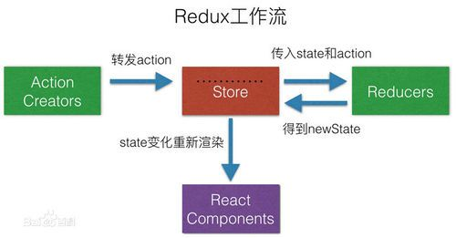

# Redux



## **Redux 的使用的三大原则**

- Single Source of Truth(唯一的数据源)
  整个应用的 state 被储存在一棵 object tree 中，并且这个 object tree 只存在于唯一一个 store 中。
- State is read-only(状态是只读的)
  唯一改变 state 的方法就是触发 action，action 是一个用于描述已发生事件的普通对象。
- Changes are made with pure function(数据的改变必须通过纯函数完成)
  为了描述 action 如何改变 state tree ，你需要编写 reducers。

## 基础

### Action

Action 是把数据从应用（译者注：这里之所以不叫 view 是因为这些数据有可能是服务器响应，用户输入或其它非 view 的数据 ）传到 store 的有效载荷。它是 store 数据的唯一来源。一般来说你会通过 store.dispatch() 将 action 传到 store。

Action 本质上是 JavaScript 普通对象。我们约定，action 内必须使用一个字符串类型的 type 字段来表示将要执行的动作。多数情况下，type 会被定义成字符串常量。当应用规模越来越大时，建议使用单独的模块或文件来存放 action。

Action 创建函数 就是生成 action 的方法。在 Redux 中的 action 创建函数只是简单的返回一个 action

- actionCreators

  ```js
  // actionCreators.js
  import { ADD, DEL } from "./actionTypes";
  const add_item = (data) => {
    return {
      type: ADD,
      data,
    };
  };
  const del_item = (id) => {
    return {
      type: DEL,
      id,
    };
  };
  export { add_item, del_item };
  ```

- actionTypes

  ```js
  // actionTypes.js
  export const ADD = "todolist/add";
  export const DEL = "todolist/del";
  ```

### Reducer

Reducers 指定了应用状态的变化如何响应 actions 并发送到 store 的，记住 actions 只是描述了有事情发生了这一事实，并没有描述应用如何更新 state。

reducer 就是一个纯函数，接收旧的 state 和 action，返回新的 state。保持 reducer 纯净非常重要。永远不要在 reducer 里做这些操作：

- 修改传入参数；
- 执行有副作用的操作，如 API 请求和路由跳转；
- 调用非纯函数，如 Date.now() 或 Math.random()。

可以开发一个函数来做为主 reducer，它调用多个子 reducer 分别处理 state 中的一部分数据，然后再把这些数据合成一个大的单一对象。主 reducer 并不需要设置初始化时完整的 state。初始时，如果传入 undefined, 子 reducer 将负责返回它们的默认值。

注意每个 reducer 只负责管理全局 state 中它负责的一部分。每个 reducer 的 state 参数都不同，分别对应它管理的那部分 state 数据。

combineReducers() 所做的只是生成一个函数，这个函数来调用你的一系列 reducer，每个 reducer 根据它们的 key 来筛选出 state 中的一部分数据并处理，然后这个生成的函数再将所有 reducer 的结果合并成一个大的对象。没有任何魔法。正如其他 reducers，如果 combineReducers() 中包含的所有 reducers 都没有更改 state，那么也就不会创建一个新的对象。

```js
// reducer.js
import { ADD, DEL } from "./actionTypes";
import { combineReducers } from "redux";
import * as reducers from "./reducers"; // 多个reducer
const defaultState = {
  list: [
    { id: 1, name: "beijing" },
    { id: 2, name: "shanghai" },
  ],
};
const reducer = (state = defaultState, action) => {
  switch (action.type) {
    case ADD:
      return {
        list: [action.data].concat(state.list),
      };
    case DEL:
      return {
        list: state.list.filter((value) => value.id !== action.id),
      };
    default:
      return state;
  }
};
export default reducer;
// const todoApp = combineReducers(reducers) // 多个reducer
```

### Store

Store 就是把 action 和 reducer 联系到一起的对象。Store 有以下职责：

- 维持应用的 state；
- 提供 getState() 方法获取 state；
- 提供 dispatch(action) 方法更新 state；
- 通过 subscribe(listener) 注册监听器;
- 通过 subscribe(listener) 返回的函数注销监听器。

再次强调一下 Redux 应用只有一个单一的 store。当需要拆分数据处理逻辑时，你应该使用 reducer 组合 而不是创建多个 store。

createStore() 的第二个参数是可选的, 用于设置 state 初始状态。这对开发同构应用时非常有用，服务器端 redux 应用的 state 结构可以与客户端保持一致, 那么客户端可以将从网络接收到的服务端 state 直接用于本地数据初始化。

```js
import { createStore } from "redux";
import reducer from "./reducer";
const store = createStore(reducer);
export default store;
```

### connect

```js
import { connect } from "react-redux";
import { add_item, del_item } from "./actionCreators";
const mapState = (state) => {
  return {
    list: state.list,
  };
};
const mapDispatch = (dispatch) => {
  return {
    addItem: (data) => {
      dispatch(add_item(data));
    },
    delItem: (id) => {
      dispatch(del_item(id));
    },
  };
};
export default connect(mapState, mapDispatch);
```

### index.js

```js
import { Provider } from "react-redux";
import store from "./redux/store";
ReactDOM.render(
  <Provider store={store}>
    <App></App>
  </Provider>,
  document.getElementById("root")
);
```

## 中间件

### redux-thunk

```jsx
// store.js
import { createStore, applyMiddleware } from "redux";
import thunk from "redux-thunk";
import reducer from "./reducer";
const store = createStore(reducer, applyMiddleware(thunk));
export default store;
```

### redux-saga

```jsx
// /src/sagas.js
import { sagas as homeSaga } from "pages/index/home/";
function* sagas() {
  yield homeSaga.loadDataSaga();
  yield homeSaga.loadMoreDataSaga();
}
export default sagas;
```

```jsx
// /src/store/index.js
import { createStore, applyMiddleware } from "redux";
import createSagaMiddleware from "redux-saga";
import reducer from "./reducer";
import sagas from "./sagas";
const sagaMiddleware = createSagaMiddleware();
const store = createStore(reducer, applyMiddleware(sagaMiddleware));
sagaMiddleware.run(sagas);
export default store;
```

```jsx
// /src/pages/index/home/sagas.js
import { takeEvery, put } from "redux-saga/effects";
import { SAGA_LOAD_DATA, SAGA_LOAD_MORE_DATA } from "./actionTypes";
import { loadData, loadMoreData } from "./actionCreator";
import http from "utils/http";
function loadDataSaga() {
  return takeEvery(SAGA_LOAD_DATA, function* () {
    let result = yield http.get({ url: "/data?_start=0&_limit=10" });
    yield put(loadData(result));
  });
}
function loadMoreDataSaga() {
  return takeEvery(SAGA_LOAD_MORE_DATA, function* (action) {
    let { start, limit } = action.data;
    let result = yield http.get({
      url: `/data?_start=${start}&_limit=${limit}`,
    });
    yield put(loadMoreData(result));
  });
}
export { loadDataSaga, loadMoreDataSaga };
```
