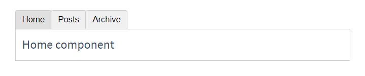

# vue

`https://cdn.staticfile.org/vue/2.6.10/vue.js`

`https://cdn.staticfile.org/vuex/3.1.0/vuex.js`

`https://cdn.staticfile.org/vue-router/3.0.2/vue-router.js`

`https://cdn.staticfile.org/axios/0.18.0/axios.js`

`https://cdn.staticfile.org/vue-resource/1.5.1/vue-resource.js`

`https://cdn.staticfile.org/vue/2.6.10/vue.min.js`

`https://cdn.staticfile.org/vuex/3.1.0/vuex.min.js`

`https://cdn.staticfile.org/vue-router/3.0.2/vue-router.min.js`

`https://cdn.staticfile.org/vue-resource/1.5.1/vue-resource.min.js`

`https://cdn.staticfile.org/axios/0.18.0/axios.min.js`

`https://unpkg.com/element-ui/lib/theme-chalk/index.css`

`https://unpkg.com/element-ui/lib/index.js`


## vue 指令

### 基本指令

1. v-cloak

   这个指令保持在元素上直到关联实例结束编译。和 CSS 规则如 [v-cloak] { display: none } 一起用时，这个指令可以隐藏未编译的 Mustache 标签直到实例准备完毕。

   ```html
   [v-cloak] { display: none; }
   <div v-cloak>
     {{ message }}
   </div>
   ```

2. v-text v-html

   v-text:更新元素的 textContent。如果要更新部分的 textContent ，需要使用 {{ Mustache }} 插值。

   ```html
   <span v-text="msg"></span>
   <!-- 和下面的一样 -->
   <span>{{msg}}</span>
   ```

   v-html:更新元素的 innerHTML 。注意：内容按普通 HTML 插入 - 不会作为 Vue 模板进行编译 。如果试图使用 v-html 组合模板，可以重新考虑是否通过使用组件来替代。

   在网站上动态渲染任意 HTML 是非常危险的，因为容易导致 XSS 攻击。只在可信内容上使用 v-html，永不用在用户提交的内容上。

   `<div v-html="html"></div>`

3. v-show

   根据表达式之真假值，切换元素的 display CSS 属性。

   当条件变化时该指令触发过渡效果。

4. v-if else

   v-if:根据表达式的值的真假条件渲染元素。在切换时元素及它的数据绑定 / 组件被销毁并重建。如果元素是 `<template>` ，将提出它的内容作为条件块。

   当和 v-if 一起使用时，v-for 的优先级比 v-if 更高。

   v-else:不需要表达式 为 v-if 或者 v-else-if 添加“else 块”。

   v-else-if:表示 v-if 的 “else if 块”。可以链式调用。

   > 一般来说，v-if 有更高的切换消耗而 v-show 有更高的初始渲染消耗。因此，如果需要频繁切换 v-show 较好，如果在运行时条件不大可能改变 v-if 较好。

5. v-for

   基于源数据多次渲染元素或模板块。此指令之值，必须使用特定语法 alias in expression ，为当前遍历的元素提供别名

   ```html
   <div v-for="item in items">
     {{ item.text }}
   </div>
   <!-- 另外也可以为数组索引指定别名 (或者用于对象的键) -->
   <div v-for="(item, index) in items"></div>
   <div v-for="(val, key) in object"></div>
   <div v-for="(val, key, index) in object"></div>
   <!-- v-for 默认行为试着不改变整体，而是替换元素。迫使其重新排序的元素，你需要提供一个 key 的特殊属性 -->
   <div v-for="item in items" :key="item.id">
     {{ item.text }}
   </div>
   ```

6. v-on

   - 缩写：@

   - 预期：Function | Inline Statement | Object

   - 参数：event

   - 修饰符：

     .stop - 调用 event.stopPropagation()。

     .prevent - 调用 event.preventDefault()。

     .capture - 添加事件侦听器时使用 capture 模式。

     .self - 只当事件是从侦听器绑定的元素本身触发时才触发回调。

     .{keyCode | keyAlias} - 只当事件是从特定键触发时才触发回调。

     .native - 监听组件根元素的原生事件。

     .once - 只触发一次回调。

     .left - (2.2.0) 只当点击鼠标左键时触发。

     .right - (2.2.0) 只当点击鼠标右键时触发。

     .middle - (2.2.0) 只当点击鼠标中键时触发。

     .passive - (2.3.0) 以 { passive: true } 模式添加侦听器

   - 用法:

     绑定事件监听器。事件类型由参数指定。表达式可以是一个方法的名字或一个内联语句，如果没有修饰符也可以省略。

     用在普通元素上时，只能监听原生 DOM 事件。用在自定义元素组件上时，也可以监听子组件触发的自定义事件。

     在监听原生 DOM 事件时，方法以事件为唯一的参数。如果使用内联语句，语句可以访问一个 `$event` 属性：`v-on:click="handle('ok', $event)"`。

     从 2.4.0 开始，v-on 同样支持不带参数绑定一个事件/监听器键值对的对象。注意当使用对象语法时，是不支持任何修饰器的。

   ```html
   <button v-on:click="doThis"></button
   ><!-- 方法处理器 -->
   <button v-on:[event]="doThis"></button
   ><!-- 动态事件 (2.6.0+) -->
   <button v-on:click="doThat('hello', $event)"></button
   ><!-- 内联语句 -->
   <button @click="doThis"></button
   ><!-- 缩写 -->
   <button @[event]="doThis"></button
   ><!-- 动态事件缩写 (2.6.0+) -->
   <button @click.stop="doThis"></button
   ><!-- 停止冒泡 -->
   <button @click.prevent="doThis"></button
   ><!-- 阻止默认行为 -->
   <form @submit.prevent></form>
   <!-- 阻止默认行为，没有表达式 -->
   <button @click.stop.prevent="doThis"></button
   ><!--  串联修饰符 -->
   <input @keyup.enter="onEnter" /><!-- 键修饰符，键别名 -->
   <input @keyup.13="onEnter" /><!-- 键修饰符，键代码 -->
   <button v-on:click.once="doThis"></button
   ><!-- 点击回调只会触发一次 -->
   <button v-on="{ mousedown: doThis, mouseup: doThat }"></button
   ><!-- 对象语法 (2.4.0+) -->
   ```

   在子组件上监听自定义事件 (当子组件触发“my-event”时将调用事件处理器)：

   ```html
   <my-component @my-event="handleThis"></my-component>
   <my-component @my-event="handleThis(123, $event)"></my-component
   ><!-- 内联语句 -->
   <my-component @click.native="onClick"></my-component
   ><!-- 组件中的原生事件 -->
   ```

   示例:跑马灯

   ```html
   <div id="app">
     <p>{{info}}</p>
     <input type="button" value="开启" @click="go" />
     <input type="button" value="停止" @click="stop" />
   </div>
   <script>
     var vm = new Vue({
       el: "#app",
       data: {
         info: "猥琐发育,别浪",
         intervalId: null,
       },
       methods: {
         go() {
           if (this.intervalId != null) return;
           this.intervalId = setInterval(() => {
             this.info = this.info.substring(1) + this.info.substring(0, 1);
           }, 500);
         },
         stop() {
           clearInterval(this.intervalId);
           this.intervalId = null;
         },
       },
     });
   </script>
   ```

7. v-bind

   - 缩写：:

   - 预期：any (with argument) | Object (without argument)

   - 参数：attrOrProp (optional)

   - 修饰符：

     .prop - 被用于绑定 DOM 属性 (property)。(差别在哪里？)

     .camel - (2.1.0+) 将 kebab-case 特性名转换为 camelCase. (从 2.1.0 开始支持)

     .sync (2.3.0+) 语法糖，会扩展成一个更新父组件绑定值的 v-on 侦听器。

   - 用法：

     动态地绑定一个或多个特性，或一个组件 prop 到表达式。

     在绑定 class 或 style 特性时，支持其它类型的值，如数组或对象。可以通过下面的教程链接查看详情。

     在绑定 prop 时，prop 必须在子组件中声明。可以用修饰符指定不同的绑定类型。

     没有参数时，可以绑定到一个包含键值对的对象。注意此时 class 和 style 绑定不支持数组和对象。

   ```html
   <!-- 绑定一个属性 -->
   <button v-bind:[key]="value"></button
   ><!-- 动态特性名 (2.6.0+) -->
   <!-- 缩写 -->
   <button :[key]="value"></button
   ><!-- 动态特性名缩写 (2.6.0+) -->
   <!-- 内联字符串拼接 -->
   <div :class="{ red: isRed }"></div>
   <!-- class 绑定 -->
   <div :class="[classA, classB]"></div>
   <div :class="[classA, { classB: isB, classC: isC }]">
     <div :style="{ fontSize: size + 'px' }"></div>
     <!-- style 绑定 -->
     <div :style="[styleObjectA, styleObjectB]"></div>
     <div v-bind="{ id: someProp, 'other-attr': otherProp }"></div>
     <!-- 绑定一个有属性的对象 -->
     <div v-bind:text-content.prop="text"></div>
     <!-- 通过 prop 修饰符绑定 DOM 属性 -->
     <my-component :prop="someThing"></my-component
     ><!-- prop 绑定。“prop”必须在 my-component 中声明。-->
     <child-component v-bind="$props"></child-component
     ><!-- 通过 $props 将父组件的 props 一起传给子组件 -->
     <svg><a :xlink:special="foo"></a></svg
     ><!-- XLink -->
   </div>
   ```

   .camel 修饰符允许在使用 DOM 模板时将 v-bind 属性名称驼峰化，例如 SVG 的 viewBox 属性：

   `<svg :view-box.camel="viewBox"></svg>`

   在使用字符串模板或通过 vue-loader/vueify 编译时，无需使用 .camel。

8. v-model

   - 预期：随表单控件类型不同而不同。

   - 限制：

     `<input>`

     `<select>`

     `<textarea>`

     `components`

   - 修饰符：

     .lazy - 取代 input 监听 change 事件

     .number - 输入字符串转为有效的数字

     .trim - 输入首尾空格过滤

   - 用法：在表单控件或者组件上创建双向绑定。

   > v-bind 只能实现数据的单向绑定，从 M 自动绑定到 V， 无法实现数据的双向绑定
   > v-model 指令，可以实现 表单元素和 Model 中数据的双向数据绑定
   > v-model 只能运用在 表单元素中

### 自定义指令

> 除了核心功能默认内置的指令 (v-model 和 v-show)，Vue 也允许注册自定义指令。注意，在 Vue2.0 中，代码复用和抽象的主要形式是组件。然而，有的情况下，你仍然需要对普通 DOM 元素进行底层操作，这时候就会用到自定义指令。

```js
// 注册一个全局自定义指令 `v-focus`
Vue.directive("focus", {
  // 当被绑定的元素插入到 DOM 中时……
  inserted: function (el) {
    // 聚焦元素
    el.focus();
  },
});
```

如果想注册局部指令，组件中也接受一个 directives 的选项

```js
directives: {
  focus: {
    // 指令的定义
    inserted: function (el) {
      el.focus()
    }
  }
}
```

可以在模板中任何元素上使用新的 `v-focus` 属性:`<input v-focus>`

## 过滤器

> Vue.js 允许你自定义过滤器，**可被用作一些常见的文本格式化**。过滤器可以用在两个地方：**mustache 插值和 v-bind 表达式**。过滤器应该被添加在 JavaScript 表达式的尾部，由“管道”符指示；

```html
{{ message | capitalize }}<!-- 在双花括号中 -->
<div v-bind:id="rawId | formatId"></div>
<!-- 在 v-bind 中 -->
```

### 私有过滤器

可以在一个组件的选项中定义本地的过滤器

```js
filters: {// 私有局部过滤器，只能在 当前 VM 对象所控制的 View 区域进行使用
  capitalize: function (value) {
    if (!value) return ''
    value = value.toString()
    return value.charAt(0).toUpperCase() + value.slice(1)
  }
}
```

### 全局过滤器

```js
// 在创建 Vue 实例之前全局定义过滤器
Vue.filter("capitalize", function (value) {
  if (!value) return "";
  value = value.toString();
  return value.charAt(0).toUpperCase() + value.slice(1);
});
new Vue({
  // ...
});
```

注意：当有局部和全局两个名称相同的过滤器时候，会以就近原则进行调用，即：局部过滤器优先于全局过滤器被调用！

### 过滤器的串联

过滤器函数总接收表达式的值 (之前的操作链的结果) 作为第一个参数。在上述例子中，capitalize 过滤器函数将会收到 message 的值作为第一个参数。

```html
{{ message | filterA | filterB }}
```

filterA 被定义为接收单个参数的过滤器函数，表达式 message 的值将作为参数传入到函数中。然后继续调用同样被定义为接收单个参数的过滤器函数 filterB，将 filterA 的结果传递到 filterB 中。

过滤器是 JavaScript 函数，因此可以接收参数：

```html
{{ message | filterA('arg1', arg2) }}
```

filterA 被定义为接收三个参数的过滤器函数。其中 message 的值作为第一个参数，普通字符串 'arg1' 作为第二个参数，表达式 arg2 的值作为第三个参数。

## Vue 的生命周期

> 所有的生命周期钩子自动绑定 this 上下文到实例中，因此你可以访问数据，对属性和方法进行运算。这意味着你不能使用箭头函数来定义一个生命周期方法 (例如 created: () => this.fetchTodos())。这是因为箭头函数绑定了父上下文，因此 this 与你期待的 Vue 实例不同，this.fetchTodos 的行为未定义。

- 什么是生命周期：从 Vue 实例创建、运行、到销毁期间，总是伴随着各种各样的事件，这些事件，统称为生命周期！

- [生命周期钩子](https://cn.vuejs.org/v2/api/#选项-生命周期钩子)：就是生命周期事件的别名而已；

- 生命周期钩子 = 生命周期函数 = 生命周期事件

### 1. 创建期间的生命周期函数

- beforeCreate：实例刚在内存中被创建出来，此时，还没有初始化好 data 和 methods 属性

- created：实例已经在内存中创建 OK，此时 data 和 methods 已经创建 OK，此时还没有开始 编译模板

- beforeMount：此时已经完成了模板的编译，但是还没有挂载到页面中

- mounted：此时，已经将编译好的模板，挂载到了页面指定的容器中显示

### 2. 运行期间的生命周期函数

- beforeUpdate：状态更新之前执行此函数， 此时 data 中的状态值是最新的，但是界面上显示的 数据还是旧的，因为此时还没有开始重新渲染 DOM 节点

- updated：实例更新完毕之后调用此函数，此时 data 中的状态值 和 界面上显示的数据，都已经完成了更新，界面已经被重新渲染好了！

### 3. 销毁期间的生命周期函数

- beforeDestroy：实例销毁之前调用。在这一步，实例仍然完全可用。

- destroyed：Vue 实例销毁后调用。调用后，Vue 实例指示的所有东西都会解绑定，所有的事件监听器会被移除，所有的子实例也会被销毁。


## 组件

### 组件与复用

```html
<div id="components-demo">
  <button-counter></button-counter>
</div>
<script>
  // 定义一个名为 button-counter 的新组件
  Vue.component("button-counter", {
    data: function () {
      return {
        count: 0,
      };
    },
    template:
      '<button v-on:click="count++">You clicked me {{ count }} times.</button>',
  });
  new Vue({ el: "#components-demo" });
</script>
```

组件是可复用的 Vue 实例，且带有一个名字 名字以短横线分割

因为组件是可复用的 `Vue` 实例，所以它们与 `new Vue` 接收相同的选项，例如 `data`、`computed`、`watch`、`methods` 以及生命周期钩子等。仅有的例外是像 `el` 这样根实例特有的选项。

你可以将组件进行任意次数的复用

一个组件的`data`选项必须是一个函数，因此每个实例可以维护一份被返回对象的独立的拷贝

为了能在模板中使用，这些组件必须先注册以便`Vue`能够识别。这里有两种组件的注册类型：全局注册和局部注册。至此，我们的组件都只是通过`Vue.component`全局注册的,全局注册的组件可以用在其被注册之后的任何 (通过`new Vue`)新创建的`Vue`根实例，也包括其组件树中的所有子组件的模板中。

```js
// 局部注册
var ComponentA = {
  /* ... */
};
var ComponentB = {
  /* ... */
};
var ComponentC = {
  /* ... */
};
new Vue({
  el: "#app",
  components: {
    "component-a": ComponentA,
    "component-b": ComponentB,
  },
});
```

局部注册的组件在其子组件中不可用。例如，如果你希望 ComponentA 在 ComponentB 中可用，则你需要这样写:

```js
var ComponentA = {
  /* ... */
};
var ComponentB = {
  components: {
    "component-a": ComponentA,
  },
  // ...
};
```

或者如果你通过 Babel 和 webpack 使用 ES2015 模块，那么代码看起来更像：

```js
import ComponentA from "./ComponentA.vue";
export default {
  components: {
    ComponentA,
  },
  // ...
};
```

### 使用 props 传递数据

`Prop` 是你可以在组件上注册的一些自定义特性。当一个值传递给一个 `prop` 特性的时候，它就变成了那个组件实例的一个属性。

一个组件默认可以拥有任意数量的`prop`，任何值都可以传递给任何`prop`。在上述模板中，你会发现我们能够在组件实例中访问这个值，就像访问`data`中的值一样。

```html
<blog-post title="My journey with Vue"></blog-post>
<blog-post title="Blogging with Vue"></blog-post>
<blog-post title="Why Vue is so fun"></blog-post>
<script>
  Vue.component("blog-post", {
    props: ["title"],
    template: "<h3>{{ title }}</h3>",
  });
</script>
```

然而在一个典型的应用中，你可能在 data 里有一个博文的数组,并想要为每篇博文渲染一个组件

发现我们可以使用 v-bind 来动态传递 prop。这在你一开始不清楚要渲染的具体内容，比如从一个 API 获取博文列表的时候，是非常有用的

```html
<blog-post
  v-for="post in posts"
  v-bind:key="post.id"
  v-bind:title="post.title"
></blog-post>
<script>
  new Vue({
    el: "#blog-post-demo",
    data: {
      posts: [
        { id: 1, title: "My journey with Vue" },
        { id: 2, title: "Blogging with Vue" },
        { id: 3, title: "Why Vue is so fun" },
      ],
    },
  });
</script>
```

当你使用 DOM 中的模板时，camelCase (驼峰命名法) 的 prop 名需要使用其等价的 kebab-case (短横线分隔命名) 命名,如果你使用字符串模板，那么这个限制就不存在了

```js
// 可以以对象形式列出prop各自的名称和类型
props: {
  title: String,
  likes: Number,
  isPublished: Boolean,
  commentIds: Array,
  author: Object,
  callback: Function,
  contactsPromise: Promise // or any other constructor
}
```

任何类型的值都可以传给一个 prop

```html
<blog-post title="My journey with Vue"></blog-post>
<!-- 给 prop 传入一个静态的值 -->
<blog-post v-bind:title="post.title"></blog-post>
<!-- 动态赋予一个变量的值 -->
<blog-post v-bind:title="post.title + ' by ' + post.author.name"></blog-post
><!-- 动态赋予一个复杂表达式的值 -->
<blog-post v-bind:likes="42"></blog-post>
<!-- 传入一个数字 -->
<blog-post v-bind:is-published="false"></blog-post>
<!-- 传入一个布尔值 -->
<blog-post v-bind:comment-ids="[234, 266, 273]"></blog-post>
<!-- 传入一个数组 -->
<blog-post
  v-bind:author="{
    name: 'Veronica',
    company: 'Veridian Dynamics'
  }"
></blog-post>
<!-- 传入一个对象 -->
<blog-post v-bind="post"></blog-post>
<!-- 传入一个对象的所有属性,使用不带参数的 v-bind -->
```

所有的 prop 都使得其父子 prop 之间形成了一个单向下行绑定：父级 prop 的更新会向下流动到子组件中，但是反过来则不行。

有两种常见的试图改变一个 prop 的情形：

1. 这个 prop 用来传递一个初始值；这个子组件接下来希望将其作为一个本地的 prop 数据来使用。在这种情况下，最好定义一个本地的 data 属性并将这个 prop 用作其初始值：

   ```js
   props: ['initialCounter'],
   data: function () {
     return {
       counter: this.initialCounter
     }
   }
   ```

2. 这个 prop 以一种原始的值传入且需要进行转换。在这种情况下，最好使用这个 prop 的值来定义一个计算属性：

   ```js
   props: ['size'],
   computed: {
     normalizedSize: function () {
       return this.size.trim().toLowerCase()
     }
   }
   ```

可以为组件的 prop 指定验证要求，为了定制 prop 的验证方式，你可以为 props 中的值提供一个带有验证需求的对象，而不是一个字符串数组

```js
Vue.component("my-component", {
  props: {
    propA: Number, // 基础的类型检查 (`null` 和 `undefined` 会通过任何类型验证)
    propB: [String, Number], // 多个可能的类型
    propC: {
      // 必填的字符串
      type: String,
      required: true,
    },
    propD: {
      // 带有默认值的数字
      type: Number,
      default: 100,
    },
    propE: {
      // 带有默认值的对象
      type: Object,
      default: function () {
        // 对象或数组默认值必须从一个工厂函数获取
        return { message: "hello" };
      },
    },
    propF: {
      // 自定义验证函数
      validator: function (value) {
        // 这个值必须匹配下列字符串中的一个
        return ["success", "warning", "danger"].indexOf(value) !== -1;
      },
    },
  },
});
```

那些 prop 会在一个组件实例创建之前进行验证，所以实例的属性 (如 data、computed 等) 在 default 或 validator 函数中是不可用的。

type 可以是下列原生构造函数中的一个：String/Number/Boolean/Array/Object/Date/Function/Symbol/自定义构造函数

对于绝大多数特性来说，从外部提供给组件的值会替换掉组件内部设置好的值。class 和 style 特性会稍微智能一些，即两边的值会被合并起来，从而得到最终的值

### 自定义事件

v-on 可用于监听 DOM 事件,还可用于组件之间的自定义事件,子组件用$emit来触发事件,父组件用$on()来监听子组件的事件

父组件也可直接在子组件的自定义标签上使用 v-on 来监听子组件触发的自定义事件 `$emit('自定义事件名',传递的数据0-无限多个)`

`v-on`在组件上监听原生事件用`.native`修饰符 `v-on:click.native=""`

还可在自定义组件上使用`v-model` 一个组件上的 v-model 默认会利用名为 value 的 prop 和名为 input 的事件，但是像单选框、复选框等类型的输入控件可能会将 value 特性用于不同的目的。model 选项可以用来避免这样的冲突

```html
<base-checkbox v-model="lovingVue"></base-checkbox>
<script>
  Vue.component("base-checkbox", {
    model: {
      prop: "checked",
      event: "change",
    },
    props: {},
    template: ``,
  });
</script>
```

这里的 lovingVue 的值将会传入这个名为`checked`的`prop`。同时当`<base-checkbox>`触发一个`change`事件并附带一个新的值的时候，这个 lovingVue 的属性将会被更新

可能需要对一个 prop 进行“双向绑定”。不幸的是，真正的双向绑定会带来维护上的问题，因为子组件可以修改父组件，且在父组件和子组件都没有明显的改动来源。这也是为什么我们推荐以 update:myPropName 的模式触发事件取而代之。

在一个包含 title prop 的假设的组件中，我们可以用以下方法表达对其赋新值的意图：`this.$emit('update:title', newTitle)`

然后父组件可以监听那个事件并根据需要更新一个本地的数据属性。

```html
<text-document
  v-bind:title="doc.title"
  v-on:update:title="doc.title = $event"
></text-document>
```

为了方便起见，我们为这种模式提供一个缩写，即 `.sync` 修饰符：`<text-document v-bind.sync="doc"></text-document>`

这样会把 doc 对象中的每一个属性 (如 title) 都作为一个独立的 prop 传进去，然后各自添加用于更新的 v-on 监听器。

将 `v-bind.sync` 用在一个字面量的对象上，例如 `v-bind.sync=”{ title: doc.title }”`，是无法正常工作的，因为在解析一个像这样的复杂表达式的时候，有很多边缘情况需要考虑。

### 组件通信总结

#### 1.props 和\$emit-父子通信

父组件向子组件传递数据是通过 prop 传递的，子组件传递数据给父组件是通过\$emit 触发事件来做到的。

```js
Vue.component("child", {
  data() {
    return {
      mymessage: this.message,
    };
  },
  template: `
        <div>
            <input type="text" v-model="mymessage" @input="passData(mymessage)"> </div>
    `,
  props: ["message"], //得到父组件传递过来的数据
  methods: {
    passData(val) {
      //触发父组件中的事件
      this.$emit("getChildData", val);
    },
  },
});
Vue.component("parent", {
  template: `
        <div>
            <p>this is parent compoent!</p>
            <child :message="message" v-on:getChildData="getChildData"></child>
        </div>
    `,
  data() {
    return {
      message: "hello",
    };
  },
  methods: {
    //执行子组件触发的事件
    getChildData(val) {
      console.log(val);
    },
  },
});
var app = new Vue({
  el: "#app",
  template: `
        <div>
            <parent></parent>
        </div>
    `,
});
```

在上面的例子中，有父组件 parent 和子组件 child。

1).父组件传递了 message 数据给子组件，并且通过 v-on 绑定了一个 getChildData 事件来监听子组件的触发事件；

2).子组件通过 props 得到相关的 message 数据,最后通过 this.\$emit 触发了 getChildData 事件。

#### 2.$attrs和$listeners-跨级通信

第一种方式处理父子组件之间的数据传输有一个问题：如果父组件 A 下面有子组件 B，组件 B 下面有组件 C,这时如果组件 A 想传递数据给组件 C 怎么办呢？

如果采用第一种方法，我们必须让组件 A 通过 prop 传递消息给组件 B，组件 B 在通过 prop 传递消息给组件 C；要是组件 A 和组件 C 之间有更多的组件，那采用这种方式就很复杂了。Vue 2.4 开始提供了$attrs和$listeners 来解决这个问题，能够让组件 A 之间传递消息给组件 C。

```js
Vue.component("C", {
  template: `
        <div>
            <input type="text" v-model="$attrs.messagec" @input="passCData($attrs.messagec)"> </div>
    `,
  methods: {
    passCData(val) {
      //触发父组件A中的事件
      this.$emit("getCData", val);
    },
  },
});
Vue.component("B", {
  data() {
    return {
      mymessage: this.message,
    };
  },
  template: `
        <div>
            <input type="text" v-model="mymessage" @input="passData(mymessage)">
            <!-- C组件中能直接触发getCData的原因在于 B组件调用C组件时 使用 v-on 绑定了$listeners 属性 -->
            <!-- 通过v-bind 绑定$attrs属性，C组件可以直接获取到A组件中传递下来的props（除了B组件中props声明的） -->
            <C v-bind="$attrs" v-on="$listeners"></C>
        </div>
    `,
  props: ["message"], //得到父组件传递过来的数据
  methods: {
    passData(val) {
      //触发父组件中的事件
      this.$emit("getChildData", val);
    },
  },
});
Vue.component("A", {
  template: `
        <div>
            <p>this is parent compoent!</p>
            <B :messagec="messagec" :message="message" v-on:getCData="getCData" v-on:getChildData="getChildData(message)"></B>
        </div>
    `,
  data() {
    return {
      message: "hello",
      messagec: "hello c", //传递给c组件的数据
    };
  },
  methods: {
    getChildData(val) {
      console.log("这是来自B组件的数据");
    },
    //执行C子组件触发的事件
    getCData(val) {
      console.log("这是来自C组件的数据：" + val);
    },
  },
});
var app = new Vue({
  el: "#app",
  template: `
        <div>
            <A></A>
        </div>
    `,
});
```

#### 3.中央事件总线-同级组件通信

上面两种方式处理的都是父子组件之间的数据传递，而如果两个组件不是父子关系呢？这种情况下可以使用中央事件总线的方式。新建一个 Vue 事件 bus 对象，然后通过 bus.$emit触发事件，bus.$on 监听触发的事件。

```js
Vue.component("brother1", {
  data() {
    return {
      mymessage: "hello brother1",
    };
  },
  template: `
        <div>
            <p>this is brother1 compoent!</p>
            <input type="text" v-model="mymessage" @input="passData(mymessage)">
        </div>
    `,
  methods: {
    passData(val) {
      bus.$emit("globalEvent", val); //触发全局事件globalEvent
    },
  },
});
Vue.component("brother2", {
  template: `
        <div>
            <p>this is brother2 compoent!</p>
            <p>brother1传递过来的数据：{{brothermessage}}</p>
        </div>
    `,
  data() {
    return {
      mymessage: "hello brother2",
      brothermessage: "",
    };
  },
  mounted() {
    bus.$on("globalEvent", (val) => {
      //绑定全局事件globalEvent
      this.brothermessage = val;
    });
  },
});
var bus = new Vue(); //中央事件总线
var app = new Vue({
  el: "#app",
  template: `
        <div>
            <brother1></brother1>
            <brother2></brother2>
        </div>
    `,
});
```

#### 4.provide 和 inject-深层跨级通信

父组件中通过 provider 来提供变量，然后在子组件中通过 inject 来注入变量。不论子组件有多深，只要调用了 inject 那么就可以注入 provider 中的数据。而不是局限于只能从当前父组件的 prop 属性来获取数据，只要在父组件的生命周期内，子组件都可以调用。

```js
Vue.component("child", {
  inject: ["for"], //得到父组件传递过来的数据
  data() {
    return {
      mymessage: this.for,
    };
  },
  template: `
        <div>
            <input type="tet" v-model="mymessage">
        </div>
    `,
});
Vue.component("parent", {
  template: `
        <div>
            <p>this is parent compoent!</p>
            <child></child>
        </div>
    `,
  provide: {
    for: "test",
  },
  data() {
    return {
      message: "hello",
    };
  },
});
var app = new Vue({
  el: "#app",
  template: `
        <div>
            <parent></parent>
        </div>
    `,
});
```

#### 5.v-model-父子组件通信

父组件通过 v-model 传递值给子组件时，会自动传递一个 value 的 prop 属性，在子组件中通过 this.\$emit(‘input’,val)自动修改 v-model 绑定的值

```js
Vue.component("child", {
  props: {
    value: String, //v-model会自动传递一个字段为value的prop属性
  },
  data() {
    return {
      mymessage: this.value,
    };
  },
  methods: {
    changeValue() {
      this.$emit("input", this.mymessage); //通过如此调用可以改变父组件上v-model绑定的值
    },
  },
  template: `
        <div>
            <input type="text" v-model="mymessage" @change="changeValue">
        </div>
    `,
});
Vue.component("parent", {
  template: `
        <div>
            <p>this is parent compoent!</p>
            <p>{{message}}</p>
            <child v-model="message"></child>
        </div>
    `,
  data() {
    return {
      message: "hello",
    };
  },
});
var app = new Vue({
  el: "#app",
  template: `
        <div>
            <parent></parent>
        </div>
    `,
});
```

#### 6.$parent和$children-父子组件通信

```js
Vue.component("child", {
  props: {
    value: String, //v-model会自动传递一个字段为value的prop属性
  },
  data() {
    return {
      mymessage: this.value,
    };
  },
  methods: {
    changeValue() {
      this.$parent.message = this.mymessage; //通过如此调用可以改变父组件的值
    },
  },
  template: `
        <div>
            <input type="text" v-model="mymessage" @change="changeValue">
        </div>
    `,
});
Vue.component("parent", {
  template: `
        <div>
            <p>this is parent compoent!</p>
            <button @click="changeChildValue">test</button >
            <child></child>
        </div>
    `,
  methods: {
    changeChildValue() {
      this.$children[0].mymessage = "hello";
    },
  },
  data() {
    return {
      message: "hello",
    };
  },
});
var app = new Vue({
  el: "#app",
  template: `
        <div>
            <parent></parent>
        </div>
    `,
});
```

#### 7.boradcast 和 dispatch-特定父子组件通信

vue1.0 中提供了这种方式，但 vue2.0 中没有，但很多开源软件都自己封装了这种方式，比如 min ui、element ui 和 iview 等。

比如如下代码，一般都作为一个 mixins 去使用, broadcast 是向特定的父组件，触发事件，dispatch 是向特定的子组件触发事件，本质上这种方式还是 on 和 on 和 emit 的封装，但在一些基础组件中却很实用。

```js
function broadcast(componentName, eventName, params) {
  this.$children.forEach((child) => {
    var name = child.$options.componentName;
    if (name === componentName) {
      child.$emit.apply(child, [eventName].concat(params));
    } else {
      broadcast.apply(child, [componentName, eventName].concat(params));
    }
  });
}
export default {
  methods: {
    dispatch(componentName, eventName, params) {
      var parent = this.$parent;
      var name = parent.$options.componentName;
      while (parent && (!name || name !== componentName)) {
        parent = parent.$parent;

        if (parent) {
          name = parent.$options.componentName;
        }
      }
      if (parent) {
        parent.$emit.apply(parent, [eventName].concat(params));
      }
    },
    broadcast(componentName, eventName, params) {
      broadcast.call(this, componentName, eventName, params);
    },
  },
};
```

#### 8.\$ref 子组件索引

尽管存在 prop 和事件，有的时候你仍可能需要在 JavaScript 里直接访问一个子组件。为了达到这个目的，你可以通过 ref 特性为这个子组件赋予一个 ID 引用。例如：`<base-input ref="usernameInput"></base-input>`

现在在你已经定义了这个 ref 的组件里，你可以使用：`this.$refs.usernameInput`来访问这个 `<base-input>` 实例，以便不时之需。比如程序化地从一个父级组件聚焦这个输入框。在刚才那个例子中，该 `<base-input>` 组件也可以使用一个类似的 ref 提供对内部这个指定元素的访问，例如：`<input ref="input">`

甚至可以通过其父级组件定义方法：

```js
methods: {
  // 用来从父级组件聚焦输入框
  focus: function () {
    this.$refs.input.focus()
  }
}
```

这样就允许父级组件通过下面的代码聚焦 `<base-input>` 里的输入框：`this.$refs.usernameInput.focus()`

当 ref 和 v-for 一起使用的时候，你得到的引用将会是一个包含了对应数据源的这些子组件的数组。

> $refs 只会在组件渲染完成之后生效，并且它们不是响应式的。这仅作为一个用于直接操作子组件的“逃生舱”——你应该避免在模板或计算属性中访问 $refs。

#### 9.vuex 处理组件之间的数据交互

如果业务逻辑复杂，很多组件之间需要同时处理一些公共的数据，这个时候才有上面这一些方法可能不利于项目的维护，vuex 的做法就是将这一些公共的数据抽离出来，然后其他组件就可以对这个公共数据进行读写操作，这样达到了解耦的目的。

详情可参考：`https://vuex.vuejs.org/zh-cn/`

### 使用 slot 分发内容

> 在 2.6.0 中，我们为具名插槽和作用域插槽引入了一个新的统一的语法 (即 v-slot 指令)。它取代了 slot 和 slot-scope 这两个目前已被废弃但未被移除且仍在文档中的特性。

#### 插槽内容

将 `<slot>` 元素作为承载分发内容的出口。它允许你像这样合成组件：

```html
<navigation-link url="/profile">
  Your Profile
</navigation-link>
```

然后你在 `<navigation-link>` 的模板中可能会写为：

```html
<a v-bind:href="url" class="nav-link">
  <slot></slot>
</a>
```

当组件渲染的时候，`<slot></slot>` 将会被替换为“Your Profile”。插槽内可以包含任何模板代码，包括 HTML：

```html
<navigation-link url="/profile">
  <!-- 添加一个 Font Awesome 图标 -->
  <span class="fa fa-user"></span>
  Your Profile
</navigation-link>
```

甚至其它的组件：

```html
<navigation-link url="/profile">
  <!-- 添加一个图标的组件 -->
  <font-awesome-icon name="user"></font-awesome-icon>
  Your Profile
</navigation-link>
```

如果 `<navigation-link>` 没有包含一个 `<slot>` 元素，则该组件起始标签和结束标签之间的任何内容都会被抛弃。

#### 作用域问题

当你想在一个插槽中使用数据时，例如：

```html
<navigation-link url="/profile">
  Logged in as {{ user.name }}
</navigation-link>
```

该插槽跟模板的其它地方一样可以访问相同的实例属性 (也就是相同的“作用域”)，而不能访问 `<navigation-link>` 的作用域。例如 url 是访问不到的：

```html
<navigation-link url="/profile">
  Clicking here will send you to: {{ url }}
  <!--
  这里的 `url` 会是 undefined，因为 "/profile" 是
  _传递给_ <navigation-link> 的而不是
  在 <navigation-link> 组件*内部*定义的。
  -->
</navigation-link>
```

作为一条规则，请记住：父级模板里的所有内容都是在父级作用域中编译的；子模板里的所有内容都是在子作用域中编译的。

#### 后备(默认)内容

有时为一个插槽设置具体的后备 (也就是默认的) 内容是很有用的，它只会在没有提供内容的时候被渲染。例如在一个 `<submit-button>` 组件中：

```html
<button type="submit">
  <slot></slot>
</button>
```

我们可能希望这个 `<button>` 内绝大多数情况下都渲染文本“Submit”。为了将“Submit”作为后备内容，我们可以将它放在 `<slot>` 标签内：

```html
<button type="submit">
  <slot>Submit</slot>
</button>
```

现在当我在一个父级组件中使用 `<submit-button>` 并且不提供任何插槽内容时,`<submit-button></submit-button>`后备内容“Submit”将会被渲染：

```html
<button type="submit">
  Submit
</button>
```

但是如果我们提供内容：

```html
<submit-button>
  Save
</submit-button>
```

则这个提供的内容将会被渲染从而取代后备内容：

```html
<button type="submit">
  Save
</button>
```

#### 具名插槽

自 2.6.0 起有所更新。

有时我们需要多个插槽。例如对于一个带有如下模板的 `<base-layout>` 组件：

```html
<div class="container">
  <header>
    <!-- 我们希望把页头放这里 -->
  </header>
  <main>
    <!-- 我们希望把主要内容放这里 -->
  </main>
  <footer>
    <!-- 我们希望把页脚放这里 -->
  </footer>
</div>
```

对于这样的情况，`<slot>` 元素有一个特殊的特性：`name`。这个特性可以用来定义额外的插槽：

```html
<div class="container">
  <header>
    <slot name="header"></slot>
  </header>
  <main>
    <slot></slot>
  </main>
  <footer>
    <slot name="footer"></slot>
  </footer>
</div>
```

一个不带 name 的 `<slot>` 出口会带有隐含的名字“default”。

在向具名插槽提供内容的时候，我们可以在一个 `<template>` 元素上使用 `v-slot` 指令，并以 `v-slot` 的参数的形式提供其名称：

```html
<base-layout>
  <template v-slot:header>
    <!-- <template slot="header">已废弃的语法 -->
    <h1>Here might be a page title</h1>
  </template>
  <p>A paragraph for the main content.</p>
  <p>And another one.</p>
  <template v-slot:footer>
    <p>Here's some contact info</p>
  </template>
</base-layout>
```

现在 `<template>` 元素中的所有内容都将会被传入相应的插槽。任何没有被包裹在带有 `v-slot` 的 `<template>` 中的内容都会被视为默认插槽的内容。

然而，如果你希望更明确一些，仍然可以在一个 `<template>` 中包裹默认插槽的内容：

```html
<base-layout>
  <template v-slot:header>
    <h1>Here might be a page title</h1>
  </template>
  <template v-slot:default>
    <p>A paragraph for the main content.</p>
    <p>And another one.</p>
  </template>
  <template v-slot:footer>
    <p>Here's some contact info</p>
  </template>
</base-layout>
```

任何一种写法都会渲染出：

```html
<div class="container">
  <header>
    <h1>Here might be a page title</h1>
  </header>
  <main>
    <p>A paragraph for the main content.</p>
    <p>And another one.</p>
  </main>
  <footer>
    <p>Here's some contact info</p>
  </footer>
</div>
```

注意: `v-slot` 只能添加在一个 `<template>` 上 (只有一种例外情况)，这一点和已经废弃的 `slot` 特性不同。

具名插槽的缩写:v-slot:header 可以被重写为 #header,没有参数时会警告#="{{user}}",无参数时可以写作#defalt="{{user}}"

#### 作用域插槽

> 自 2.6.0 起有所更新。slot-scope 特性的语法已废弃使用

时让插槽内容能够访问子组件中才有的数据是很有用的。例如，设想一个带有如下模板的 `<current-user>` 组件,我们想让它的后备内容显示用户的名，以取代正常情况下用户的姓

```html
<span>
  <slot>{{ user.lastName }}</slot>
</span>
<current-user>
  {{ user.firstName }}
</current-user>
```

然而上述代码不会正常工作，因为只有 `<current-user>` 组件可以访问到 user 而我们提供的内容是在父级渲染的。为了让 user 在父级的插槽内容可用，我们可以将 user 作为一个 `<slot>` 元素的特性绑定上去：

```html
<span>
  <slot v-bind:user="user">
    {{ user.lastName }}
  </slot>
</span>
```

绑定在 `<slot>` 元素上的特性被称为插槽 prop。现在在父级作用域中，我们可以给 v-slot 带一个值来定义我们提供的插槽 prop 的名字：

```html
<current-user>
  <template v-slot:default="slotProps">
    {{ slotProps.user.firstName }}
  </template>
</current-user>
```

在上述情况下，当被提供的内容只有默认插槽时，组件的标签才可以被当作插槽的模板来使用。这样我们就可以把 v-slot 直接用在组件上：

```html
<current-user v-slot:default="slotProps">
  {{ slotProps.user.firstName }}
</current-user>
```

这种写法还可以更简单。就像假定未指明的内容对应默认插槽一样，不带参数的 v-slot 被假定对应默认插槽：

```html
<current-user v-slot="slotProps">
  {{ slotProps.user.firstName }}
</current-user>
```

注意默认插槽的缩写语法不能和具名插槽混用，因为它会导致作用域不明确：

```html
<!-- 无效，会导致警告 -->
<current-user v-slot="slotProps">
  {{ slotProps.user.firstName }}
  <template v-slot:other="otherSlotProps">
    slotProps is NOT available here
  </template>
</current-user>
```

只要出现多个插槽，请始终为所有的插槽使用完整的基于 `<template>` 的语法：

```html
<current-user>
  <template v-slot:default="slotProps">
    {{ slotProps.user.firstName }}
  </template>
  <template v-slot:other="otherSlotProps">
    ...
  </template>
</current-user>
```

作用域插槽的内部工作原理是将你的插槽内容包括在一个传入单个参数的函数里,这意味着 v-slot 的值实际上可以是任何能够作为函数定义中的参数的 JavaScript 表达式。所以在支持的环境下 (单文件组件或现代浏览器)，你也可以使用 ES2015 解构来传入具体的插槽 prop，如下:

```html
<current-user v-slot="{ user }">
  {{ user.firstName }}
</current-user>
```

这样可以使模板更简洁，尤其是在该插槽提供了多个 prop 的时候。它同样开启了 prop 重命名等其它可能，例如将 user 重命名为 person：

```html
<current-user v-slot="{ user: person }">
  {{ person.firstName }}
</current-user>
```

你甚至可以定义后备内容，用于插槽 prop 是 undefined 的情形：

```html
<current-user v-slot="{ user = { firstName: 'Guest' } }">
  {{ user.firstName }}
</current-user>
```

### 组件高级用法

> 实际业务中不常用,独立组件开发中可能会用到

#### 递归组件

组件是可以在它们自己的模板中调用自身的。不过它们只能通过 name 选项来做这件事：`name: 'unique-name-of-my-component'`

当你使用 `Vue.component` 全局注册一个组件时，这个全局的 ID 会自动设置为该组件的 name 选项。

```js
Vue.component("unique-name-of-my-component", {
  // ...
});
```

稍有不慎，递归组件就可能导致无限循环：

```js
name: 'stack-overflow',
template: '<div><stack-overflow></stack-overflow></div>'
```

类似上述的组件将会导致“max stack size exceeded”错误，所以请确保递归调用是条件性的 (例如使用一个最终会得到 `false` 的 `v-if`)

#### 内联模板

当 `inline-template` 这个特殊的特性出现在一个子组件上时，这个组件将会使用其里面的内容作为模板，而不是将其作为被分发的内容。这使得模板的撰写工作更加灵活。

```html
<my-component inline-template>
  <div>
    <p>These are compiled as the component's own template.</p>
    <p>Not parent's transclusion content.</p>
  </div>
</my-component>
```

内联模板需要定义在 Vue 所属的 DOM 元素内。

不过，`inline-template` 会让模板的作用域变得更加难以理解。所以作为最佳实践，请在组件内优先选择 template 选项或 .vue 文件里的一个 `<template>` 元素来定义模板。

#### 动态组件

有的时候，在不同组件之间进行动态切换是非常有用的，比如在一个多标签的界面里



上述内容可以通过 Vue 的 `<component>` 元素加一个特殊的 `is` 特性来实现,组件会在 `currentTabComponent`改变时改变

`<component v-bind:is="currentTabComponent"></component>`

在上述示例中，`currentTabComponent` 可以包括已注册组件的名字，或一个组件的选项对象

```html
<script src="https://unpkg.com/vue"></script>
<div id="dynamic-component-demo" class="demo">
  <button
    v-for="tab in tabs"
    v-bind:key="tab"
    v-bind:class="['tab-button', { active: currentTab === tab }]"
    v-on:click="currentTab = tab"
  >
    {{ tab }}
  </button>
  <component v-bind:is="currentTabComponent" class="tab"></component>
</div>
<script>
  Vue.component("tab-home", {
    template: "<div>Home component</div>",
  });
  Vue.component("tab-posts", {
    template: "<div>Posts component</div>",
  });
  Vue.component("tab-archive", {
    template: "<div>Archive component</div>",
  });
  new Vue({
    el: "#dynamic-component-demo",
    data: {
      currentTab: "Home",
      tabs: ["Home", "Posts", "Archive"],
    },
    computed: {
      currentTabComponent: function () {
        return "tab-" + this.currentTab.toLowerCase();
      },
    },
  });
</script>
```

当在这些组件之间切换的时候，你有时会想保持这些组件的状态，以避免反复重渲染导致的性能问题.重新创建动态组件的行为通常是非常有用的，但是在这个案例中，我们更希望那些标签的组件实例能够被在它们第一次被创建的时候缓存下来。为了解决这个问题，我们可以用一个 `<keep-alive>` 元素将其动态组件包裹起来。

```html
<!-- 失活的组件将会被缓存！-->
<keep-alive>
  <component v-bind:is="currentTabComponent"></component>
</keep-alive>
```

注意这个 `<keep-alive>` 要求被切换到的组件都有自己的名字，不论是通过组件的 `name` 选项还是局部/全局注册。

#### 异步组件

在大型应用中，我们可能需要将应用分割成小一些的代码块，并且只在需要的时候才从服务器加载一个模块。为了简化，Vue 允许你以一个工厂函数的方式定义你的组件，这个工厂函数会异步解析你的组件定义。Vue 只有在这个组件需要被渲染的时候才会触发该工厂函数，且会把结果缓存起来供未来重渲染。

```js
Vue.component("async-example", function (resolve, reject) {
  setTimeout(function () {
    // 向 `resolve` 回调传递组件定义
    resolve({
      template: "<div>I am async!</div>",
    });
  }, 1000);
});
```

这个工厂函数会收到一个 `resolve` 回调，这个回调函数会在你从服务器得到组件定义的时候被调用。你也可以调用 `reject(reason)` 来表示加载失败。这里的 `setTimeout` 是为了演示用的，如何获取组件取决于你自己。一个推荐的做法是将异步组件和 `webpack` 的 `code-splitting` 功能一起配合使用

```js
Vue.component("async-webpack-example", function (resolve) {
  // 这个特殊的 `require` 语法将会告诉 webpack
  // 自动将你的构建代码切割成多个包，这些包
  // 会通过 Ajax 请求加载
  require(["./my-async-component"], resolve);
});
```

你也可以在工厂函数中返回一个 `Promise`，所以把 `webpack 2` 和 `ES2015` 语法加在一起，我们可以写成这样：

```js
Vue.component(
  "async-webpack-example",
  // 这个 `import` 函数会返回一个 `Promise` 对象。
  () => import("./my-async-component")
);
```

当使用局部注册的时候，你也可以直接提供一个返回 `Promise` 的函数：

```js
new Vue({
  // ...
  components: {
    "my-component": () => import("./my-async-component"),
  },
});
```

#### X-Template

另一个定义模板的方式是在一个 `<script>` 元素中，并为其带上 `text/x-template` 的类型，然后通过一个 id 将模板引用过去。例如：

```html
<script type="text/x-template" id="hello-world-template">
  <p>Hello hello hello</p>
</script>
```

```js
Vue.component("hello-world", {
  template: "#hello-world-template",
});
```

`x-template` 需要定义在 Vue 所属的 DOM 元素外。

这些可以用于模板特别大的 demo 或极小型的应用，但是其它情况下请避免使用，因为这会将模板和该组件的其它定义分离开。

## 动画

### 在 CSS 过渡和动画中应用 class

在进入/离开的过渡中可以应用 6 个 class 切换

1.v-enter：定义进入过渡的开始状态。在元素被插入之前生效，在元素被插入之后的下一帧移除。

2.v-enter-active：定义进入过渡生效时的状态。在整个进入过渡的阶段中应用，在元素被插入之前生效，在过渡/动画完成之后移除。这个类可以被用来定义进入过渡的过程时间，延迟和曲线函数。

3.v-enter-to: 2.1.8 版及以上 定义进入过渡的结束状态。在元素被插入之后下一帧生效 (与此同时 v-enter 被移除)，在过渡/动画完成之后移除。

4.v-leave: 定义离开过渡的开始状态。在离开过渡被触发时立刻生效，下一帧被移除。

5.v-leave-active：定义离开过渡生效时的状态。在整个离开过渡的阶段中应用，在离开过渡被触发时立刻生效，在过渡/动画完成之后移除。这个类可以被用来定义离开过渡的过程时间，延迟和曲线函数。

6.v-leave-to: 2.1.8 版及以上 定义离开过渡的结束状态。在离开过渡被触发之后下一帧生效 (与此同时 v-leave 被删除)，在过渡/动画完成之后移除。

对于这些在过渡中切换的类名来说,如果你使用一个没有名字的`<transition>`,则 v- 是这些类名的默认前缀。如果你使用了`<transition name="my-transition">`，那么 v-enter 会替换为 my-transition-enter。

```css
/* 定义进入和离开时候的过渡状态 */
.fade-enter-active,
.fade-leave-active {
  transition: all 0.2s ease;
  position: absolute;
}
/* 定义进入过渡的开始状态 和 离开过渡的结束状态 */
.fade-enter,
.fade-leave-to {
  opacity: 0;
  transform: translateX(100px);
}
```

```html
<div id="app">
  <input type="button" value="动起来" @click="myAnimate" />
  <!-- 使用 transition 将需要过渡的元素包裹起来 -->
  <transition name="fade">
    <div v-show="isshow">动画哦</div>
  </transition>
</div>
```

```js
var vm = new Vue({
  // 创建 Vue 实例，得到 ViewModel
  el: "#app",
  data: {
    isshow: false,
  },
  methods: {
    myAnimate() {
      this.isshow = !this.isshow;
    },
  },
});
```

### 使用第三方动画库

1.导入动画类库

`<link rel="stylesheet" type="text/css" href="./lib/animate.css">`

2.定义 transition 及属性

```html
<transition
  enter-active-class="fadeInRight"
  leave-active-class="fadeOutRight"
  :duration="{ enter: 500, leave: 800 }"
>
  <div class="animated" v-show="isshow">动画哦</div>
</transition>
```

### 使用动画钩子函数

1.定义 transition 组件以及三个钩子函数

```html
<div id="app">
  <input type="button" value="切换动画" @click="isshow = !isshow" />
  <transition
    @before-enter="beforeEnter"
    @enter="enter"
    @after-enter="afterEnter"
  >
    <div v-if="isshow" class="show">OK</div>
  </transition>
</div>
```

2.定义三个 methods 钩子方法
在 enter 和 leave 中必须使用 done 进行回调。否则，它们将被同步调用，过渡会立即完成

```js
methods: {
  beforeEnter(el) { // 动画进入之前的回调
    el.style.transform = 'translateX(500px)';
  },
  enter(el, done) { // 动画进入完成时候的回调
    el.offsetWidth;
    el.style.transform = 'translateX(0px)';
    done();
  },
  afterEnter(el) { // 动画进入完成之后的回调
    this.isshow = !this.isshow;
  }
}
```

3.定义动画过渡时长和样式

```css
.show {
  transition: all 0.4s ease;
}
```

### v-for 的列表过渡

1.定义过渡样式

```html
<style>
  .list-enter,
  .list-leave-to {
    opacity: 0;
    transform: translateY(10px);
  }
  .list-enter-active,
  .list-leave-active {
    transition: all 0.3s ease;
  }
</style>
```

2.定义 DOM 结构，其中，需要使用 transition-group 组件把 v-for 循环的列表包裹起来

```html
<div id="app">
  <input type="text" v-model="txt" @keyup.enter="add" />
  <transition-group tag="ul" name="list">
    <li v-for="(item, i) in list" :key="i">{{item}}</li>
  </transition-group>
</div>
```

3.定义 VM 中的结构

```js
// 创建 Vue 实例，得到 ViewModel
var vm = new Vue({
  el: "#app",
  data: {
    txt: "",
    list: [1, 2, 3, 4],
  },
  methods: {
    add() {
      this.list.push(this.txt);
      this.txt = "";
    },
  },
});
```

### 列表的排序过渡

`<transition-group>` 组件还有一个特殊之处。不仅可以进入和离开动画，**还可以改变定位**。要使用这个新功能只需了解新增的 `v-move` 特性，**它会在元素的改变定位的过程中应用**。

- `v-move` 和 `v-leave-active` 结合使用，能够让列表的过渡更加平缓柔和

```css
.v-move {
  transition: all 0.8s ease;
}
.v-leave-active {
  position: absolute;
}
```

## 渲染函数 & JSX
