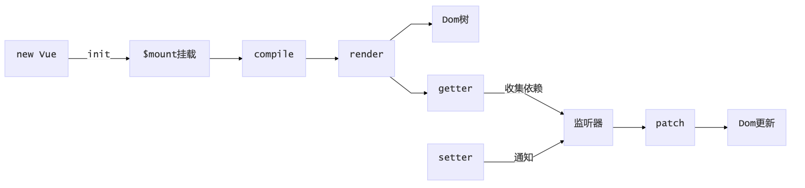
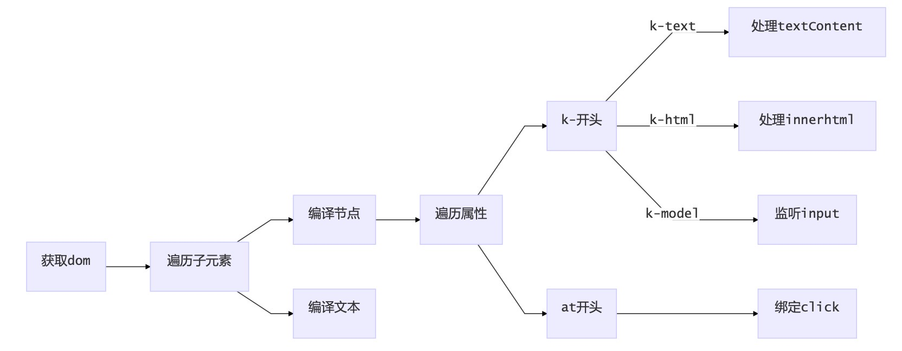

# Vue 源码解析

## 课堂目标

- 深入理解 vue 底层原理

- 手写 vue 核心部分实现

## 知识要点

- vue 工作机制

- Vue 响应式的原理

- 依赖收集与追踪

- 编译 compile

## Vue 工作机制



## Vue 响应式的原理 defineProperty

```js
class KVue {
  constructor(options) {
    this._data = options.data;
    this.observer(this._data);
  }
  observer(value) {
    if (!value || typeof value !== "object") {
      return;
    }
    Object.keys(value).forEach((key) => {
      this.defineReactive(value, key, value[key]);
    });
  }
  defineReactive(obj, key, val) {
    Object.defineProperty(obj, key, {
      enumerable: true /* 属性可枚举 */,
      configurable: true /* 属性可被修改或删除 */,
      get() {
        return val;
      },
      set(newVal) {
        if (newVal === val) return;
        this.cb(newVal);
      },
    });
  }
  cb(val) {
    console.log("更新数据了", val);
  }
}
let o = new KVue({
  data: {
    test: "I am test.",
  },
});
o._data.test = "hello,kaikeba";
```

## 依赖收集与追踪

```js
new Vue({
  template: `<div> <span>{{text1}}</span> <span>{{text2}}</span><div>`,
  data: {
    text1: "name1",
  },
  created() {
    this.text1 = "开课吧";
  },
});
```

text1 被修改，所以视图更新，但是 text2 视图没用到，所以不需要更新，如何实现呢，就需要我们的依赖收集

```js
// 依赖收集小朋友
class Dep {
  constructor() {
    // 存数所有的依赖
    this.deps = [];
  }
  // 在deps中添加一个监听器对象
  addDep(dep) {
    this.deps.push(dep);
  }
  // 通知所有监听器去更新视图
  notify() {
    this.deps.forEach((dep) => {
      dep.update();
    });
  }
}
```

```js
class Watcher {
  constructor() {
    // 在new一个监听器对象时将该对象赋值给Dep.target，在get中会用到
    Dep.target = this;
  }
  // 更新视图的方法
  update() {
    console.log("视图更新啦~");
  }
}
```

我们在增加了一个 Dep 类的对象，用来收集 Watcher 对象。读数据的时候，会触发 reactiveGetter 函数把当前的 Watcher 对象(存放在 Dep.target 中)收集到 Dep 类中去。

写数据的时候，则会触发 reactiveSetter 方法，通知 Dep 类调用 notify 来触发所有 watcher 对象的 update 方法更 新对应视图

```js
constructor(options) {
    this._data = options.data
    this.observer(this._data)
    // 新建一个Watcher观察者对象，这时候Dep.target会指向这个Watcher对象
    new Watcher();
    // 在这里模拟render的过程，为了触发test属性的get函数
    console.log('模拟render，触发test的getter', this._data.test);
}
defineReactive(obj, key, val) {
    const dep = new Dep()
    Object.defineProperty(obj, key, {
        enumerable: true,
        configurable: true,
        get: function reactiveGetter() {
            // 将Dep.target(即当前的Watcher对象存入Dep的deps中)
            dep.addDep(Dep.target)
            return val
        },
        set: function reactiveSetter(newVal) {
            if (newVal === val) return
            // 在set的时候触发dep的notify来通知所有的Watcher对象更新视图
            dep.notify()
        }
    })
}
```

## 编译 compile

核心逻辑 获取 dom，遍历 dom，获取{{}}、k-和@开头的 ，设置响应式



### 目标功能

```html
<body>
  <div id="app">
    <p>{{name}}</p>
    <p k-text="name"></p>
    <p>{{age}}</p>
    <p>{{doubleAge}}</p>
    <input type="text" k-model="name" />
    <button @click="changeName">呵呵</button>
    <div k-html="html"></div>
  </div>
  <script src="./compile.js"></script>
  <script src="./kaikeba-vue.js"></script>
  <script>
    let kaikeba = new KVue({
        el: '#app',
        data: {
            name: "I am test.",
            age: 12, html: '<button>这是一个按钮</button>'
        },
        created() {
            console.log('开始啦')
            setTimeout(() => {
                this.name = '我是蜗牛'
            }, 1500)
        },
        methods: {
            changeName() {
                this.name = '哈喽，开课吧' this.age = 1
                this.id = 'xx'
                console.log(1, this)
            }
        }
    });
  </script>
</body>
```

### compile.js

```js
class Compile {
  constructor(el, vm) {
    this.$vm = vm;
    this.$el = document.querySelector(el);
    if (this.$el) {
      this.$fragment = this.node2Fragment(this.$el);
      this.compileElement(this.$fragment);
      this.$el.appendChild(this.$fragment);
    }
  }
  node2Fragment(el) {
    // 新建文档碎片 dom接口
    let fragment = document.createDocumentFragment();
    let child;
    // 将原生节点拷贝到fragment
    while ((child = el.firstChild)) {
      fragment.appendChild(child);
    }
    return fragment;
  }
  compileElement(el) {
    let childNodes = el.childNodes;
    Array.from(childNodes).forEach((node) => {
      let text = node.textContent;
      // 表达式文本
      // 就是识别{{}}中的数据
      let reg = /\{\{(.*)\}\}/;
      // 按元素节点方式编译
      if (this.isElementNode(node)) {
        this.compile(node);
      } else if (this.isTextNode(node) && reg.test(text)) {
        // 文本 并且有{{}} this.compileText(node, RegExp.$1)
      }
      // 遍历编译子节点
      if (node.childNodes && node.childNodes.length) {
        this.compileElement(node);
      }
    });
  }
  compile(node) {
    let nodeAttrs = node.attributes;
    Array.from(nodeAttrs).forEach((attr) => {
      // 规定:指令以 v-xxx 命名
      // 如 <span v-text="content"></span> 中指令为 v-text let attrName = attr.name // v-text
      let exp = attr.value; // content
      if (this.isDirective(attrName)) {
        let dir = attrName.substring(2); // text
        // 普通指令
        this[dir] && this[dir](node, this.$vm, exp);
      }
      if (this.isEventDirective(attrName)) {
        let dir = attrName.substring(1); // text this.eventHandler(node, this.$vm, exp, dir)
      }
    });
  }
  compileText(node, exp) {
    this.text(node, this.$vm, exp);
  }
  isDirective(attr) {
    return attr.indexOf("k-") == 0;
  }
  isEventDirective(dir) {
    return dir.indexOf("@") === 0;
  }
  isElementNode(node) {
    return node.nodeType == 1;
  }
  isTextNode(node) {
    return node.nodeType == 3;
  }
  text(node, vm, exp) {
    this.update(node, vm, exp, "text");
  }
  html(node, vm, exp) {
    this.update(node, vm, exp, "html");
  }
  model(node, vm, exp) {
    this.update(node, vm, exp, "model");
    let val = vm.exp;
    node.addEventListener("input", (e) => {
      let newValue = e.target.value;
      vm[exp] = newValue;
      val = newValue;
    });
  }
  update(node, vm, exp, dir) {
    let updaterFn = this[dir + "Updater"];
    updaterFn && updaterFn(node, vm[exp]);
    new Watcher(vm, exp, function (value) {
      updaterFn && updaterFn(node, value);
    });
  }
  // 事件处理
  eventHandler(node, vm, exp, dir) {
    let fn = vm.$options.methods && vm.$options.methods[exp];
    if (dir && fn) {
      node.addEventListener(dir, fn.bind(vm), false);
    }
  }
  textUpdater(node, value) {
    node.textContent = value;
  }
  htmlUpdater(node, value) {
    node.innerHTML = value;
  }
  modelUpdater(node, value) {
    node.value = value;
  }
}
```

### 入口文件

```js
class KVue {
  constructor(options) {
    this.$data = options.data;
    this.$options = options;
    this.observer(this.$data);
    // 新建一个Watcher观察者对象，这时候Dep.target会指向这个Watcher对象 // new Watcher()
    // 在这里模拟render的过程，为了触发test属性的get函数
    console.log("模拟render，触发test的getter", this.$data);
    if (options.created) {
      options.created.call(this);
    }
    this.$compile = new Compile(options.el, this);
  }
  observer(value) {
    if (!value || typeof value !== "object") {
      return;
    }
    Object.keys(value).forEach((key) => {
      this.proxyData(key);
      this.defineReactive(value, key, value[key]);
    });
  }
  defineReactive(obj, key, val) {
    const dep = new Dep();
    Object.defineProperty(obj, key, {
      enumerable: true,
      configurable: true,
      get() {
        // 将Dep.target(即当前的Watcher对象存入Dep的deps中)
        Dep.target && dep.addDep(Dep.target);
        return val;
      },
      set(newVal) {
        if (newVal === val) return;
        val = newVal;
        // 在set的时候触发dep的notify来通知所有的Watcher对象更新视图
        dep.notify();
      },
    });
  }
  proxyData(key) {
    Object.defineProperty(this, key, {
      configurable: false,
      enumerable: true,
      get() {
        return this.$data[key];
      },
      set(newVal) {
        this.$data[key] = newVal;
      },
    });
  }
}
```

### 依赖收集 Dep

```js
class Dep {
  constructor() {
    // 存数所有的依赖
    this.deps = [];
  }
  // 在deps中添加一个监听器对象
  addDep(dep) {
    this.deps.push(dep);
  }
  depend() {
    Dep.target.addDep(this);
  }
  // 通知所有监听器去更新视图
  notify() {
    this.deps.forEach((dep) => {
      dep.update();
    });
  }
}
```

### 监听器

```js
// 监听器
class Watcher {
  constructor(vm, key, cb) {
    // 在new一个监听器对象时将该对象赋值给Dep.target，在get中会用到 // 将 Dep.target 指向自己
    // 然后触发属性的 getter 添加监听

    // 最后将 Dep.target 置空
    this.cb = cb;
    this.vm = vm;
    this.key = key;
    this.value = this.get();
  }
  get() {
    Dep.target = this;
    let value = this.vm[this.key];
    return value;
  }
  // 更新视图的方法
  update() {
    this.value = this.get();
    this.cb.call(this.vm, this.value);
  }
}
```
