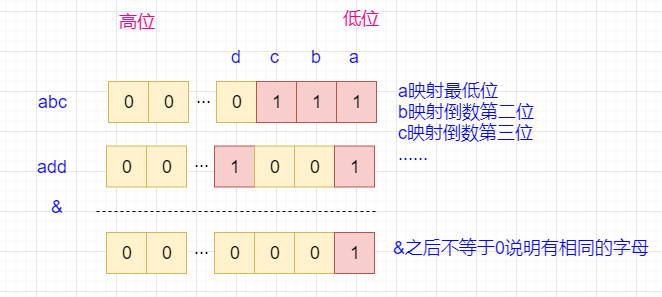

# [318. 最大单词长度乘积](https://leetcode-cn.com/problems/maximum-product-of-word-lengths/)

## 题目

给定一个字符串数组 `words`，找到 `length(word[i]) * length(word[j])`  的最大值，并且这两个单词不含有公共字母。你可以认为每个单词只包含小写字母。如果不存在这样的两个单词，返回 0。

示例 1:

```txt
输入: ["abcw","baz","foo","bar","xtfn","abcdef"]
输出: 16
解释: 这两个单词为 "abcw", "xtfn"。
```

示例 2:

```txt
输入: ["a","ab","abc","d","cd","bcd","abcd"]
输出: 4
解释: 这两个单词为 "ab", "cd"。
```

示例 3:

```txt
输入: ["a","aa","aaa","aaaa"]
输出: 0
解释: 不存在这样的两个单词。
```

提示：

- `2 <= words.length <= 1000`
- `1 <= words[i].length <= 1000`
- `words[i]` 仅包含小写字母

## 难度

中等

## 标签

位运算 数组 字符串

## 解题思路

这道题目的关键是两个单词不能含有相同的字母，那么，怎么判断两个单词不含有相同的字母呢？

一种简单的方法是使用哈希表存储每个单词中出现的字母，然后两个哈希表取交集，如果不存在交集就说明不存在相同的字母，你可以使用 `Set` 来取交集，但是，这个效率是非常低的，所以，我们要另辟蹊径。

题目约定了每个单词仅包含小写字母，所以，我们可以将单词中的每个字母都映射到一个 `number` 类型的不同位上，这样，就做到了每个单词都对应一个 `number` 类型的数值，这样的话，我们对比两个单词是否包含相同的字母，只需要把它们对应的 `number` 数值做 & 运算，看是不是等于 0 即可，如果等于 0 ，说明没有相同的位是 1，也就不存在相同的字母。

举个例子，假设比较的两个单词分别为："abc" 和 "add"，比较过程见下图：



复杂度分析

- 时间复杂度：`O(n * m + n^2)`，`n` 为单词数量，`m` 为单词平均长度。
- 空间复杂度：`O(n)`。

## 提交速度

- 执行用时：`88 ms`, 在所有 JavaScript 提交中击败了 `84.78%` 的用户
- 内存消耗：`41.5 MB`, 在所有 JavaScript 提交中击败了 `50.00%` 的用户
