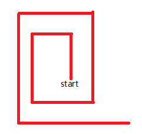
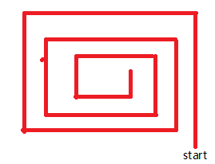
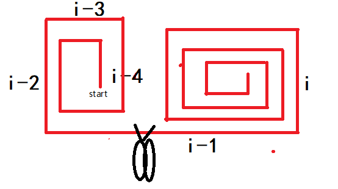

# [335. 路径交叉](https://leetcode-cn.com/problems/self-crossing/)

## 题目

给你一个整数数组 `distance` 。

从 `X-Y` 平面上的点 `(0,0)` 开始，先向北移动 `distance[0]` 米，然后向西移动 `distance[1]` 米，向南移动 `distance[2]` 米，向东移动 `distance[3]` 米，持续移动。也就是说，每次移动后你的方位会发生逆时针变化。

判断你所经过的路径是否相交。如果相交，返回 `true` ；否则，返回 `false` 。

示例 1：


```txt
输入：distance = [2,1,1,2]
输出：true
```

示例 2：

```txt
输入：distance = [1,2,3,4]
输出：false
```

示例 3：

```txt
输入：distance = [1,1,1,1]
输出：true
```

提示：

- `1 <= distance.length <= 10^5`
- `1 <= distance[i] <= 10^5`

## 难度

困难

## 标签

几何 数组 数学

## 解题思路

归纳法

这道题如果我们从正面去找相交的情况会非常的复杂，所以，我们可以反向思考：什么情况下不会相交？

主要有以下三种情况：

1. 一直向外卷，如下图所示，这样是不会相交的，这种是比较好检查的，只要对于每一个 `i` 来说 `dist[i] > dist[i-2]` 就一直不会相遇。

   

2. 一直向内卷，如下图所示，这样也不会相交，这种也比较好检查，只要对于每一个 `i` 来说 `dist[i] < dist[i-2]` 就一直不会相遇。

   

3. 外卷转内卷，如下图所示，这种分情况讨论，只有出现下面这种情况才不会相交，而我们只要在外卷内卷交界处做一个特殊处理就可以转换成上面两种情况，即 `dist[i] > dist[i-2] - dist[i-4]` 时，从 `i-1` 处剪成两半

   

复杂度分析

- 时间复杂度：`O(n)`。
- 空间复杂度：`O(1)`

## 提交速度

- 执行用时：`72 ms`, 在所有 JavaScript 提交中击败了 `80.95%` 的用户
- 内存消耗：`41 MB`, 在所有 JavaScript 提交中击败了 `47.62%` 的用户
