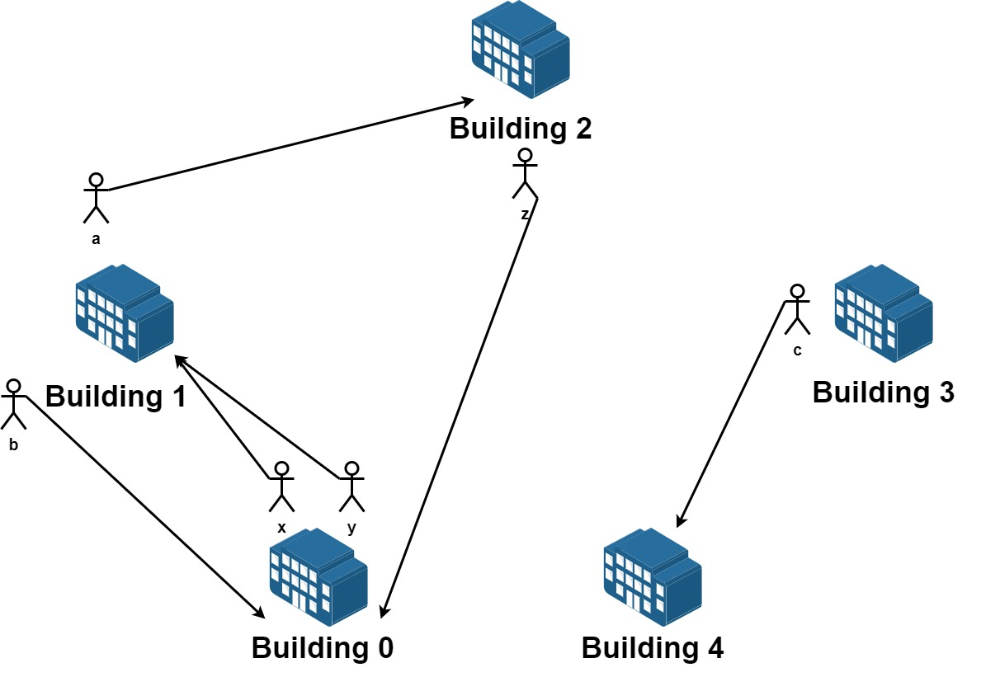

# [1601. 最多可达成的换楼请求数目](https://leetcode-cn.com/problems/maximum-number-of-achievable-transfer-requests/)

## 题目

我们有 `n` 栋楼，编号从 0 到 `n - 1` 。每栋楼有若干员工。由于现在是换楼的季节，部分员工想要换一栋楼居住。

给你一个数组 `requests` ，其中 `requests[i] = [from_i, to_i]` ，表示一个员工请求从编号为 `from_i` 的楼搬到编号为 `to_i` 的楼。

一开始**所有楼都是满的**，所以从请求列表中选出的若干个请求是可行的需要满足 每栋楼员工净变化为 0 。意思是每栋楼**离开**的员工数目**等于**该楼**搬入**的员工数数目。比方说 `n = 3` 且两个员工要离开楼 0 ，一个员工要离开楼 1 ，一个员工要离开楼 2 ，如果该请求列表可行，应该要有两个员工搬入楼 0 ，一个员工搬入楼 1 ，一个员工搬入楼 2 。

请你从原请求列表中选出若干个请求，使得它们是一个可行的请求列表，并返回所有可行列表中最大请求数目。

示例 1：



```txt
输入：n = 5, requests = [[0,1],[1,0],[0,1],[1,2],[2,0],[3,4]]
输出：5
解释：请求列表如下：
从楼 0 离开的员工为 x 和 y ，且他们都想要搬到楼 1 。
从楼 1 离开的员工为 a 和 b ，且他们分别想要搬到楼 2 和 0 。
从楼 2 离开的员工为 z ，且他想要搬到楼 0 。
从楼 3 离开的员工为 c ，且他想要搬到楼 4 。
没有员工从楼 4 离开。
我们可以让 x 和 b 交换他们的楼，以满足他们的请求。
我们可以让 y，a 和 z 三人在三栋楼间交换位置，满足他们的要求。
所以最多可以满足 5 个请求。
```

示例 2：

```txt
输入：n = 3, requests = [[0,0],[1,2],[2,1]]
输出：3
解释：请求列表如下：
从楼 0 离开的员工为 x ，且他想要回到原来的楼 0 。
从楼 1 离开的员工为 y ，且他想要搬到楼 2 。
从楼 2 离开的员工为 z ，且他想要搬到楼 1 。
我们可以满足所有的请求。
```

示例 3：

```txt
输入：n = 4, requests = [[0,3],[3,1],[1,2],[2,0]]
输出：4
```

提示：

- `1 <= n <= 20`
- `1 <= requests.length <= 16`
- `requests[i].length == 2`
- `0 <= from_i, to_i < n`

## 难度

困难

## 标签

位运算 数组 回溯 枚举

## 解题思路

从大到小枚举最多成立的请求数(记为 `m`)，遍历这个请求数下，所有构成请求数的组合(`C_n^m` 个)中，有没有满足题目要求的，有的话直接返回答案即可。

## 提交速度

- 执行用时：`348 ms`, 在所有 JavaScript 提交中击败了`78.57%`的用户
- 内存消耗：`50.7 MB`, 在所有 JavaScript 提交中击败了`28.57%`的用户
