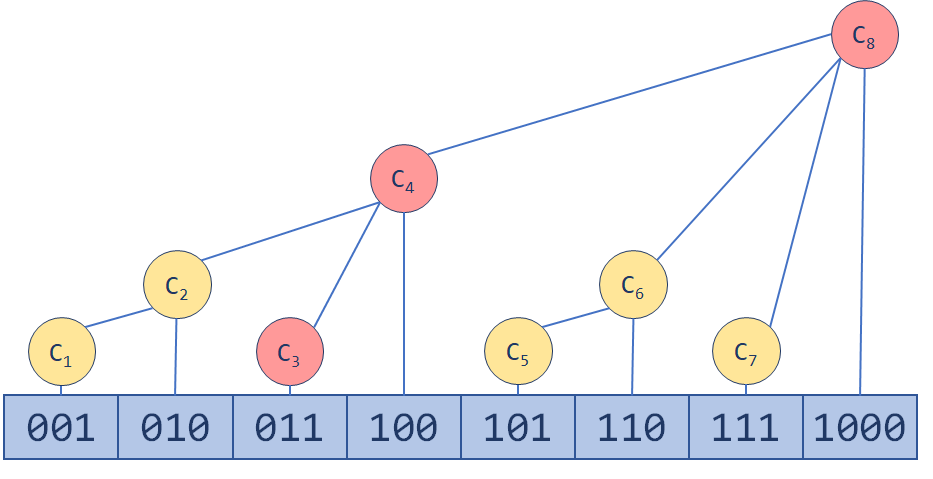

# 树状数组

树状数组（Binary Index Tree, BIT）也是很多 OIer 心中最简洁优美的数据结构之一。最简单的树状数组支持两种操作，时间复杂度均为 O(n logn) ：

- 单点修改：更改数组中一个元素的值
- 区间查询：查询一个区间内所有元素的和

## 树状数组的结构


## 如何更新



每一步都把从右边起一系列连续的 1 变为 0，再把这一系列 1 的前一位 0 变为 1。这看起来像是一个进位的过程对吧？实际上，每一次加的正是 `lowBit(x)`

## 如何实现

`lowBit` 怎么算？如果一位一位验证的话，会形成额外的时间开销。然而，我们有这样神奇的一个公式：

```js
const lowBit = x => x & -x;
```

为什么可以这样？我们需要知道，计算机里有符号数一般是以补码的形式存储的。`-x` 相当于 `x` 按位取反再加 1，会把结尾处原来 1000...的形式，变成 `0111...`，再变成 `1000...`；而前面每一位都与原来相反。这时我们再把它和 `x` 按位与，得到的结果便是 `lowBit(x)`。

```js
class NumArray {
  /**
   * @param {number[]} nums
   */
  constructor(nums) {
    // 下标从 1 开始
    this.tree = new Array(nums.length + 1).fill(0);
    for (let i = 0; i < nums.length; i++) {
      this.add(i, nums[i]);
    }
    this.nums = nums;
  }

  lowBit(pos) {
    return pos & -pos;
  }

  /** 把序列第 `index` 个数增加 `val` */
  add(index, val) {
    for (let pos = index + 1; pos < this.tree.length; pos += this.lowBit(pos)) {
      this.tree[pos] += val;
    }
  }

  /** 查询前 `index` 个元素的前缀和 */
  prefixSum(n) {
    let ans = 0;
    for (let pos = n; pos; pos -= this.lowBit(pos)) {
      ans += this.tree[pos];
    }
    return ans;
  }
}
```
