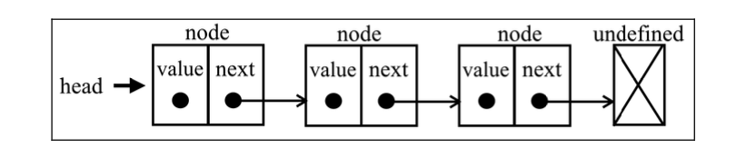
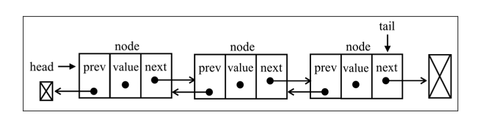
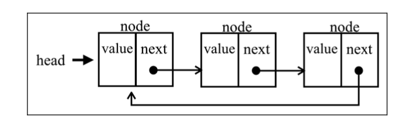
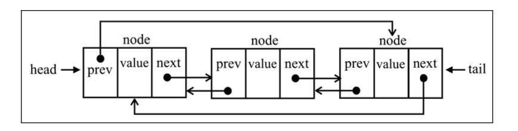

# LinkedList

要存储多个元素，数组（或列表）可能是最常用的数据结构。这种数据结构非常方便，提供了一个便利的[]语法来访问其元素。然而，这种数据结构有一个缺点：（在大多数语言中）数组的大小是固定的，从数组的起点或中间插入或移除项的成本很高，因为需要移动元素。（尽管我们已经学过，JavaScript 有来自 Array 类的方法可以帮我们做这些事，但背后的情况同样如此。）

链表存储有序的元素集合，但不同于数组，链表中的元素在内存中并不是连续放置的。每个元素由一个存储元素本身的节点和一个指向下一个元素的引用（也称指针或链接）组成。

相对于传统的数组，链表的一个好处在于，添加或移除元素的时候不需要移动其他元素。然而，链表需要使用指针，因此实现链表时需要额外注意。在数组中，我们可以直接访问任何位置的任何元素，而要想访问链表中间的一个元素，则需要从起点（表头）开始迭代链表直到找到所需的元素。

## 创建链表

- push(element)：向链表尾部添加一个新元素。
- insert(element, position)：向链表的特定位置插入一个新元素。
- getElementAt(index)：返回链表中特定位置的元素。如果链表中不存在这样的元素，则返回 undefined。
- remove(element)：从链表中移除一个元素。
- indexOf(element)：返回元素在链表中的索引。如果链表中没有该元素则返回-1。
- removeAt(position)：从链表的特定位置移除一个元素。
- isEmpty()：如果链表中不包含任何元素，返回 true，如果链表长度大于 0则返回 false。
- size()：返回链表包含的元素个数，与数组的 length 属性类似。
- toString()：返回表示整个链表的字符串。由于列表项使用了 Node 类，就需要重写继承自 JavaScript 对象默认的 toString 方法，让其只输出元素的值。

## 双向链表

双向链表和普通链表的区别在于，在链表中， 一个节点只有链向下一个节点的链接;而在双向链表中，链接是双向的:一个链向下一个元素， 另一个链向前一个元素

## 循环链表

循环链表可以像链表一样只有单向引用，也可以像双向链表一样有双向引用。循环链表和链表之间唯一的区别在于，最后一个元素指向下一个元素的指针(tail.next)不是引用undefined，而是指向第一个元素(head)

双向循环链表有指向 head 元素的 tail.next 和指向 tail 元素的 head.prev。

## 有序链表

有序链表是指保持元素有序的链表结构。除了使用排序算法之外，我们还可以将元素插入到正确的位置来保证链表的有序性。
